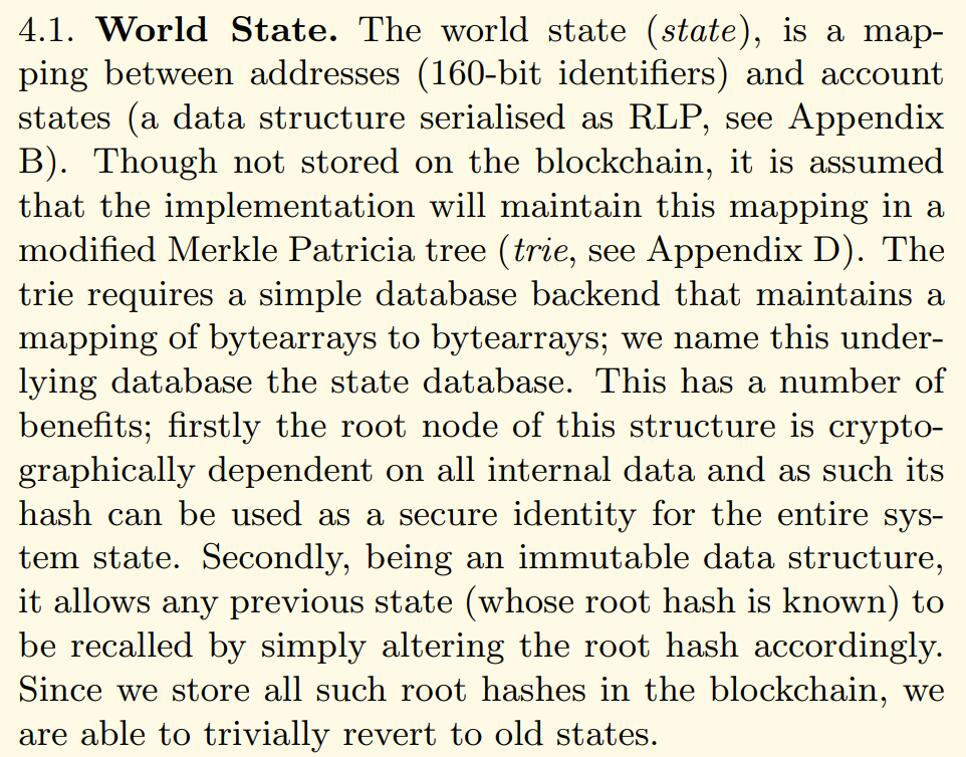
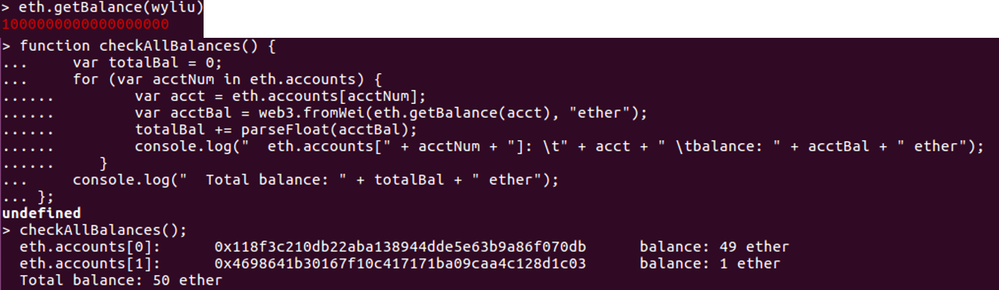

# 从世界状态获取账户余额



#### 以太坊账户

* 状态 = 账户 + 转移价值和信息的状态转换
* 包含四个部分
    * 随机数，用于确定每笔交易只能被处理一次的计数器
    * 账户目前的以太币余额
    * 账户的合约代码，如果有的话
    * 账户的存储（默认为空）

## getBalance()

geth操作调用web3中的`getBalance()`：



指向`GetBalance()`方法：

```go
# internal/ethapi/api.go

func (s *PublicBlockChainAPI) GetBalance(ctx context.Context, address common.Address, blockNr rpc.BlockNumber) (*big.Int, error) {
    state, _, err := s.b.StateAndHeaderByNumber(ctx, blockNr)
    if state == nil || err != nil {
        return nil, err
    }
    b := state.GetBalance(address)
    return b, state.Error()
}
```

若指定`BlockNumber`，查询该`Block`账户当时的余额；缺省查询账目目前的余额。

从`stateObject`中获取余额：

```go
# core/state/statedb.go

func (self *StateDB) GetBalance(addr common.Address) *big.Int {
    stateObject := self.getStateObject(addr)
    if stateObject != nil {
        return stateObject.Balance()
    }
    return common.Big0
}
```

查找指定`Address`的账户的`stateObject`；若该`Address`不存在，返回0。

检索`StateDB`：

```go
func (self *StateDB) getStateObject(addr common.Address) (stateObject *stateObject) {
    if obj := self.stateObjects[addr]; obj != nil {
        if obj.deleted {
            return nil
        }
        return obj
    }

    enc, err := self.trie.TryGet(addr[:])
    if len(enc) == 0 {
        self.setError(err)
        return nil
    }
    var data Account
    if err := rlp.DecodeBytes(enc, &data); err != nil {
        debugLog.Error("Failed to decode state object", "addr", addr, "err", err)
        return nil
    }

    obj := newObject(self, addr, data, self.MarkStateObjectDirty)
    self.setStateObject(obj)
    return obj
}
```

优先从缓存中读取；若无，从数据库中加载到缓存。

关注`load`过程：

具体见[trie/trie.go](./trie.md#triego)。


