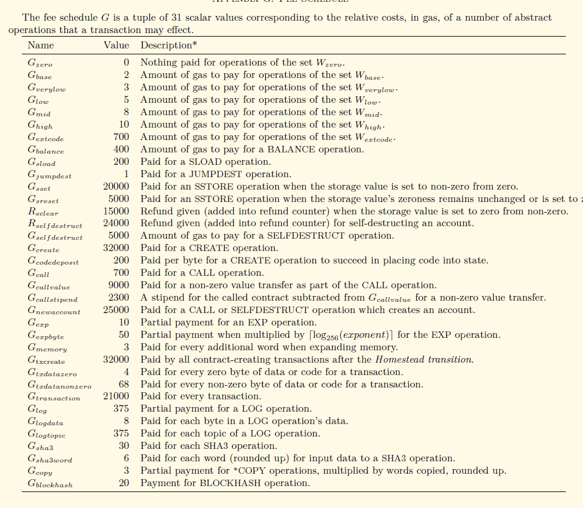
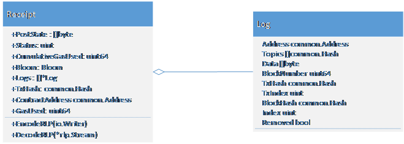

#  一、Gas 的设计
在之前的汇报中，我们提到了有关Gas的设计，它就像整个以太坊的血液系统，每个别执行的合约与交易命令，都必须消耗一定数值的Gas,而Gas又和具备真实价值的以太币关联，使得整个系统再“有偿”使用的前提下，能够健康平稳地运行，避免了网络的滥用。目前，出现的恶意DOS攻击，主要的原因都是通过智能合约的设计，恶意利用系统的漏洞，使得复杂的系统操作仅仅消耗非常少量的Gas,使得大量待处理的交易堵塞系统，增加了正常交易所等待的时间。

根据以太坊黄皮书，Gas设计的基本理念在于，创建交易与合约的固定费用加上执行命令的复杂程度构成一条交易最终的Gas费用。在以太坊黄皮书中，有着明确的命令Gas费用表，如下图所示：


在这个表格中，可以和以太坊源码中Params/protocol_params.go中的定义所对应，如红框中的内容，定义了一次SHA3操作的gas费用和每个输入数据单词的SHA3操作额外费用，可以与下图代码段完美契合。

```
Sha256BaseGas           uint64 = 60     // Base price for a SHA256 operation
Sha256PerWordGas        uint64 = 12     // Per-word price for a SHA256 operation
```
但是，表格中前列的集合指令没有在这个代码段中，源码中还会根据实际的情况，定义一些操作集合的gas费用。

# 二、ApplyTransaction()
在之前的汇报中，我们已经从命令行调用一条交易追溯到了矿工提交这条交易到执行的步骤，从work.go中的commitNewWork()组装区块，到调用Env中的commitTransaction，最终发现，在虚拟机外，真实的交易执行代码是在core.state_processor中的ApplyTransaction()，这条命令将会最终执行交易，并返回收据（Receipt,以太坊中数据结构的一种）。它主要的执行步骤有：
1.	根据输入参数分别封装出一个Message和一个EVM对象

2.	然后将Message, EVM以及输入变量GasPool，通过ApplyMessage传递到TransitionDb()执行交易

3.	最后创建并返回Recetip对象，以及整个tx执行过程所消耗Gas数量

随后的内容，我们将分别的阐述数据结构Message，交易的执行函数TransitionDB的流程，以及Receipt的基本数据结构。
## （一） Message

在ApplyTransaction()中，首先调用的AsMessage(),从上图可以看出，这个方法的主要的作用是返回一个已经对账户地址进行了签名的message，message的数据结构如下：
```
func (tx *Transaction) AsMessage(s Signer) (Message, error) {
	msg := Message{
		nonce:      tx.data.AccountNonce,
		gasLimit:   tx.data.GasLimit,
		gasPrice:   new(big.Int).Set(tx.data.Price),
		to:         tx.data.Recipient,
		amount:     tx.data.Amount,
		data:       tx.data.Payload,
		checkNonce: true,
	}

	var err error
	msg.from, err = Sender(s, tx)
	return msg, err
}
```
    type Message struct {
    	to         *common.Address
    	from       common.Address
    	nonce      uint64
    	amount     *big.Int
    	gasLimit   uint64
    	gasPrice   *big.Int
    	data       []byte
    	checkNonce bool
    }
从数据结构的来看，Message和交易的变量基本相同。在交易执行中，Message由此次待执行的tx对象转化而来，并携带了解析出的tx的(转帐)转出方地址，属于待处理的数据对象。
##(二)  TransitionDB

交易执行是以太坊协议中最复杂的部分：它定义了状态转换函数
##(三) Receipt

Receipt 中有一个Log类型的数组，其中每一个Log对象记录了Tx中一小步的操作。所以，每一个tx的执行结果，由一个Receipt对象来表示；更详细的内容，由一组Log对象来记录。这个Log数组很重要，比如在不同Ethereum节点(Node)的相互同步过程中，待同步区块的Log数组有助于验证同步中收到的block是否正确和完整，所以会被单独同步(传输)。

Receipt的PostState保存了创建该Receipt对象时，整个Block内所有“帐户”的当时状态。Ethereum 里用stateObject来表示一个账户Account，这个账户可转帐(transfer value), 可执行tx, 它的唯一标示符是一个Address类型变量。 这个Receipt.PostState 就是当时所在Block里所有stateObject对象的RLP Hash值。

