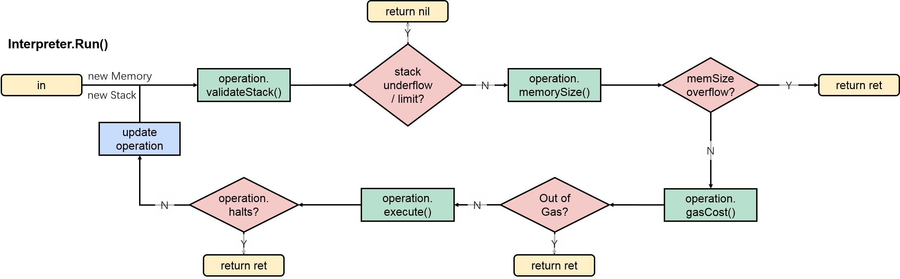

# 以太坊虚拟机解释器

以太坊虚拟机解释执行Code。

## EVM的汇编代码

合约`C`有状态变量和构造器：

```solidity
pragma solidity ^0.4.21;

contract C {
    uint256 cbd;
    function C() public{
        cbd = 109;
    }
}
```

使用`solc`编译合约`C`：

```solc
======= c1.sol:C =======
EVM assembly:
... */ "c1.sol":28:114  contract C {
  mstore(0x40, 0x60)
... */ "c1.sol":64:111  function C() public{
  jumpi(tag_1, iszero(callvalue))
  0x0
  dup1
  revert
tag_1:
    /* "c1.sol":100:103  109 */
  0x6d
    /* "c1.sol":94:97  cbd */
  0x0
    /* "c1.sol":94:103  cbd = 109 */
  dup2
  swap1
  sstore
  pop
... */ "c1.sol":28:114  contract C {
  dataSize(sub_0)
  dup1
  dataOffset(sub_0)
  0x0
  codecopy
  0x0
  return
stop

sub_0: assembly {
... */  /* "c1.sol":28:114  contract C {
      mstore(0x40, 0x60)
      0x0
      dup1
      revert

    auxdata: 0xa165627a7a723058204c4b7cb2d6601994bbe06eeb297368f48ca11be35e15fe1d8e5aca29313706070029
}

Binary:
60606040523415600e57600080fd5b606d60008190555060358060236000396000f3006060604052600080fd00a165627a7a723058204c4b7cb2d6601994bbe06eeb297368f48ca11be35e15fe1d8e5aca29313706070029
```

其中，`Binary`是EVM运行时的字节码。变量赋值`cbd = 109;`由字节码`606d600081905550`表示，缩进到标签`tag_1`下：

```solc
tag_1:
    /* 60 6d */
  0x6d
    /* 60 00 */
  0x0
    /* 81 */
  dup2
    /* 90 */
  swap1
    /* 55 */
  sstore
    /* 50 */
  pop
```

在汇编代码中，`0x0`是`PUSH(0x0)`的简写，即将数值0压栈。

模拟EVM（详见附录[指令集](#指令集)）执行字节序列，打印每条指令执行后的机器状态得到：

```solc
  /* 60 6d：压栈6d */
0x6d
  stack: [0x6d]
  store: {}
    
  /* 60 00：压栈0 */
0x0
  stack: [0x0 0x6d]
  store: {}
    
  /* 81：复制栈中的第2项 */
dup2
  stack: [0x6d 0x0 0x6d]
  store: {}
    
  /* 90：交换栈中的第1和2项 */
swap1
  stack: [0x0 0x6d 0x6d]
  store: {}
    
  /* 55：存储数值 */
sstore
  stack: [0x6d]
  store: {0x0=>0x6d}
    
  /* 50：出栈 */
pop
  stack: []
  store: {0x0=>0x6d}
```

#### 存疑❓

```diff
- 如何解读智能合约中的样板语句？
- 在汇编语言中，状态变量cbd的名称是如何存储的？
- auxdata里存储的是什么？
```

## 测试运行时实例

执行字节码为`6060604052600a8060106000396000f360606040526008565b00`的code，同时追踪栈上的函数调用信息。

```go
# core/vm/runtime/runtime_example_test.go

ret, _, err := runtime.Execute(common.Hex2Bytes("6060604052600a8060106000396000f360606040526008565b00"), nil, nil)
if err != nil {
    fmt.Println(err)
}
fmt.Println(ret)
```

对应的[汇编语言代码](https://etherscan.io/opcode-tool)是：

```solc
PUSH1 0x60
BLOCKHASH
MSTORE
PUSH1 0x0a
DUP1
PUSH1 0x10
PUSH1 0x00
CODECOPY
PUSH1 0x00
RETURN
PUSH1 0x60
PUSH1 0x40
MSTORE
PUSH1 0x08
JUMP
JUMPDEST
STOP
```

#### 存疑❓

```diff
- 字节码和汇编语言代码不是顺序对应的关系？
```

实例进行了1950次函数调用，过程（有删减，详见附录[运行时实例测试日志](#运行时实例测试日志)）如下：

* 初始化运行时环境`core/vm/runtime/runtime.go/Execute() line 96`
    * 将16进制的code字符串`6060604052600a8060106000396000f360606040526008565b00`转换成code字节数组`common/bytes.go/Hex2Bytes() line 83`
    * 构建内存的、临时的环境，返回EVM的返回值和新的状态`core/vm/runtime/runtime.go/Execute() line 96`，期望结果`[96 96 96 64 82 96 8 86 91 0]`
    * 传入`cfg == nil`，设置缺省的cfg`core/vm/runtime/runtime.go/setDefaults() line 53`，其`State == nil`，构建非持久的内存数据库`ethdb/memory_database.go/NewMemDatabase() line 36`，并为state创建备份存储`core/state/statedb.go/New() line 92`（略去更多构建过程和配置其他变量的详细内容），该备份存储是一棵在写入磁盘或者垃圾回收前暂存内容的trie`trie/database.go/NewDatabase() line 73`
* 给定cfg，调用code`core/vm/evm.go/(*EVM).Call() line 144`
    * 遍历code，循环解释`core/vm/interpreter.go/(*Interpreter).Run() line 110`



```go
# core/vm/interpreter.go
func (in *Interpreter) Run(contract *Contract, input []byte) (ret []byte, err error) {
	log.DebugLog()
	in.evm.depth++
	defer func() { in.evm.depth-- }()

	in.returnData = nil

	if len(contract.Code) == 0 {
		return nil, nil
	}

	var (
		op    OpCode
		mem   = NewMemory()
		stack = newstack()
		pc   = uint64(0)
		cost uint64
		pcCopy  uint64
		gasCopy uint64
		logged  bool
	)
	contract.Input = input

	if in.cfg.Debug {
		defer func() {
			if err != nil {
				if !logged {
					in.cfg.Tracer.CaptureState(in.evm, pcCopy, op, gasCopy, cost, mem, stack, contract, in.evm.depth, err)
				} else {
					in.cfg.Tracer.CaptureFault(in.evm, pcCopy, op, gasCopy, cost, mem, stack, contract, in.evm.depth, err)
				}
			}
		}()
	}
	
	// main run loop
	for atomic.LoadInt32(&in.evm.abort) == 0 {
		if in.cfg.Debug {
			logged, pcCopy, gasCopy = false, pc, contract.Gas
		}

		op = contract.GetOp(pc)
		operation := in.cfg.JumpTable[op]
		if !operation.valid {
			return nil, fmt.Errorf("invalid opcode 0x%x", int(op))
		}
		if err := operation.validateStack(stack); err != nil {
			return nil, err
		}
		if err := in.enforceRestrictions(op, operation, stack); err != nil {
			return nil, err
		}

		var memorySize uint64
		if operation.memorySize != nil {
			memSize, overflow := bigUint64(operation.memorySize(stack))
			if overflow {
				return nil, errGasUintOverflow
			}
			if memorySize, overflow = math.SafeMul(toWordSize(memSize), 32); overflow {
				return nil, errGasUintOverflow
			}
		}
		cost, err = operation.gasCost(in.gasTable, in.evm, contract, stack, mem, memorySize)
		if err != nil || !contract.UseGas(cost) {
			return nil, ErrOutOfGas
		}
		if memorySize > 0 {
			mem.Resize(memorySize)
		}

		if in.cfg.Debug {
			in.cfg.Tracer.CaptureState(in.evm, pc, op, gasCopy, cost, mem, stack, contract, in.evm.depth, err)
			logged = true
		}

		res, err := operation.execute(&pc, in.evm, contract, mem, stack)
		if verifyPool {
			verifyIntegerPool(in.intPool)
		}
		if operation.returns {
			in.returnData = res
		}

		switch {
		case err != nil:
			return nil, err
		case operation.reverts:
			return res, errExecutionReverted
		case operation.halts:
			return res, nil
		case !operation.jumps:
			pc++
		}
	}
	return nil, nil
}
```

:exclamation:	evm.depth

* [ ] 计划：Execute() with input data

## 附录

#### 指令集

详见[以太坊黄皮书](https://ethereum.github.io/yellowpaper/paper.pdf)Appendix H.2. Instruction Set。


#### 运行时实例测试日志

节选`ExampleExecute`函数的栈上调用信息：

```go
common/bytes.go/Hex2Bytes() line 83
core/vm/runtime/runtime.go/Execute() line 96
core/vm/runtime/runtime.go/setDefaults() line 53
ethdb/memory_database.go/NewMemDatabase() line 36
core/state/database.go/NewDatabase() line 80
trie/database.go/NewDatabase() line 73
core/state/statedb.go/New() line 92
core/state/database.go/(*cachingDB).OpenTrie() line 97
trie/secure_trie.go/NewSecure() line 54
trie/trie.go/New() line 101
trie/trie.go/(*Trie).SetCacheLimit() line 84
common/types.go/StringToAddress() line 169
common/types.go/BytesToAddress() line 164
common/types.go/(*Address).SetBytes() line 234
core/vm/runtime/env.go/NewEnv() line 26
core/vm/evm.go/NewEVM() line 119
params/config.go/(*ChainConfig).Rules() line 352
params/config.go/(*ChainConfig).IsHomestead() line 176
params/config.go/isForked() line 289
params/config.go/(*ChainConfig).IsEIP150() line 187
params/config.go/isForked() line 289
params/config.go/(*ChainConfig).IsEIP155() line 192
params/config.go/isForked() line 289
params/config.go/(*ChainConfig).IsEIP158() line 197
params/config.go/isForked() line 289
params/config.go/(*ChainConfig).IsByzantium() line 202
params/config.go/isForked() line 289
core/vm/interpreter.go/NewInterpreter() line 61
core/vm/evm.go/(*EVM).ChainConfig() line 404
params/config.go/(*ChainConfig).IsConstantinople() line 207
params/config.go/isForked() line 289
core/vm/evm.go/(*EVM).ChainConfig() line 404
params/config.go/(*ChainConfig).IsByzantium() line 202
params/config.go/isForked() line 289
core/vm/evm.go/(*EVM).ChainConfig() line 404
params/config.go/(*ChainConfig).IsHomestead() line 176
params/config.go/isForked() line 289
core/vm/evm.go/(*EVM).ChainConfig() line 404
params/config.go/(*ChainConfig).GasTable() line 215
params/config.go/(*ChainConfig).IsEIP158() line 197
params/config.go/isForked() line 289
core/vm/intpool.go/newIntPool() line 35
core/vm/stack.go/newstack() line 33
core/state/statedb.go/(*StateDB).CreateAccount() line 471
core/state/statedb.go/(*StateDB).createObject() line 447
core/state/statedb.go/(*StateDB).getStateObject() line 396
trie/secure_trie.go/(*SecureTrie).TryGet() line 79
trie/secure_trie.go/(*SecureTrie).hashKey() line 180
trie/hasher.go/newHasher() line 46
crypto/sha3/hashes.go/NewKeccak256() line 17
crypto/sha3/sha3.go/(*state).Reset() line 62
crypto/sha3/sha3.go/(*state).Write() line 134
crypto/sha3/sha3.go/(*state).Sum() line 196
crypto/sha3/sha3.go/(*state).clone() line 72
crypto/sha3/sha3.go/(*state).Read() line 170
crypto/sha3/sha3.go/(*state).padAndPermute() line 106
crypto/sha3/sha3.go/(*state).permute() line 86
crypto/sha3/xor_unaligned.go/xorInUnaligned() line 15
crypto/sha3/xor_unaligned.go/copyOutUnaligned() line 51
trie/hasher.go/returnHasherToPool() line 53
trie/trie.go/(*Trie).TryGet() line 141
trie/encoding.go/keybytesToHex() line 71
trie/trie.go/(*Trie).tryGet() line 151
core/state/statedb.go/(*StateDB).setError() line 109
core/state/state_object.go/newObject() line 115
crypto/crypto.go/Keccak256Hash() line 54
crypto/sha3/hashes.go/NewKeccak256() line 17
crypto/sha3/sha3.go/(*state).Write() line 134
crypto/sha3/sha3.go/(*state).Sum() line 196
crypto/sha3/sha3.go/(*state).clone() line 72
crypto/sha3/sha3.go/(*state).Read() line 170
crypto/sha3/sha3.go/(*state).padAndPermute() line 106
crypto/sha3/sha3.go/(*state).permute() line 86
crypto/sha3/xor_unaligned.go/xorInUnaligned() line 15
crypto/sha3/xor_unaligned.go/copyOutUnaligned() line 51
core/state/state_object.go/(*stateObject).setNonce() line 391
core/state/state_object.go/(*stateObject).Address() line 338
core/state/statedb.go/(*StateDB).MarkStateObjectDirty() line 440
core/state/statedb.go/(*StateDB).setStateObject() line 423
core/state/state_object.go/(*stateObject).Address() line 338
core/state/statedb.go/(*StateDB).SetCode() line 334
core/state/statedb.go/(*StateDB).GetOrNewStateObject() line 429
core/state/statedb.go/(*StateDB).getStateObject() line 396
crypto/crypto.go/Keccak256Hash() line 54
crypto/sha3/hashes.go/NewKeccak256() line 17
crypto/sha3/sha3.go/(*state).Write() line 134
crypto/sha3/sha3.go/(*state).Sum() line 196
crypto/sha3/sha3.go/(*state).clone() line 72
crypto/sha3/sha3.go/(*state).Read() line 170
crypto/sha3/sha3.go/(*state).padAndPermute() line 106
crypto/sha3/sha3.go/(*state).permute() line 86
crypto/sha3/xor_unaligned.go/xorInUnaligned() line 15
crypto/sha3/xor_unaligned.go/copyOutUnaligned() line 51
core/state/state_object.go/(*stateObject).SetCode() line 360
core/state/state_object.go/(*stateObject).Code() line 344
core/state/state_object.go/(*stateObject).CodeHash() line 400
core/state/state_object.go/(*stateObject).CodeHash() line 400
core/state/state_object.go/(*stateObject).setCode() line 371
common/types.go/StringToAddress() line 169
common/types.go/BytesToAddress() line 164
common/types.go/(*Address).SetBytes() line 234
core/vm/evm.go/(*EVM).Call() line 144
core/vm/contract.go/AccountRef.Address() line 42
core/evm.go/CanTransfer() line 93
core/state/statedb.go/(*StateDB).GetBalance() line 207
core/state/statedb.go/(*StateDB).getStateObject() line 396
trie/secure_trie.go/(*SecureTrie).TryGet() line 79
trie/secure_trie.go/(*SecureTrie).hashKey() line 180
trie/hasher.go/newHasher() line 46
crypto/sha3/sha3.go/(*state).Reset() line 62
crypto/sha3/sha3.go/(*state).Write() line 134
crypto/sha3/sha3.go/(*state).Sum() line 196
crypto/sha3/sha3.go/(*state).clone() line 72
crypto/sha3/sha3.go/(*state).Read() line 170
crypto/sha3/sha3.go/(*state).padAndPermute() line 106
crypto/sha3/sha3.go/(*state).permute() line 86
crypto/sha3/xor_unaligned.go/xorInUnaligned() line 15
crypto/sha3/xor_unaligned.go/copyOutUnaligned() line 51
trie/hasher.go/returnHasherToPool() line 53
trie/trie.go/(*Trie).TryGet() line 141
trie/encoding.go/keybytesToHex() line 71
trie/trie.go/(*Trie).tryGet() line 151
core/state/statedb.go/(*StateDB).setError() line 109
core/state/statedb.go/(*StateDB).Snapshot() line 535
core/state/statedb.go/(*StateDB).Exist() line 193
core/state/statedb.go/(*StateDB).getStateObject() line 396
core/vm/contract.go/AccountRef.Address() line 42
core/vm/contract.go/AccountRef.Address() line 42
core/evm.go/Transfer() line 99
core/state/statedb.go/(*StateDB).SubBalance() line 310
core/state/statedb.go/(*StateDB).GetOrNewStateObject() line 429
core/state/statedb.go/(*StateDB).getStateObject() line 396
trie/secure_trie.go/(*SecureTrie).TryGet() line 79
trie/secure_trie.go/(*SecureTrie).hashKey() line 180
trie/hasher.go/newHasher() line 46
crypto/sha3/sha3.go/(*state).Reset() line 62
crypto/sha3/sha3.go/(*state).Write() line 134
crypto/sha3/sha3.go/(*state).Sum() line 196
crypto/sha3/sha3.go/(*state).clone() line 72
crypto/sha3/sha3.go/(*state).Read() line 170
crypto/sha3/sha3.go/(*state).padAndPermute() line 106
crypto/sha3/sha3.go/(*state).permute() line 86
crypto/sha3/xor_unaligned.go/xorInUnaligned() line 15
crypto/sha3/xor_unaligned.go/copyOutUnaligned() line 51
trie/hasher.go/returnHasherToPool() line 53
trie/trie.go/(*Trie).TryGet() line 141
trie/encoding.go/keybytesToHex() line 71
trie/trie.go/(*Trie).tryGet() line 151
core/state/statedb.go/(*StateDB).setError() line 109
core/state/statedb.go/(*StateDB).createObject() line 447
core/state/statedb.go/(*StateDB).getStateObject() line 396
trie/secure_trie.go/(*SecureTrie).TryGet() line 79
trie/secure_trie.go/(*SecureTrie).hashKey() line 180
trie/hasher.go/newHasher() line 46
crypto/sha3/sha3.go/(*state).Reset() line 62
crypto/sha3/sha3.go/(*state).Write() line 134
crypto/sha3/sha3.go/(*state).Sum() line 196
crypto/sha3/sha3.go/(*state).clone() line 72
crypto/sha3/sha3.go/(*state).Read() line 170
crypto/sha3/sha3.go/(*state).padAndPermute() line 106
crypto/sha3/sha3.go/(*state).permute() line 86
crypto/sha3/xor_unaligned.go/xorInUnaligned() line 15
crypto/sha3/xor_unaligned.go/copyOutUnaligned() line 51
trie/hasher.go/returnHasherToPool() line 53
trie/trie.go/(*Trie).TryGet() line 141
trie/encoding.go/keybytesToHex() line 71
trie/trie.go/(*Trie).tryGet() line 151
core/state/statedb.go/(*StateDB).setError() line 109
core/state/state_object.go/newObject() line 115
crypto/crypto.go/Keccak256Hash() line 54
crypto/sha3/hashes.go/NewKeccak256() line 17
crypto/sha3/sha3.go/(*state).Write() line 134
crypto/sha3/sha3.go/(*state).Sum() line 196
crypto/sha3/sha3.go/(*state).clone() line 72
crypto/sha3/sha3.go/(*state).Read() line 170
crypto/sha3/sha3.go/(*state).padAndPermute() line 106
crypto/sha3/sha3.go/(*state).permute() line 86
crypto/sha3/xor_unaligned.go/xorInUnaligned() line 15
crypto/sha3/xor_unaligned.go/copyOutUnaligned() line 51
core/state/state_object.go/(*stateObject).setNonce() line 391
core/state/state_object.go/(*stateObject).Address() line 338
core/state/statedb.go/(*StateDB).MarkStateObjectDirty() line 440
core/state/statedb.go/(*StateDB).setStateObject() line 423
core/state/state_object.go/(*stateObject).Address() line 338
core/state/state_object.go/(*stateObject).SubBalance() line 289
core/state/statedb.go/(*StateDB).AddBalance() line 301
core/state/statedb.go/(*StateDB).GetOrNewStateObject() line 429
core/state/statedb.go/(*StateDB).getStateObject() line 396
core/state/state_object.go/(*stateObject).AddBalance() line 273
core/state/state_object.go/(*stateObject).empty() line 100
core/vm/contract.go/NewContract() line 73
core/vm/contract.go/AccountRef.Address() line 42
core/state/statedb.go/(*StateDB).GetCodeHash() line 251
core/state/statedb.go/(*StateDB).getStateObject() line 396
core/state/state_object.go/(*stateObject).CodeHash() line 400
common/types.go/BytesToHash() line 45
common/types.go/(*Hash).SetBytes() line 108
core/state/statedb.go/(*StateDB).GetCode() line 226
core/state/statedb.go/(*StateDB).getStateObject() line 396
core/state/state_object.go/(*stateObject).Code() line 344
core/vm/contract.go/(*Contract).SetCallCode() line 163
core/vm/evm.go/run() line 44
core/vm/evm.go/(*EVM).ChainConfig() line 404
params/config.go/(*ChainConfig).IsByzantium() line 202
params/config.go/isForked() line 289
core/vm/interpreter.go/(*Interpreter).Run() line 110
core/vm/memory.go/NewMemory() line 31
core/vm/stack.go/newstack() line 33
core/vm/contract.go/(*Contract).GetOp() line 108
core/vm/contract.go/(*Contract).GetByte() line 114
core/vm/stack.go/(*Stack).require() line 88
core/vm/stack.go/(*Stack).len() line 62
core/vm/stack.go/(*Stack).len() line 62
core/vm/interpreter.go/(*Interpreter).enforceRestrictions() line 87
core/vm/gas_table.go/gasPush() line 477
core/vm/contract.go/(*Contract).UseGas() line 133
core/vm/intpool.go/(*intPool).get() line 42
core/vm/stack.go/(*Stack).len() line 62
common/bytes.go/RightPadBytes() line 104
core/vm/stack.go/(*Stack).push() line 43
core/vm/contract.go/(*Contract).GetOp() line 108
core/vm/contract.go/(*Contract).GetByte() line 114
core/vm/stack.go/(*Stack).require() line 88
core/vm/stack.go/(*Stack).len() line 62
core/vm/stack.go/(*Stack).len() line 62
core/vm/interpreter.go/(*Interpreter).enforceRestrictions() line 87
core/vm/gas_table.go/gasPush() line 477
core/vm/contract.go/(*Contract).UseGas() line 133
core/vm/intpool.go/(*intPool).get() line 42
core/vm/stack.go/(*Stack).len() line 62
common/bytes.go/RightPadBytes() line 104
core/vm/stack.go/(*Stack).push() line 43
core/vm/contract.go/(*Contract).GetOp() line 108
core/vm/contract.go/(*Contract).GetByte() line 114
core/vm/stack.go/(*Stack).require() line 88
core/vm/stack.go/(*Stack).len() line 62
core/vm/stack.go/(*Stack).len() line 62
core/vm/interpreter.go/(*Interpreter).enforceRestrictions() line 87
core/vm/memory_table.go/memoryMStore() line 62
core/vm/stack.go/(*Stack).Back() line 83
core/vm/stack.go/(*Stack).len() line 62
core/vm/common.go/calcMemSize() line 29
core/vm/common.go/bigUint64() line 66
core/vm/common.go/toWordSize() line 72
common/math/integer.go/SafeMul() line 95
core/vm/gas_table.go/gasMStore() line 281
core/vm/gas_table.go/memoryGasCost() line 29
core/vm/common.go/toWordSize() line 72
core/vm/memory.go/(*Memory).Len() line 92
common/math/integer.go/SafeAdd() line 90
core/vm/contract.go/(*Contract).UseGas() line 133
core/vm/memory.go/(*Memory).Resize() line 53
core/vm/memory.go/(*Memory).Len() line 92
core/vm/memory.go/(*Memory).Len() line 92
core/vm/instructions.go/opMstore() line 608
core/vm/stack.go/(*Stack).pop() line 55
core/vm/stack.go/(*Stack).pop() line 55
common/math/big.go/PaddedBigBytes() line 134
common/math/big.go/ReadBits() line 176
core/vm/memory.go/(*Memory).Set() line 37
core/vm/intpool.go/(*intPool).put() line 62
core/vm/stack.go/(*Stack).push() line 43
core/vm/stack.go/(*Stack).push() line 43
core/vm/contract.go/(*Contract).GetOp() line 108
core/vm/contract.go/(*Contract).GetByte() line 114
core/vm/stack.go/(*Stack).require() line 88
core/vm/stack.go/(*Stack).len() line 62
core/vm/stack.go/(*Stack).len() line 62
core/vm/interpreter.go/(*Interpreter).enforceRestrictions() line 87
core/vm/gas_table.go/gasPush() line 477
core/vm/contract.go/(*Contract).UseGas() line 133
core/vm/intpool.go/(*intPool).get() line 42
core/vm/stack.go/(*Stack).len() line 62
core/vm/stack.go/(*Stack).pop() line 55
common/bytes.go/RightPadBytes() line 104
core/vm/stack.go/(*Stack).push() line 43
core/vm/contract.go/(*Contract).GetOp() line 108
core/vm/contract.go/(*Contract).GetByte() line 114
core/vm/stack.go/(*Stack).require() line 88
core/vm/stack.go/(*Stack).len() line 62
core/vm/stack.go/(*Stack).len() line 62
core/vm/interpreter.go/(*Interpreter).enforceRestrictions() line 87
core/vm/gas_table.go/gasDup() line 487
core/vm/contract.go/(*Contract).UseGas() line 133
core/vm/stack.go/(*Stack).dup() line 72
core/vm/intpool.go/(*intPool).get() line 42
core/vm/stack.go/(*Stack).len() line 62
core/vm/stack.go/(*Stack).pop() line 55
core/vm/stack.go/(*Stack).len() line 62
core/vm/stack.go/(*Stack).push() line 43
core/vm/contract.go/(*Contract).GetOp() line 108
core/vm/contract.go/(*Contract).GetByte() line 114
core/vm/stack.go/(*Stack).require() line 88
core/vm/stack.go/(*Stack).len() line 62
core/vm/stack.go/(*Stack).len() line 62
core/vm/interpreter.go/(*Interpreter).enforceRestrictions() line 87
core/vm/gas_table.go/gasPush() line 477
core/vm/contract.go/(*Contract).UseGas() line 133
core/vm/intpool.go/(*intPool).get() line 42
core/vm/stack.go/(*Stack).len() line 62
common/bytes.go/RightPadBytes() line 104
core/vm/stack.go/(*Stack).push() line 43
core/vm/contract.go/(*Contract).GetOp() line 108
core/vm/contract.go/(*Contract).GetByte() line 114
core/vm/stack.go/(*Stack).require() line 88
core/vm/stack.go/(*Stack).len() line 62
core/vm/stack.go/(*Stack).len() line 62
core/vm/interpreter.go/(*Interpreter).enforceRestrictions() line 87
core/vm/gas_table.go/gasPush() line 477
core/vm/contract.go/(*Contract).UseGas() line 133
core/vm/intpool.go/(*intPool).get() line 42
core/vm/stack.go/(*Stack).len() line 62
common/bytes.go/RightPadBytes() line 104
core/vm/stack.go/(*Stack).push() line 43
core/vm/contract.go/(*Contract).GetOp() line 108
core/vm/contract.go/(*Contract).GetByte() line 114
core/vm/stack.go/(*Stack).require() line 88
core/vm/stack.go/(*Stack).len() line 62
core/vm/stack.go/(*Stack).len() line 62
core/vm/interpreter.go/(*Interpreter).enforceRestrictions() line 87
core/vm/memory_table.go/memoryCodeCopy() line 42
core/vm/stack.go/(*Stack).Back() line 83
core/vm/stack.go/(*Stack).len() line 62
core/vm/stack.go/(*Stack).Back() line 83
core/vm/stack.go/(*Stack).len() line 62
core/vm/common.go/calcMemSize() line 29
core/vm/common.go/bigUint64() line 66
core/vm/common.go/toWordSize() line 72
common/math/integer.go/SafeMul() line 95
core/vm/gas_table.go/gasCodeCopy() line 203
core/vm/gas_table.go/memoryGasCost() line 29
core/vm/common.go/toWordSize() line 72
core/vm/memory.go/(*Memory).Len() line 92
common/math/integer.go/SafeAdd() line 90
core/vm/stack.go/(*Stack).Back() line 83
core/vm/stack.go/(*Stack).len() line 62
core/vm/common.go/bigUint64() line 66
core/vm/common.go/toWordSize() line 72
common/math/integer.go/SafeMul() line 95
common/math/integer.go/SafeAdd() line 90
core/vm/contract.go/(*Contract).UseGas() line 133
core/vm/memory.go/(*Memory).Resize() line 53
core/vm/memory.go/(*Memory).Len() line 92
core/vm/instructions.go/opCodeCopy() line 513
core/vm/stack.go/(*Stack).pop() line 55
core/vm/stack.go/(*Stack).pop() line 55
core/vm/stack.go/(*Stack).pop() line 55
core/vm/common.go/getDataBig() line 55
common/math/big.go/BigMin() line 113
common/math/big.go/BigMin() line 113
common/bytes.go/RightPadBytes() line 104
core/vm/memory.go/(*Memory).Set() line 37
core/vm/intpool.go/(*intPool).put() line 62
core/vm/stack.go/(*Stack).push() line 43
core/vm/stack.go/(*Stack).push() line 43
core/vm/stack.go/(*Stack).push() line 43
core/vm/contract.go/(*Contract).GetOp() line 108
core/vm/contract.go/(*Contract).GetByte() line 114
core/vm/stack.go/(*Stack).require() line 88
core/vm/stack.go/(*Stack).len() line 62
core/vm/stack.go/(*Stack).len() line 62
core/vm/interpreter.go/(*Interpreter).enforceRestrictions() line 87
core/vm/gas_table.go/gasPush() line 477
core/vm/contract.go/(*Contract).UseGas() line 133
core/vm/intpool.go/(*intPool).get() line 42
core/vm/stack.go/(*Stack).len() line 62
core/vm/stack.go/(*Stack).pop() line 55
common/bytes.go/RightPadBytes() line 104
core/vm/stack.go/(*Stack).push() line 43
core/vm/contract.go/(*Contract).GetOp() line 108
core/vm/contract.go/(*Contract).GetByte() line 114
core/vm/stack.go/(*Stack).require() line 88
core/vm/stack.go/(*Stack).len() line 62
core/vm/stack.go/(*Stack).len() line 62
core/vm/interpreter.go/(*Interpreter).enforceRestrictions() line 87
core/vm/memory_table.go/memoryReturn() line 103
core/vm/stack.go/(*Stack).Back() line 83
core/vm/stack.go/(*Stack).len() line 62
core/vm/stack.go/(*Stack).Back() line 83
core/vm/stack.go/(*Stack).len() line 62
core/vm/common.go/calcMemSize() line 29
core/vm/common.go/bigUint64() line 66
core/vm/common.go/toWordSize() line 72
common/math/integer.go/SafeMul() line 95
core/vm/gas_table.go/gasReturn() line 398
core/vm/gas_table.go/memoryGasCost() line 29
core/vm/common.go/toWordSize() line 72
core/vm/memory.go/(*Memory).Len() line 92
core/vm/contract.go/(*Contract).UseGas() line 133
core/vm/memory.go/(*Memory).Resize() line 53
core/vm/memory.go/(*Memory).Len() line 92
```

