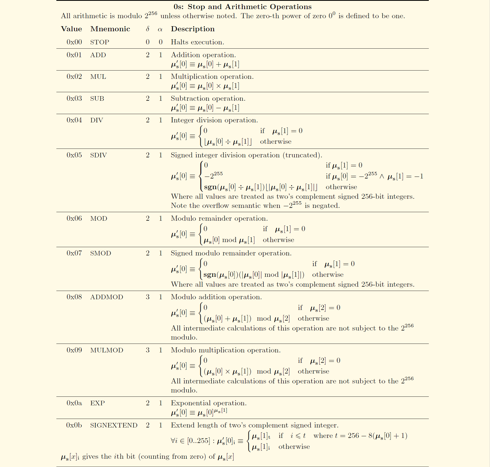
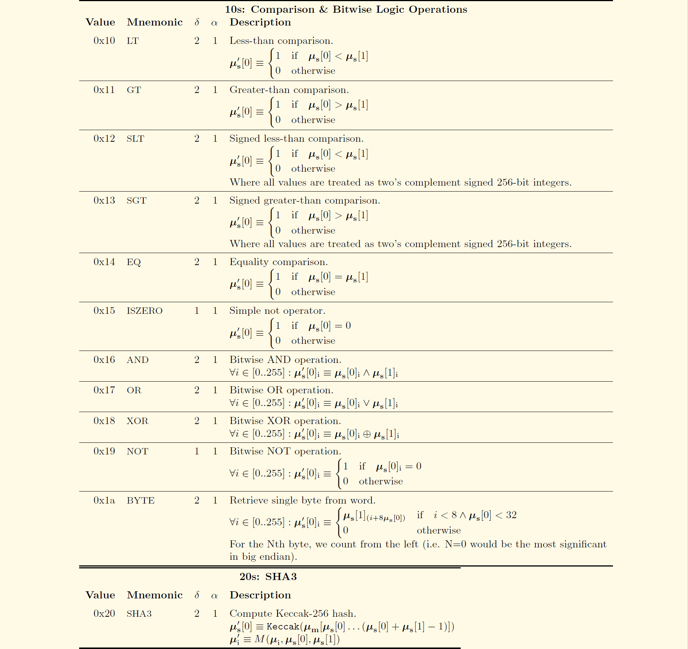
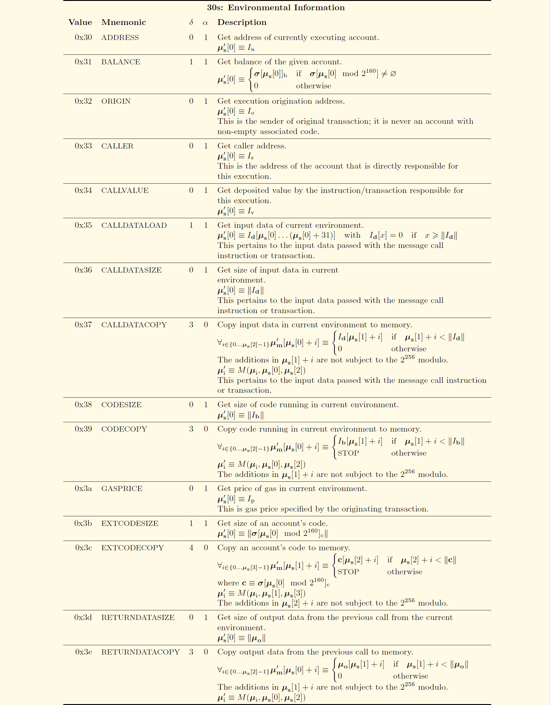
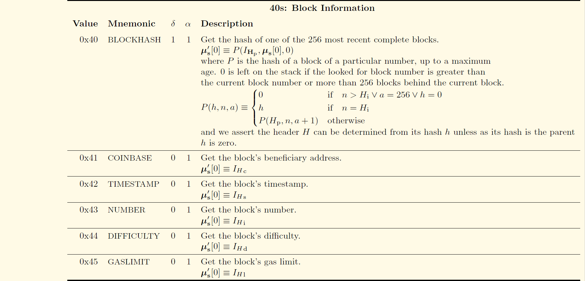
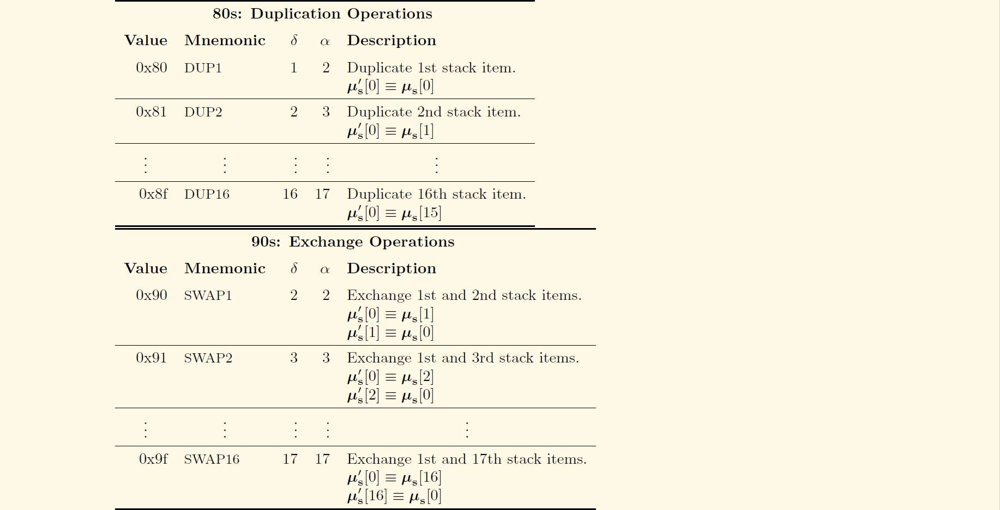
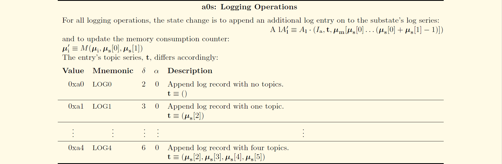
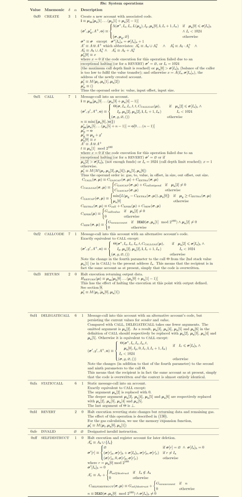

# 以太坊虚拟机

以太坊虚拟机（Ethereum Virtual Machine, EVM）是Account相关的EVM Code执行的关键部分。

## 指令集

详见[以太坊黄皮书](https://ethereum.github.io/yellowpaper/paper.pdf)Appendix H.2. Instruction Set。











## EVM的汇编代码

合约`C`有状态变量和构造器：

```solidity
pragma solidity ^0.4.21;

contract C {
    uint256 cbd;
    function C() public{
        cbd = 109;
    }
}
```

使用`solc`编译合约`C`：

```solc
======= c1.sol:C =======
EVM assembly:
... */ "c1.sol":28:114  contract C {
  mstore(0x40, 0x60)
... */ "c1.sol":64:111  function C() public{
  jumpi(tag_1, iszero(callvalue))
  0x0
  dup1
  revert
tag_1:
    /* "c1.sol":100:103  109 */
  0x6d
    /* "c1.sol":94:97  cbd */
  0x0
    /* "c1.sol":94:103  cbd = 109 */
  dup2
  swap1
  sstore
  pop
... */ "c1.sol":28:114  contract C {
  dataSize(sub_0)
  dup1
  dataOffset(sub_0)
  0x0
  codecopy
  0x0
  return
stop

sub_0: assembly {
... */  /* "c1.sol":28:114  contract C {
      mstore(0x40, 0x60)
      0x0
      dup1
      revert

    auxdata: 0xa165627a7a723058204c4b7cb2d6601994bbe06eeb297368f48ca11be35e15fe1
d8e5aca29313706070029
}

Binary:
60606040523415600e57600080fd5b606d60008190555060358060236000396000f3006060604052600080fd00a165627a7a723058204c4b7cb2d6601994bbe06eeb297368f48ca11be35e15fe1d8e5aca29313706070029
```

其中，`Binary`是EVM运行时的字节码。变量赋值`cbd = 109;`由字节码`606d600081905550`表示，缩进到标签`tag_1`下：

```solc
tag_1:
    /* 60 6d */
  0x6d
    /* 60 00 */
  0x0
    /* 81 */
  dup2
    /* 90 */
  swap1
    /* 55 */
  sstore
    /* 50 */
  pop
```

在汇编代码中，`0x0`是`PUSH(0x0)`的简写，即将数值0压栈。

模拟EVM执行字节序列，同时打印每条指令执行后的机器状态得到：

```solc
    /* 60 6d：压栈6d */
  0x6d
    stack: [0x6d]
    store: {}
    
    /* 60 00：压栈0 */
  0x0
    stack: [0x0 0x6d]
    store: {}
    
    /* 81：复制栈中的第2项 */
  dup2
    stack: [0x6d 0x0 0x6d]
    store: {}
    
    /* 90：交换栈中的第1和2项 */
  swap1
    stack: [0x0 0x6d 0x6d]
    store: {}
    
    /* 55：存储数值 */
  sstore
    stack: [0x6d]
    store: {0x0=>0x6d}
    
    /* 50：出栈 */
  pop
    stack: []
    store: {0x0=>0x6d}
```

#### 存疑❓

```diff
- 在汇编语言中，状态变量cbd的名称是如何存储的？
- auxdata里存储的是什么？
```

## :warning: TODO

```go
github.com/ethereum/go-ethereum/core/state/state_object.go/github.com/ethereum/go-ethereum/core/state.(*stateObject).Address() line 338
github.com/ethereum/go-ethereum/core/state/statedb.go/github.com/ethereum/go-ethereum/core/state.(*StateDB).MarkStateObjectDirty() line 440
github.com/ethereum/go-ethereum/core/state/statedb.go/github.com/ethereum/go-ethereum/core/state.(*StateDB).setStateObject() line 423
github.com/ethereum/go-ethereum/core/state/state_object.go/github.com/ethereum/go-ethereum/core/state.(*stateObject).Address() line 338
github.com/ethereum/go-ethereum/core/state/statedb.go/github.com/ethereum/go-ethereum/core/state.(*StateDB).SetCode() line 334
github.com/ethereum/go-ethereum/core/state/statedb.go/github.com/ethereum/go-ethereum/core/state.(*StateDB).GetOrNewStateObject() line 429
github.com/ethereum/go-ethereum/core/state/statedb.go/github.com/ethereum/go-ethereum/core/state.(*StateDB).getStateObject() line 396
github.com/ethereum/go-ethereum/crypto/crypto.go/github.com/ethereum/go-ethereum/crypto.Keccak256Hash() line 54
github.com/ethereum/go-ethereum/crypto/sha3/hashes.go/github.com/ethereum/go-ethereum/crypto/sha3.NewKeccak256() line 17
github.com/ethereum/go-ethereum/crypto/sha3/sha3.go/github.com/ethereum/go-ethereum/crypto/sha3.(*state).Write() line 134
github.com/ethereum/go-ethereum/crypto/sha3/sha3.go/github.com/ethereum/go-ethereum/crypto/sha3.(*state).Sum() line 196
github.com/ethereum/go-ethereum/crypto/sha3/sha3.go/github.com/ethereum/go-ethereum/crypto/sha3.(*state).clone() line 72
github.com/ethereum/go-ethereum/crypto/sha3/sha3.go/github.com/ethereum/go-ethereum/crypto/sha3.(*state).Read() line 170
github.com/ethereum/go-ethereum/crypto/sha3/sha3.go/github.com/ethereum/go-ethereum/crypto/sha3.(*state).padAndPermute() line 106
github.com/ethereum/go-ethereum/crypto/sha3/sha3.go/github.com/ethereum/go-ethereum/crypto/sha3.(*state).permute() line 86
github.com/ethereum/go-ethereum/crypto/sha3/xor_unaligned.go/github.com/ethereum/go-ethereum/crypto/sha3.xorInUnaligned() line 15
github.com/ethereum/go-ethereum/crypto/sha3/xor_unaligned.go/github.com/ethereum/go-ethereum/crypto/sha3.copyOutUnaligned() line 51
github.com/ethereum/go-ethereum/core/state/state_object.go/github.com/ethereum/go-ethereum/core/state.(*stateObject).SetCode() line 360
github.com/ethereum/go-ethereum/core/state/state_object.go/github.com/ethereum/go-ethereum/core/state.(*stateObject).Code() line 344
github.com/ethereum/go-ethereum/core/state/state_object.go/github.com/ethereum/go-ethereum/core/state.(*stateObject).CodeHash() line 400
github.com/ethereum/go-ethereum/core/state/state_object.go/github.com/ethereum/go-ethereum/core/state.(*stateObject).CodeHash() line 400
github.com/ethereum/go-ethereum/core/state/state_object.go/github.com/ethereum/go-ethereum/core/state.(*stateObject).setCode() line 371
github.com/ethereum/go-ethereum/common/types.go/github.com/ethereum/go-ethereum/common.StringToAddress() line 169
github.com/ethereum/go-ethereum/common/types.go/github.com/ethereum/go-ethereum/common.BytesToAddress() line 164
github.com/ethereum/go-ethereum/common/types.go/github.com/ethereum/go-ethereum/common.(*Address).SetBytes() line 234
github.com/ethereum/go-ethereum/core/vm/evm.go/github.com/ethereum/go-ethereum/core/vm.(*EVM).Call() line 144
github.com/ethereum/go-ethereum/core/vm/contract.go/github.com/ethereum/go-ethereum/core/vm.AccountRef.Address() line 42
github.com/ethereum/go-ethereum/core/evm.go/github.com/ethereum/go-ethereum/core.CanTransfer() line 93
github.com/ethereum/go-ethereum/core/state/statedb.go/github.com/ethereum/go-ethereum/core/state.(*StateDB).GetBalance() line 207
github.com/ethereum/go-ethereum/core/state/statedb.go/github.com/ethereum/go-ethereum/core/state.(*StateDB).getStateObject() line 396
github.com/ethereum/go-ethereum/trie/secure_trie.go/github.com/ethereum/go-ethereum/trie.(*SecureTrie).TryGet() line 79
github.com/ethereum/go-ethereum/trie/secure_trie.go/github.com/ethereum/go-ethereum/trie.(*SecureTrie).hashKey() line 180
github.com/ethereum/go-ethereum/trie/hasher.go/github.com/ethereum/go-ethereum/trie.newHasher() line 46
github.com/ethereum/go-ethereum/crypto/sha3/hashes.go/github.com/ethereum/go-ethereum/crypto/sha3.NewKeccak256() line 17
github.com/ethereum/go-ethereum/crypto/sha3/sha3.go/github.com/ethereum/go-ethereum/crypto/sha3.(*state).Reset() line 62
github.com/ethereum/go-ethereum/crypto/sha3/sha3.go/github.com/ethereum/go-ethereum/crypto/sha3.(*state).Write() line 134
github.com/ethereum/go-ethereum/crypto/sha3/sha3.go/github.com/ethereum/go-ethereum/crypto/sha3.(*state).Sum() line 196
github.com/ethereum/go-ethereum/crypto/sha3/sha3.go/github.com/ethereum/go-ethereum/crypto/sha3.(*state).clone() line 72
github.com/ethereum/go-ethereum/crypto/sha3/sha3.go/github.com/ethereum/go-ethereum/crypto/sha3.(*state).Read() line 170
github.com/ethereum/go-ethereum/crypto/sha3/sha3.go/github.com/ethereum/go-ethereum/crypto/sha3.(*state).padAndPermute() line 106
github.com/ethereum/go-ethereum/crypto/sha3/sha3.go/github.com/ethereum/go-ethereum/crypto/sha3.(*state).permute() line 86
github.com/ethereum/go-ethereum/crypto/sha3/xor_unaligned.go/github.com/ethereum/go-ethereum/crypto/sha3.xorInUnaligned() line 15
github.com/ethereum/go-ethereum/crypto/sha3/xor_unaligned.go/github.com/ethereum/go-ethereum/crypto/sha3.copyOutUnaligned() line 51
github.com/ethereum/go-ethereum/trie/hasher.go/github.com/ethereum/go-ethereum/trie.returnHasherToPool() line 53
github.com/ethereum/go-ethereum/trie/trie.go/github.com/ethereum/go-ethereum/trie.(*Trie).TryGet() line 141
github.com/ethereum/go-ethereum/trie/encoding.go/github.com/ethereum/go-ethereum/trie.keybytesToHex() line 71
github.com/ethereum/go-ethereum/trie/trie.go/github.com/ethereum/go-ethereum/trie.(*Trie).tryGet() line 151
github.com/ethereum/go-ethereum/core/state/statedb.go/github.com/ethereum/go-ethereum/core/state.(*StateDB).setError() line 109
github.com/ethereum/go-ethereum/core/state/statedb.go/github.com/ethereum/go-ethereum/core/state.(*StateDB).Snapshot() line 535
github.com/ethereum/go-ethereum/core/state/statedb.go/github.com/ethereum/go-ethereum/core/state.(*StateDB).Exist() line 193
github.com/ethereum/go-ethereum/core/state/statedb.go/github.com/ethereum/go-ethereum/core/state.(*StateDB).getStateObject() line 396
github.com/ethereum/go-ethereum/core/vm/contract.go/github.com/ethereum/go-ethereum/core/vm.AccountRef.Address() line 42
github.com/ethereum/go-ethereum/core/vm/contract.go/github.com/ethereum/go-ethereum/core/vm.AccountRef.Address() line 42
github.com/ethereum/go-ethereum/core/evm.go/github.com/ethereum/go-ethereum/core.Transfer() line 99
github.com/ethereum/go-ethereum/core/state/statedb.go/github.com/ethereum/go-ethereum/core/state.(*StateDB).SubBalance() line 310
github.com/ethereum/go-ethereum/core/state/statedb.go/github.com/ethereum/go-ethereum/core/state.(*StateDB).GetOrNewStateObject() line 429
github.com/ethereum/go-ethereum/core/state/statedb.go/github.com/ethereum/go-ethereum/core/state.(*StateDB).getStateObject() line 396
github.com/ethereum/go-ethereum/trie/secure_trie.go/github.com/ethereum/go-ethereum/trie.(*SecureTrie).TryGet() line 79
github.com/ethereum/go-ethereum/trie/secure_trie.go/github.com/ethereum/go-ethereum/trie.(*SecureTrie).hashKey() line 180
github.com/ethereum/go-ethereum/trie/hasher.go/github.com/ethereum/go-ethereum/trie.newHasher() line 46
github.com/ethereum/go-ethereum/crypto/sha3/sha3.go/github.com/ethereum/go-ethereum/crypto/sha3.(*state).Reset() line 62
github.com/ethereum/go-ethereum/crypto/sha3/sha3.go/github.com/ethereum/go-ethereum/crypto/sha3.(*state).Write() line 134
github.com/ethereum/go-ethereum/crypto/sha3/sha3.go/github.com/ethereum/go-ethereum/crypto/sha3.(*state).Sum() line 196
github.com/ethereum/go-ethereum/crypto/sha3/sha3.go/github.com/ethereum/go-ethereum/crypto/sha3.(*state).clone() line 72
github.com/ethereum/go-ethereum/crypto/sha3/sha3.go/github.com/ethereum/go-ethereum/crypto/sha3.(*state).Read() line 170
github.com/ethereum/go-ethereum/crypto/sha3/sha3.go/github.com/ethereum/go-ethereum/crypto/sha3.(*state).padAndPermute() line 106
github.com/ethereum/go-ethereum/crypto/sha3/sha3.go/github.com/ethereum/go-ethereum/crypto/sha3.(*state).permute() line 86
github.com/ethereum/go-ethereum/crypto/sha3/xor_unaligned.go/github.com/ethereum/go-ethereum/crypto/sha3.xorInUnaligned() line 15
github.com/ethereum/go-ethereum/crypto/sha3/xor_unaligned.go/github.com/ethereum/go-ethereum/crypto/sha3.copyOutUnaligned() line 51
github.com/ethereum/go-ethereum/trie/hasher.go/github.com/ethereum/go-ethereum/trie.returnHasherToPool() line 53
github.com/ethereum/go-ethereum/trie/trie.go/github.com/ethereum/go-ethereum/trie.(*Trie).TryGet() line 141
github.com/ethereum/go-ethereum/trie/encoding.go/github.com/ethereum/go-ethereum/trie.keybytesToHex() line 71
github.com/ethereum/go-ethereum/trie/trie.go/github.com/ethereum/go-ethereum/trie.(*Trie).tryGet() line 151
github.com/ethereum/go-ethereum/core/state/statedb.go/github.com/ethereum/go-ethereum/core/state.(*StateDB).setError() line 109
github.com/ethereum/go-ethereum/core/state/statedb.go/github.com/ethereum/go-ethereum/core/state.(*StateDB).createObject() line 447
github.com/ethereum/go-ethereum/core/state/statedb.go/github.com/ethereum/go-ethereum/core/state.(*StateDB).getStateObject() line 396
github.com/ethereum/go-ethereum/trie/secure_trie.go/github.com/ethereum/go-ethereum/trie.(*SecureTrie).TryGet() line 79
github.com/ethereum/go-ethereum/trie/secure_trie.go/github.com/ethereum/go-ethereum/trie.(*SecureTrie).hashKey() line 180
github.com/ethereum/go-ethereum/trie/hasher.go/github.com/ethereum/go-ethereum/trie.newHasher() line 46
github.com/ethereum/go-ethereum/crypto/sha3/sha3.go/github.com/ethereum/go-ethereum/crypto/sha3.(*state).Reset() line 62
github.com/ethereum/go-ethereum/crypto/sha3/sha3.go/github.com/ethereum/go-ethereum/crypto/sha3.(*state).Write() line 134
github.com/ethereum/go-ethereum/crypto/sha3/sha3.go/github.com/ethereum/go-ethereum/crypto/sha3.(*state).Sum() line 196
github.com/ethereum/go-ethereum/crypto/sha3/sha3.go/github.com/ethereum/go-ethereum/crypto/sha3.(*state).clone() line 72
github.com/ethereum/go-ethereum/crypto/sha3/sha3.go/github.com/ethereum/go-ethereum/crypto/sha3.(*state).Read() line 170
github.com/ethereum/go-ethereum/crypto/sha3/sha3.go/github.com/ethereum/go-ethereum/crypto/sha3.(*state).padAndPermute() line 106
github.com/ethereum/go-ethereum/crypto/sha3/sha3.go/github.com/ethereum/go-ethereum/crypto/sha3.(*state).permute() line 86
github.com/ethereum/go-ethereum/crypto/sha3/xor_unaligned.go/github.com/ethereum/go-ethereum/crypto/sha3.xorInUnaligned() line 15
github.com/ethereum/go-ethereum/crypto/sha3/xor_unaligned.go/github.com/ethereum/go-ethereum/crypto/sha3.copyOutUnaligned() line 51
github.com/ethereum/go-ethereum/trie/hasher.go/github.com/ethereum/go-ethereum/trie.returnHasherToPool() line 53
github.com/ethereum/go-ethereum/trie/trie.go/github.com/ethereum/go-ethereum/trie.(*Trie).TryGet() line 141
github.com/ethereum/go-ethereum/trie/encoding.go/github.com/ethereum/go-ethereum/trie.keybytesToHex() line 71
github.com/ethereum/go-ethereum/trie/trie.go/github.com/ethereum/go-ethereum/trie.(*Trie).tryGet() line 151
github.com/ethereum/go-ethereum/core/state/statedb.go/github.com/ethereum/go-ethereum/core/state.(*StateDB).setError() line 109
github.com/ethereum/go-ethereum/core/state/state_object.go/github.com/ethereum/go-ethereum/core/state.newObject() line 115
github.com/ethereum/go-ethereum/crypto/crypto.go/github.com/ethereum/go-ethereum/crypto.Keccak256Hash() line 54
github.com/ethereum/go-ethereum/crypto/sha3/hashes.go/github.com/ethereum/go-ethereum/crypto/sha3.NewKeccak256() line 17
github.com/ethereum/go-ethereum/crypto/sha3/sha3.go/github.com/ethereum/go-ethereum/crypto/sha3.(*state).Write() line 134
github.com/ethereum/go-ethereum/crypto/sha3/sha3.go/github.com/ethereum/go-ethereum/crypto/sha3.(*state).Sum() line 196
github.com/ethereum/go-ethereum/crypto/sha3/sha3.go/github.com/ethereum/go-ethereum/crypto/sha3.(*state).clone() line 72
github.com/ethereum/go-ethereum/crypto/sha3/sha3.go/github.com/ethereum/go-ethereum/crypto/sha3.(*state).Read() line 170
github.com/ethereum/go-ethereum/crypto/sha3/sha3.go/github.com/ethereum/go-ethereum/crypto/sha3.(*state).padAndPermute() line 106
github.com/ethereum/go-ethereum/crypto/sha3/sha3.go/github.com/ethereum/go-ethereum/crypto/sha3.(*state).permute() line 86
github.com/ethereum/go-ethereum/crypto/sha3/xor_unaligned.go/github.com/ethereum/go-ethereum/crypto/sha3.xorInUnaligned() line 15
github.com/ethereum/go-ethereum/crypto/sha3/xor_unaligned.go/github.com/ethereum/go-ethereum/crypto/sha3.copyOutUnaligned() line 51
github.com/ethereum/go-ethereum/core/state/state_object.go/github.com/ethereum/go-ethereum/core/state.(*stateObject).setNonce() line 391
github.com/ethereum/go-ethereum/core/state/state_object.go/github.com/ethereum/go-ethereum/core/state.(*stateObject).Address() line 338
github.com/ethereum/go-ethereum/core/state/statedb.go/github.com/ethereum/go-ethereum/core/state.(*StateDB).MarkStateObjectDirty() line 440
github.com/ethereum/go-ethereum/core/state/statedb.go/github.com/ethereum/go-ethereum/core/state.(*StateDB).setStateObject() line 423
github.com/ethereum/go-ethereum/core/state/state_object.go/github.com/ethereum/go-ethereum/core/state.(*stateObject).Address() line 338
github.com/ethereum/go-ethereum/core/state/state_object.go/github.com/ethereum/go-ethereum/core/state.(*stateObject).SubBalance() line 289
github.com/ethereum/go-ethereum/core/state/statedb.go/github.com/ethereum/go-ethereum/core/state.(*StateDB).AddBalance() line 301
github.com/ethereum/go-ethereum/core/state/statedb.go/github.com/ethereum/go-ethereum/core/state.(*StateDB).GetOrNewStateObject() line 429
github.com/ethereum/go-ethereum/core/state/statedb.go/github.com/ethereum/go-ethereum/core/state.(*StateDB).getStateObject() line 396
github.com/ethereum/go-ethereum/core/state/state_object.go/github.com/ethereum/go-ethereum/core/state.(*stateObject).AddBalance() line 273
github.com/ethereum/go-ethereum/core/state/state_object.go/github.com/ethereum/go-ethereum/core/state.(*stateObject).empty() line 100
github.com/ethereum/go-ethereum/core/vm/contract.go/github.com/ethereum/go-ethereum/core/vm.NewContract() line 73
github.com/ethereum/go-ethereum/core/vm/contract.go/github.com/ethereum/go-ethereum/core/vm.AccountRef.Address() line 42
github.com/ethereum/go-ethereum/core/state/statedb.go/github.com/ethereum/go-ethereum/core/state.(*StateDB).GetCodeHash() line 251
github.com/ethereum/go-ethereum/core/state/statedb.go/github.com/ethereum/go-ethereum/core/state.(*StateDB).getStateObject() line 396
github.com/ethereum/go-ethereum/core/state/state_object.go/github.com/ethereum/go-ethereum/core/state.(*stateObject).CodeHash() line 400
github.com/ethereum/go-ethereum/common/types.go/github.com/ethereum/go-ethereum/common.BytesToHash() line 45
github.com/ethereum/go-ethereum/common/types.go/github.com/ethereum/go-ethereum/common.(*Hash).SetBytes() line 108
github.com/ethereum/go-ethereum/core/state/statedb.go/github.com/ethereum/go-ethereum/core/state.(*StateDB).GetCode() line 226
github.com/ethereum/go-ethereum/core/state/statedb.go/github.com/ethereum/go-ethereum/core/state.(*StateDB).getStateObject() line 396
github.com/ethereum/go-ethereum/core/state/state_object.go/github.com/ethereum/go-ethereum/core/state.(*stateObject).Code() line 344
github.com/ethereum/go-ethereum/core/vm/contract.go/github.com/ethereum/go-ethereum/core/vm.(*Contract).SetCallCode() line 163
github.com/ethereum/go-ethereum/core/vm/evm.go/github.com/ethereum/go-ethereum/core/vm.run() line 44
github.com/ethereum/go-ethereum/core/vm/evm.go/github.com/ethereum/go-ethereum/core/vm.(*EVM).ChainConfig() line 404
github.com/ethereum/go-ethereum/params/config.go/github.com/ethereum/go-ethereum/params.(*ChainConfig).IsByzantium() line 202
github.com/ethereum/go-ethereum/params/config.go/github.com/ethereum/go-ethereum/params.isForked() line 289
github.com/ethereum/go-ethereum/core/vm/interpreter.go/github.com/ethereum/go-ethereum/core/vm.(*Interpreter).Run() line 110
github.com/ethereum/go-ethereum/core/vm/memory.go/github.com/ethereum/go-ethereum/core/vm.NewMemory() line 31
github.com/ethereum/go-ethereum/core/vm/stack.go/github.com/ethereum/go-ethereum/core/vm.newstack() line 33
github.com/ethereum/go-ethereum/core/vm/contract.go/github.com/ethereum/go-ethereum/core/vm.(*Contract).GetOp() line 108
github.com/ethereum/go-ethereum/core/vm/contract.go/github.com/ethereum/go-ethereum/core/vm.(*Contract).GetByte() line 114
github.com/ethereum/go-ethereum/core/vm/stack.go/github.com/ethereum/go-ethereum/core/vm.(*Stack).require() line 88
github.com/ethereum/go-ethereum/core/vm/stack.go/github.com/ethereum/go-ethereum/core/vm.(*Stack).len() line 62
github.com/ethereum/go-ethereum/core/vm/stack.go/github.com/ethereum/go-ethereum/core/vm.(*Stack).len() line 62
github.com/ethereum/go-ethereum/core/vm/interpreter.go/github.com/ethereum/go-ethereum/core/vm.(*Interpreter).enforceRestrictions() line 87
github.com/ethereum/go-ethereum/core/vm/gas_table.go/github.com/ethereum/go-ethereum/core/vm.gasPush() line 477
github.com/ethereum/go-ethereum/core/vm/contract.go/github.com/ethereum/go-ethereum/core/vm.(*Contract).UseGas() line 133
github.com/ethereum/go-ethereum/core/vm/intpool.go/github.com/ethereum/go-ethereum/core/vm.(*intPool).get() line 42
github.com/ethereum/go-ethereum/core/vm/stack.go/github.com/ethereum/go-ethereum/core/vm.(*Stack).len() line 62
github.com/ethereum/go-ethereum/common/bytes.go/github.com/ethereum/go-ethereum/common.RightPadBytes() line 104
github.com/ethereum/go-ethereum/core/vm/stack.go/github.com/ethereum/go-ethereum/core/vm.(*Stack).push() line 43
github.com/ethereum/go-ethereum/core/vm/contract.go/github.com/ethereum/go-ethereum/core/vm.(*Contract).GetOp() line 108
github.com/ethereum/go-ethereum/core/vm/contract.go/github.com/ethereum/go-ethereum/core/vm.(*Contract).GetByte() line 114
github.com/ethereum/go-ethereum/core/vm/stack.go/github.com/ethereum/go-ethereum/core/vm.(*Stack).require() line 88
github.com/ethereum/go-ethereum/core/vm/stack.go/github.com/ethereum/go-ethereum/core/vm.(*Stack).len() line 62
github.com/ethereum/go-ethereum/core/vm/stack.go/github.com/ethereum/go-ethereum/core/vm.(*Stack).len() line 62
github.com/ethereum/go-ethereum/core/vm/interpreter.go/github.com/ethereum/go-ethereum/core/vm.(*Interpreter).enforceRestrictions() line 87
github.com/ethereum/go-ethereum/core/vm/gas_table.go/github.com/ethereum/go-ethereum/core/vm.gasPush() line 477
github.com/ethereum/go-ethereum/core/vm/contract.go/github.com/ethereum/go-ethereum/core/vm.(*Contract).UseGas() line 133
github.com/ethereum/go-ethereum/core/vm/intpool.go/github.com/ethereum/go-ethereum/core/vm.(*intPool).get() line 42
github.com/ethereum/go-ethereum/core/vm/stack.go/github.com/ethereum/go-ethereum/core/vm.(*Stack).len() line 62
github.com/ethereum/go-ethereum/common/bytes.go/github.com/ethereum/go-ethereum/common.RightPadBytes() line 104
github.com/ethereum/go-ethereum/core/vm/stack.go/github.com/ethereum/go-ethereum/core/vm.(*Stack).push() line 43
github.com/ethereum/go-ethereum/core/vm/contract.go/github.com/ethereum/go-ethereum/core/vm.(*Contract).GetOp() line 108
github.com/ethereum/go-ethereum/core/vm/contract.go/github.com/ethereum/go-ethereum/core/vm.(*Contract).GetByte() line 114
github.com/ethereum/go-ethereum/core/vm/stack.go/github.com/ethereum/go-ethereum/core/vm.(*Stack).require() line 88
github.com/ethereum/go-ethereum/core/vm/stack.go/github.com/ethereum/go-ethereum/core/vm.(*Stack).len() line 62
github.com/ethereum/go-ethereum/core/vm/stack.go/github.com/ethereum/go-ethereum/core/vm.(*Stack).len() line 62
github.com/ethereum/go-ethereum/core/vm/interpreter.go/github.com/ethereum/go-ethereum/core/vm.(*Interpreter).enforceRestrictions() line 87
github.com/ethereum/go-ethereum/core/vm/memory_table.go/github.com/ethereum/go-ethereum/core/vm.memoryMStore() line 62
github.com/ethereum/go-ethereum/core/vm/stack.go/github.com/ethereum/go-ethereum/core/vm.(*Stack).Back() line 83
github.com/ethereum/go-ethereum/core/vm/stack.go/github.com/ethereum/go-ethereum/core/vm.(*Stack).len() line 62
github.com/ethereum/go-ethereum/core/vm/common.go/github.com/ethereum/go-ethereum/core/vm.calcMemSize() line 29
github.com/ethereum/go-ethereum/core/vm/common.go/github.com/ethereum/go-ethereum/core/vm.bigUint64() line 66
github.com/ethereum/go-ethereum/core/vm/common.go/github.com/ethereum/go-ethereum/core/vm.toWordSize() line 72
github.com/ethereum/go-ethereum/common/math/integer.go/github.com/ethereum/go-ethereum/common/math.SafeMul() line 95
github.com/ethereum/go-ethereum/core/vm/gas_table.go/github.com/ethereum/go-ethereum/core/vm.gasMStore() line 281
github.com/ethereum/go-ethereum/core/vm/gas_table.go/github.com/ethereum/go-ethereum/core/vm.memoryGasCost() line 29
github.com/ethereum/go-ethereum/core/vm/common.go/github.com/ethereum/go-ethereum/core/vm.toWordSize() line 72
github.com/ethereum/go-ethereum/core/vm/memory.go/github.com/ethereum/go-ethereum/core/vm.(*Memory).Len() line 92
github.com/ethereum/go-ethereum/common/math/integer.go/github.com/ethereum/go-ethereum/common/math.SafeAdd() line 90
github.com/ethereum/go-ethereum/core/vm/contract.go/github.com/ethereum/go-ethereum/core/vm.(*Contract).UseGas() line 133
github.com/ethereum/go-ethereum/core/vm/memory.go/github.com/ethereum/go-ethereum/core/vm.(*Memory).Resize() line 53
github.com/ethereum/go-ethereum/core/vm/memory.go/github.com/ethereum/go-ethereum/core/vm.(*Memory).Len() line 92
github.com/ethereum/go-ethereum/core/vm/memory.go/github.com/ethereum/go-ethereum/core/vm.(*Memory).Len() line 92
github.com/ethereum/go-ethereum/core/vm/instructions.go/github.com/ethereum/go-ethereum/core/vm.opMstore() line 608
github.com/ethereum/go-ethereum/core/vm/stack.go/github.com/ethereum/go-ethereum/core/vm.(*Stack).pop() line 55
github.com/ethereum/go-ethereum/core/vm/stack.go/github.com/ethereum/go-ethereum/core/vm.(*Stack).pop() line 55
github.com/ethereum/go-ethereum/common/math/big.go/github.com/ethereum/go-ethereum/common/math.PaddedBigBytes() line 134
github.com/ethereum/go-ethereum/common/math/big.go/github.com/ethereum/go-ethereum/common/math.ReadBits() line 176
github.com/ethereum/go-ethereum/core/vm/memory.go/github.com/ethereum/go-ethereum/core/vm.(*Memory).Set() line 37
github.com/ethereum/go-ethereum/core/vm/intpool.go/github.com/ethereum/go-ethereum/core/vm.(*intPool).put() line 62
github.com/ethereum/go-ethereum/core/vm/stack.go/github.com/ethereum/go-ethereum/core/vm.(*Stack).push() line 43
github.com/ethereum/go-ethereum/core/vm/stack.go/github.com/ethereum/go-ethereum/core/vm.(*Stack).push() line 43
github.com/ethereum/go-ethereum/core/vm/contract.go/github.com/ethereum/go-ethereum/core/vm.(*Contract).GetOp() line 108
github.com/ethereum/go-ethereum/core/vm/contract.go/github.com/ethereum/go-ethereum/core/vm.(*Contract).GetByte() line 114
github.com/ethereum/go-ethereum/core/vm/stack.go/github.com/ethereum/go-ethereum/core/vm.(*Stack).require() line 88
github.com/ethereum/go-ethereum/core/vm/stack.go/github.com/ethereum/go-ethereum/core/vm.(*Stack).len() line 62
github.com/ethereum/go-ethereum/core/vm/stack.go/github.com/ethereum/go-ethereum/core/vm.(*Stack).len() line 62
github.com/ethereum/go-ethereum/core/vm/interpreter.go/github.com/ethereum/go-ethereum/core/vm.(*Interpreter).enforceRestrictions() line 87
github.com/ethereum/go-ethereum/core/vm/gas_table.go/github.com/ethereum/go-ethereum/core/vm.gasPush() line 477
github.com/ethereum/go-ethereum/core/vm/contract.go/github.com/ethereum/go-ethereum/core/vm.(*Contract).UseGas() line 133
github.com/ethereum/go-ethereum/core/vm/intpool.go/github.com/ethereum/go-ethereum/core/vm.(*intPool).get() line 42
github.com/ethereum/go-ethereum/core/vm/stack.go/github.com/ethereum/go-ethereum/core/vm.(*Stack).len() line 62
github.com/ethereum/go-ethereum/core/vm/stack.go/github.com/ethereum/go-ethereum/core/vm.(*Stack).pop() line 55
github.com/ethereum/go-ethereum/common/bytes.go/github.com/ethereum/go-ethereum/common.RightPadBytes() line 104
github.com/ethereum/go-ethereum/core/vm/stack.go/github.com/ethereum/go-ethereum/core/vm.(*Stack).push() line 43
github.com/ethereum/go-ethereum/core/vm/contract.go/github.com/ethereum/go-ethereum/core/vm.(*Contract).GetOp() line 108
github.com/ethereum/go-ethereum/core/vm/contract.go/github.com/ethereum/go-ethereum/core/vm.(*Contract).GetByte() line 114
github.com/ethereum/go-ethereum/core/vm/stack.go/github.com/ethereum/go-ethereum/core/vm.(*Stack).require() line 88
github.com/ethereum/go-ethereum/core/vm/stack.go/github.com/ethereum/go-ethereum/core/vm.(*Stack).len() line 62
github.com/ethereum/go-ethereum/core/vm/stack.go/github.com/ethereum/go-ethereum/core/vm.(*Stack).len() line 62
github.com/ethereum/go-ethereum/core/vm/interpreter.go/github.com/ethereum/go-ethereum/core/vm.(*Interpreter).enforceRestrictions() line 87
github.com/ethereum/go-ethereum/core/vm/gas_table.go/github.com/ethereum/go-ethereum/core/vm.gasDup() line 487
github.com/ethereum/go-ethereum/core/vm/contract.go/github.com/ethereum/go-ethereum/core/vm.(*Contract).UseGas() line 133
github.com/ethereum/go-ethereum/core/vm/stack.go/github.com/ethereum/go-ethereum/core/vm.(*Stack).dup() line 72
github.com/ethereum/go-ethereum/core/vm/intpool.go/github.com/ethereum/go-ethereum/core/vm.(*intPool).get() line 42
github.com/ethereum/go-ethereum/core/vm/stack.go/github.com/ethereum/go-ethereum/core/vm.(*Stack).len() line 62
github.com/ethereum/go-ethereum/core/vm/stack.go/github.com/ethereum/go-ethereum/core/vm.(*Stack).pop() line 55
github.com/ethereum/go-ethereum/core/vm/stack.go/github.com/ethereum/go-ethereum/core/vm.(*Stack).len() line 62
github.com/ethereum/go-ethereum/core/vm/stack.go/github.com/ethereum/go-ethereum/core/vm.(*Stack).push() line 43
github.com/ethereum/go-ethereum/core/vm/contract.go/github.com/ethereum/go-ethereum/core/vm.(*Contract).GetOp() line 108
github.com/ethereum/go-ethereum/core/vm/contract.go/github.com/ethereum/go-ethereum/core/vm.(*Contract).GetByte() line 114
github.com/ethereum/go-ethereum/core/vm/stack.go/github.com/ethereum/go-ethereum/core/vm.(*Stack).require() line 88
github.com/ethereum/go-ethereum/core/vm/stack.go/github.com/ethereum/go-ethereum/core/vm.(*Stack).len() line 62
github.com/ethereum/go-ethereum/core/vm/stack.go/github.com/ethereum/go-ethereum/core/vm.(*Stack).len() line 62
github.com/ethereum/go-ethereum/core/vm/interpreter.go/github.com/ethereum/go-ethereum/core/vm.(*Interpreter).enforceRestrictions() line 87
github.com/ethereum/go-ethereum/core/vm/gas_table.go/github.com/ethereum/go-ethereum/core/vm.gasPush() line 477
github.com/ethereum/go-ethereum/core/vm/contract.go/github.com/ethereum/go-ethereum/core/vm.(*Contract).UseGas() line 133
github.com/ethereum/go-ethereum/core/vm/intpool.go/github.com/ethereum/go-ethereum/core/vm.(*intPool).get() line 42
github.com/ethereum/go-ethereum/core/vm/stack.go/github.com/ethereum/go-ethereum/core/vm.(*Stack).len() line 62
github.com/ethereum/go-ethereum/common/bytes.go/github.com/ethereum/go-ethereum/common.RightPadBytes() line 104
github.com/ethereum/go-ethereum/core/vm/stack.go/github.com/ethereum/go-ethereum/core/vm.(*Stack).push() line 43
github.com/ethereum/go-ethereum/core/vm/contract.go/github.com/ethereum/go-ethereum/core/vm.(*Contract).GetOp() line 108
github.com/ethereum/go-ethereum/core/vm/contract.go/github.com/ethereum/go-ethereum/core/vm.(*Contract).GetByte() line 114
github.com/ethereum/go-ethereum/core/vm/stack.go/github.com/ethereum/go-ethereum/core/vm.(*Stack).require() line 88
github.com/ethereum/go-ethereum/core/vm/stack.go/github.com/ethereum/go-ethereum/core/vm.(*Stack).len() line 62
github.com/ethereum/go-ethereum/core/vm/stack.go/github.com/ethereum/go-ethereum/core/vm.(*Stack).len() line 62
github.com/ethereum/go-ethereum/core/vm/interpreter.go/github.com/ethereum/go-ethereum/core/vm.(*Interpreter).enforceRestrictions() line 87
github.com/ethereum/go-ethereum/core/vm/gas_table.go/github.com/ethereum/go-ethereum/core/vm.gasPush() line 477
github.com/ethereum/go-ethereum/core/vm/contract.go/github.com/ethereum/go-ethereum/core/vm.(*Contract).UseGas() line 133
github.com/ethereum/go-ethereum/core/vm/intpool.go/github.com/ethereum/go-ethereum/core/vm.(*intPool).get() line 42
github.com/ethereum/go-ethereum/core/vm/stack.go/github.com/ethereum/go-ethereum/core/vm.(*Stack).len() line 62
github.com/ethereum/go-ethereum/common/bytes.go/github.com/ethereum/go-ethereum/common.RightPadBytes() line 104
github.com/ethereum/go-ethereum/core/vm/stack.go/github.com/ethereum/go-ethereum/core/vm.(*Stack).push() line 43
github.com/ethereum/go-ethereum/core/vm/contract.go/github.com/ethereum/go-ethereum/core/vm.(*Contract).GetOp() line 108
github.com/ethereum/go-ethereum/core/vm/contract.go/github.com/ethereum/go-ethereum/core/vm.(*Contract).GetByte() line 114
github.com/ethereum/go-ethereum/core/vm/stack.go/github.com/ethereum/go-ethereum/core/vm.(*Stack).require() line 88
github.com/ethereum/go-ethereum/core/vm/stack.go/github.com/ethereum/go-ethereum/core/vm.(*Stack).len() line 62
github.com/ethereum/go-ethereum/core/vm/stack.go/github.com/ethereum/go-ethereum/core/vm.(*Stack).len() line 62
github.com/ethereum/go-ethereum/core/vm/interpreter.go/github.com/ethereum/go-ethereum/core/vm.(*Interpreter).enforceRestrictions() line 87
github.com/ethereum/go-ethereum/core/vm/memory_table.go/github.com/ethereum/go-ethereum/core/vm.memoryCodeCopy() line 42
github.com/ethereum/go-ethereum/core/vm/stack.go/github.com/ethereum/go-ethereum/core/vm.(*Stack).Back() line 83
github.com/ethereum/go-ethereum/core/vm/stack.go/github.com/ethereum/go-ethereum/core/vm.(*Stack).len() line 62
github.com/ethereum/go-ethereum/core/vm/stack.go/github.com/ethereum/go-ethereum/core/vm.(*Stack).Back() line 83
github.com/ethereum/go-ethereum/core/vm/stack.go/github.com/ethereum/go-ethereum/core/vm.(*Stack).len() line 62
github.com/ethereum/go-ethereum/core/vm/common.go/github.com/ethereum/go-ethereum/core/vm.calcMemSize() line 29
github.com/ethereum/go-ethereum/core/vm/common.go/github.com/ethereum/go-ethereum/core/vm.bigUint64() line 66
github.com/ethereum/go-ethereum/core/vm/common.go/github.com/ethereum/go-ethereum/core/vm.toWordSize() line 72
github.com/ethereum/go-ethereum/common/math/integer.go/github.com/ethereum/go-ethereum/common/math.SafeMul() line 95
github.com/ethereum/go-ethereum/core/vm/gas_table.go/github.com/ethereum/go-ethereum/core/vm.gasCodeCopy() line 203
github.com/ethereum/go-ethereum/core/vm/gas_table.go/github.com/ethereum/go-ethereum/core/vm.memoryGasCost() line 29
github.com/ethereum/go-ethereum/core/vm/common.go/github.com/ethereum/go-ethereum/core/vm.toWordSize() line 72
github.com/ethereum/go-ethereum/core/vm/memory.go/github.com/ethereum/go-ethereum/core/vm.(*Memory).Len() line 92
github.com/ethereum/go-ethereum/common/math/integer.go/github.com/ethereum/go-ethereum/common/math.SafeAdd() line 90
github.com/ethereum/go-ethereum/core/vm/stack.go/github.com/ethereum/go-ethereum/core/vm.(*Stack).Back() line 83
github.com/ethereum/go-ethereum/core/vm/stack.go/github.com/ethereum/go-ethereum/core/vm.(*Stack).len() line 62
github.com/ethereum/go-ethereum/core/vm/common.go/github.com/ethereum/go-ethereum/core/vm.bigUint64() line 66
github.com/ethereum/go-ethereum/core/vm/common.go/github.com/ethereum/go-ethereum/core/vm.toWordSize() line 72
github.com/ethereum/go-ethereum/common/math/integer.go/github.com/ethereum/go-ethereum/common/math.SafeMul() line 95
github.com/ethereum/go-ethereum/common/math/integer.go/github.com/ethereum/go-ethereum/common/math.SafeAdd() line 90
github.com/ethereum/go-ethereum/core/vm/contract.go/github.com/ethereum/go-ethereum/core/vm.(*Contract).UseGas() line 133
github.com/ethereum/go-ethereum/core/vm/memory.go/github.com/ethereum/go-ethereum/core/vm.(*Memory).Resize() line 53
github.com/ethereum/go-ethereum/core/vm/memory.go/github.com/ethereum/go-ethereum/core/vm.(*Memory).Len() line 92
github.com/ethereum/go-ethereum/core/vm/instructions.go/github.com/ethereum/go-ethereum/core/vm.opCodeCopy() line 513
github.com/ethereum/go-ethereum/core/vm/stack.go/github.com/ethereum/go-ethereum/core/vm.(*Stack).pop() line 55
github.com/ethereum/go-ethereum/core/vm/stack.go/github.com/ethereum/go-ethereum/core/vm.(*Stack).pop() line 55
github.com/ethereum/go-ethereum/core/vm/stack.go/github.com/ethereum/go-ethereum/core/vm.(*Stack).pop() line 55
github.com/ethereum/go-ethereum/core/vm/common.go/github.com/ethereum/go-ethereum/core/vm.getDataBig() line 55
github.com/ethereum/go-ethereum/common/math/big.go/github.com/ethereum/go-ethereum/common/math.BigMin() line 113
github.com/ethereum/go-ethereum/common/math/big.go/github.com/ethereum/go-ethereum/common/math.BigMin() line 113
github.com/ethereum/go-ethereum/common/bytes.go/github.com/ethereum/go-ethereum/common.RightPadBytes() line 104
github.com/ethereum/go-ethereum/core/vm/memory.go/github.com/ethereum/go-ethereum/core/vm.(*Memory).Set() line 37
github.com/ethereum/go-ethereum/core/vm/intpool.go/github.com/ethereum/go-ethereum/core/vm.(*intPool).put() line 62
github.com/ethereum/go-ethereum/core/vm/stack.go/github.com/ethereum/go-ethereum/core/vm.(*Stack).push() line 43
github.com/ethereum/go-ethereum/core/vm/stack.go/github.com/ethereum/go-ethereum/core/vm.(*Stack).push() line 43
github.com/ethereum/go-ethereum/core/vm/stack.go/github.com/ethereum/go-ethereum/core/vm.(*Stack).push() line 43
github.com/ethereum/go-ethereum/core/vm/contract.go/github.com/ethereum/go-ethereum/core/vm.(*Contract).GetOp() line 108
github.com/ethereum/go-ethereum/core/vm/contract.go/github.com/ethereum/go-ethereum/core/vm.(*Contract).GetByte() line 114
github.com/ethereum/go-ethereum/core/vm/stack.go/github.com/ethereum/go-ethereum/core/vm.(*Stack).require() line 88
github.com/ethereum/go-ethereum/core/vm/stack.go/github.com/ethereum/go-ethereum/core/vm.(*Stack).len() line 62
github.com/ethereum/go-ethereum/core/vm/stack.go/github.com/ethereum/go-ethereum/core/vm.(*Stack).len() line 62
github.com/ethereum/go-ethereum/core/vm/interpreter.go/github.com/ethereum/go-ethereum/core/vm.(*Interpreter).enforceRestrictions() line 87
github.com/ethereum/go-ethereum/core/vm/gas_table.go/github.com/ethereum/go-ethereum/core/vm.gasPush() line 477
github.com/ethereum/go-ethereum/core/vm/contract.go/github.com/ethereum/go-ethereum/core/vm.(*Contract).UseGas() line 133
github.com/ethereum/go-ethereum/core/vm/intpool.go/github.com/ethereum/go-ethereum/core/vm.(*intPool).get() line 42
github.com/ethereum/go-ethereum/core/vm/stack.go/github.com/ethereum/go-ethereum/core/vm.(*Stack).len() line 62
github.com/ethereum/go-ethereum/core/vm/stack.go/github.com/ethereum/go-ethereum/core/vm.(*Stack).pop() line 55
github.com/ethereum/go-ethereum/common/bytes.go/github.com/ethereum/go-ethereum/common.RightPadBytes() line 104
github.com/ethereum/go-ethereum/core/vm/stack.go/github.com/ethereum/go-ethereum/core/vm.(*Stack).push() line 43
github.com/ethereum/go-ethereum/core/vm/contract.go/github.com/ethereum/go-ethereum/core/vm.(*Contract).GetOp() line 108
github.com/ethereum/go-ethereum/core/vm/contract.go/github.com/ethereum/go-ethereum/core/vm.(*Contract).GetByte() line 114
github.com/ethereum/go-ethereum/core/vm/stack.go/github.com/ethereum/go-ethereum/core/vm.(*Stack).require() line 88
github.com/ethereum/go-ethereum/core/vm/stack.go/github.com/ethereum/go-ethereum/core/vm.(*Stack).len() line 62
github.com/ethereum/go-ethereum/core/vm/stack.go/github.com/ethereum/go-ethereum/core/vm.(*Stack).len() line 62
github.com/ethereum/go-ethereum/core/vm/interpreter.go/github.com/ethereum/go-ethereum/core/vm.(*Interpreter).enforceRestrictions() line 87
github.com/ethereum/go-ethereum/core/vm/memory_table.go/github.com/ethereum/go-ethereum/core/vm.memoryReturn() line 103
github.com/ethereum/go-ethereum/core/vm/stack.go/github.com/ethereum/go-ethereum/core/vm.(*Stack).Back() line 83
github.com/ethereum/go-ethereum/core/vm/stack.go/github.com/ethereum/go-ethereum/core/vm.(*Stack).len() line 62
github.com/ethereum/go-ethereum/core/vm/stack.go/github.com/ethereum/go-ethereum/core/vm.(*Stack).Back() line 83
github.com/ethereum/go-ethereum/core/vm/stack.go/github.com/ethereum/go-ethereum/core/vm.(*Stack).len() line 62
github.com/ethereum/go-ethereum/core/vm/common.go/github.com/ethereum/go-ethereum/core/vm.calcMemSize() line 29
github.com/ethereum/go-ethereum/core/vm/common.go/github.com/ethereum/go-ethereum/core/vm.bigUint64() line 66
github.com/ethereum/go-ethereum/core/vm/common.go/github.com/ethereum/go-ethereum/core/vm.toWordSize() line 72
github.com/ethereum/go-ethereum/common/math/integer.go/github.com/ethereum/go-ethereum/common/math.SafeMul() line 95
github.com/ethereum/go-ethereum/core/vm/gas_table.go/github.com/ethereum/go-ethereum/core/vm.gasReturn() line 398
github.com/ethereum/go-ethereum/core/vm/gas_table.go/github.com/ethereum/go-ethereum/core/vm.memoryGasCost() line 29
github.com/ethereum/go-ethereum/core/vm/common.go/github.com/ethereum/go-ethereum/core/vm.toWordSize() line 72
github.com/ethereum/go-ethereum/core/vm/memory.go/github.com/ethereum/go-ethereum/core/vm.(*Memory).Len() line 92
github.com/ethereum/go-ethereum/core/vm/contract.go/github.com/ethereum/go-ethereum/core/vm.(*Contract).UseGas() line 133
github.com/ethereum/go-ethereum/core/vm/memory.go/github.com/ethereum/go-ethereum/core/vm.(*Memory).Resize() line 53
github.com/ethereum/go-ethereum/core/vm/memory.go/github.com/ethereum/go-ethereum/core/vm.(*Memory).Len() line 92
github.com/ethereum/go-ethereum/core/vm/instructions.go/github.com/ethereum/go-ethereum/core/vm.opReturn() line 843
github.com/ethereum/go-ethereum/core/vm/stack.go/github.com/ethereum/go-ethereum/core/vm.(*Stack).pop() line 55
github.com/ethereum/go-ethereum/core/vm/stack.go/github.com/ethereum/go-ethereum/core/vm.(*Stack).pop() line 55
github.com/ethereum/go-ethereum/core/vm/memory.go/github.com/ethereum/go-ethereum/core/vm.(*Memory).GetPtr() line 78
github.com/ethereum/go-ethereum/core/vm/intpool.go/github.com/ethereum/go-ethereum/core/vm.(*intPool).put() line 62
github.com/ethereum/go-ethereum/core/vm/stack.go/github.com/ethereum/go-ethereum/core/vm.(*Stack).push() line 43
github.com/ethereum/go-ethereum/core/vm/stack.go/github.com/ethereum/go-ethereum/core/vm.(*Stack).push() line 43
```


