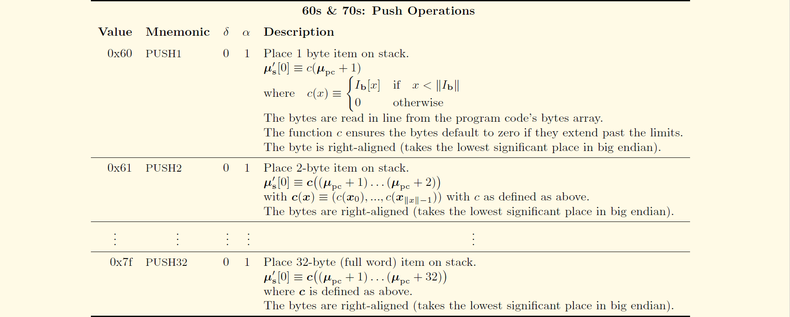

# 以太坊虚拟机解释器

以太坊虚拟机解释执行Code。

## EVM的汇编代码

合约`C`有状态变量和构造器：

```solidity
pragma solidity ^0.4.21;

contract C {
    uint256 cbd;
    function C() public{
        cbd = 109;
    }
}
```

使用`solc`编译合约`C`：

```solc
$ solc --bin --asm c2.sol

======= c2.sol:C =======
EVM assembly:
... */ "c2.sol":28:114  contract C {
  mstore(0x40, 0x60)
... */ "c2.sol":64:111  function C() public{
  jumpi(tag_1, iszero(callvalue))
  0x0
  dup1
  revert
tag_1:
    /* "c2.sol":100:103  109 */
  0x6d
    /* "c2.sol":94:97  cbd */
  0x0
    /* "c2.sol":94:103  cbd = 109 */
  dup2
  swap1
  sstore
  pop
... */ "c2.sol":28:114  contract C {
  dataSize(sub_0)
  dup1
  dataOffset(sub_0)
  0x0
  codecopy
  0x0
  return
stop

sub_0: assembly {
... */  /* "c2.sol":28:114  contract C {
      mstore(0x40, 0x60)
      0x0
      dup1
      revert

    auxdata: 0xa165627a7a723058204c4b7cb2d6601994bbe06eeb297368f48ca11be35e15fe1d8e5aca29313706070029
}

Binary:
60606040523415600e57600080fd5b606d60008190555060358060236000396000f3006060604052600080fd00a165627a7a723058204c4b7cb2d6601994bbe06eeb297368f48ca11be35e15fe1d8e5aca29313706070029
```

其中，`Binary`是EVM运行时的字节码。变量赋值`cbd = 109;`由字节码`606d600081905550`表示，缩进到标签`tag_1`下：

```solc
tag_1:
    /* 60 6d */
  0x6d
    /* 60 00 */
  0x0
    /* 81 */
  dup2
    /* 90 */
  swap1
    /* 55 */
  sstore
    /* 50 */
  pop
```

在汇编代码中，`0x0`是`PUSH(0x0)`的简写，即将数值0压栈。

模拟EVM（详见附录[指令集](#指令集)）执行字节序列，打印每条指令执行后的机器状态得到：

```solc
  /* 60 6d：压栈6d */
0x6d
  stack: [0x6d]
  store: {}
    
  /* 60 00：压栈0 */
0x0
  stack: [0x0 0x6d]
  store: {}
    
  /* 81：复制栈中的第2项 */
dup2
  stack: [0x6d 0x0 0x6d]
  store: {}
    
  /* 90：交换栈中的第1和2项 */
swap1
  stack: [0x0 0x6d 0x6d]
  store: {}
    
  /* 55：存储数值 */
sstore
  stack: [0x6d]
  store: {0x0=>0x6d}
    
  /* 50：出栈 */
pop
  stack: []
  store: {0x0=>0x6d}
```

#### 存疑❓

```diff
- 如何解读智能合约中的预加载语句？
- 在汇编语言中，状态变量cbd的名称是如何存储的？
- auxdata里存储的是什么？
```

#### 释疑❗️

```diff
+ 智能合约的字节码：
```

> When compiling a new smart-contract with Solidity, you will be asked to choose between two options to retrieve the bytecode as shown below.
> 
> --bin
> 
> --bin-runtime
> 
> The first one will output the binary of the entire contract, which includes its pre-loader. While the second one will output the binary of the runtime part of the contract which is the part we are interested in for analysis.
> 
> ——Suiche, M., 2017. Porosity: A Decompiler For Blockchain-Based Smart Contracts Bytecode. DEF CON, 25.

> Smart contract bytecode is divided into two sections: the pre-loader and the runtime code. The pre-loader bootstraps the contract by deploying it on the Ethereum network and running its constructor. The runtime code only contains the core functionality of the contract that can be invoked by other blockchain agents.
>
> ——Amani, S., Bégel, M., Bortin, M. and Staples, M., 2018. Towards Verifying Ethereum Smart Contract Bytecode in Isabelle/HOL. CPP. ACM. To appear.

智能合约的字节码分为两个类别：

* 预加载代码
    * 引导合约的程序，在开始时构建
* 合约的运行时代码
    * 由用户编写、Solidity编译的核心代码
    * 调度函数，基于指定的哈希，重定向调用相应的函数

<details>
    <summary>合约文件c0.sol</summary>

```solidity
pragma solidity ^0.4.21;

contract C {
}
```

```solc
$ solc --bin --asm c0.sol

======= c0.sol:C =======
EVM assembly:
... */ "c0.sol":28:43  contract C {
  mstore(0x40, 0x60)
  jumpi(tag_1, iszero(callvalue))
  0x0
  dup1
  revert
tag_1:
  dataSize(sub_0)
  dup1
  dataOffset(sub_0)
  0x0
  codecopy
  0x0
  return
stop

sub_0: assembly {
... */  /* "c0.sol":28:43  contract C {
      mstore(0x40, 0x60)
      0x0
      dup1
      revert

    auxdata: 0xa165627a7a723058201d469b4657b693edab593906b8c3ee445c385829905abe3bdd93ba71553773760029
}

Binary:
60606040523415600e57600080fd5b603580601b6000396000f3006060604052600080fd00a165627a7a723058201d469b4657b693edab593906b8c3ee445c385829905abe3bdd93ba71553773760029
```

</details>

<details>
    <summary>合约文件c1.sol</summary>

```solidity
pragma solidity ^0.4.21;

contract C {
    uint256 cbd;
}
```

```solc
$ solc --bin --asm c1.sol

======= c1.sol:C =======
EVM assembly:
... */ "c1.sol":28:61  contract C {
  mstore(0x40, 0x60)
  jumpi(tag_1, iszero(callvalue))
  0x0
  dup1
  revert
tag_1:
  dataSize(sub_0)
  dup1
  dataOffset(sub_0)
  0x0
  codecopy
  0x0
  return
stop

sub_0: assembly {
... */  /* "c1.sol":28:61  contract C {
      mstore(0x40, 0x60)
      0x0
      dup1
      revert

    auxdata: 0xa165627a7a72305820968d746a315303b79deb2c805205e6b37ea9252d9e50e39ac97b747b7c8f40140029
}

Binary:
60606040523415600e57600080fd5b603580601b6000396000f3006060604052600080fd00a165627a7a72305820968d746a315303b79deb2c805205e6b37ea9252d9e50e39ac97b747b7c8f40140029
```

</details>

<details>
    <summary>合约文件c2.sol</summary>

```solidity
pragma solidity ^0.4.21;

contract C {
    uint256 cbd;
    function C() public{
        cbd = 109;
    }
}
```

```solc
$ solc --bin --asm c2.sol

======= c2.sol:C =======
EVM assembly:
... */ "c2.sol":28:114  contract C {
  mstore(0x40, 0x60)
... */ "c2.sol":64:111  function C() public{
  jumpi(tag_1, iszero(callvalue))
  0x0
  dup1
  revert
tag_1:
    /* "c2.sol":100:103  109 */
  0x6d
    /* "c2.sol":94:97  cbd */
  0x0
    /* "c2.sol":94:103  cbd = 109 */
  dup2
  swap1
  sstore
  pop
... */ "c2.sol":28:114  contract C {
  dataSize(sub_0)
  dup1
  dataOffset(sub_0)
  0x0
  codecopy
  0x0
  return
stop

sub_0: assembly {
... */  /* "c2.sol":28:114  contract C {
      mstore(0x40, 0x60)
      0x0
      dup1
      revert

    auxdata: 0xa165627a7a723058208f314c40e9246a81f576d441000fa46691b988eed9f4e0692e4b8e74d9738f880029
}

Binary:
60606040523415600e57600080fd5b606d60008190555060358060236000396000f3006060604052600080fd00a165627a7a723058208f314c40e9246a81f576d441000fa46691b988eed9f4e0692e4b8e74d9738f880029
```

</details>

捉对比较合约，得出结论：

* 智能合约的字节码由预加载代码`60606040523415600e57600080fd5b603580601b6000396000f300`和运行时代码连接组成，运行时代码由合约代码`6060604052600080fd00`和auxdata`a165627a7a723058201d469b4657b693edab593906b8c3ee445c385829905abe3bdd93ba71553773760029`连接组成
* 仅声明变量而不存储数据时，运行时代码相同，不消耗任何成本

预加载代码主要有两个作用：

1. 运行构造函数，初始化变量
2. 加载运行时合约代码

```solc
  /* 603580601b6000396000f3 */
tag_1:
  /* 60 35：PUSH1 0x35 */
  dataSize(sub_0)
    stack: [0x35]
    memory: {}
    
  /* 80: DUP1 */
  dup1
    stack: [0x35 0x35]
    memory: {}
    
  /* 60 1b: PUSH1 0x1b */
  dataOffset(sub_0)
    stack: [0x1b 0x35 0x35]
    memory: {}
    
  /* 60 00: PUSH1 0x0 */
  0x0
    stack: [0x0 0x1b 0x35 0x35]
    memory: {}
  
  /* 39: CODECOPY，将运行在当前环境中的代码拷贝到memory中
     消耗三个栈元素
     memoryOffset = 0x00
     codeOffset = 0x1b
     codeLength = 0x35 */
  codecopy
    stack: [0x35]
    memory: {0x0:0x35 => calldata[0x1b:0x50]}
  
  /* 60 00: PUSH1 0*/
  0x0
    stack: [0x0 0x35]
    memory: {0x0:0x35 => calldata[0x1b:0x50]}
  
  /* f3: RETURN */
  return
    stack: []
    memory: {0x0:0x35 => calldata[0x1b:0x50]}
```

其中，`dataSize(sub_0)`和`dataOffset(sub_0)`不是真正的指令，而是将常量压栈的PUSH指令。

`memory`的作用之一是存储运行时代码。

`CodeCopy`的指令行为如下：

```go
# core/vm/instructions.go

func opCodeCopy(pc *uint64, evm *EVM, contract *Contract, memory *Memory, stack *Stack) ([]byte, error) {
	var (
		memOffset  = stack.pop()
		codeOffset = stack.pop()
		length     = stack.pop()
	)
	codeCopy := getDataBig(contract.Code, codeOffset, length)
	memory.Set(memOffset.Uint64(), length.Uint64(), codeCopy)

	evm.interpreter.intPool.put(memOffset, codeOffset, length)
	return nil, nil
}
```

`auxdata`[在字节码中编码元数据的哈希值](https://github.com/ethereum/solidity/blob/8fbfd62d15ae83a757301db35621e95bccace97b/docs/metadata.rst#encoding-of-the-metadata-hash-in-the-bytecode)。

> Because we might support other ways to retrieve the metadata file in the future, the mapping {"bzzr0": <Swarm hash>} is stored [CBOR](https://tools.ietf.org/html/rfc7049)-encoded. Since the beginning of that encoding is not easy to find, its length is added in a two-byte big-endian encoding. The current version of the Solidity compiler thus adds the following to the end of the deployed bytecode:
>
> `0xa1 0x65 'b' 'z' 'z' 'r' '0' 0x58 0x20 <32 bytes swarm hash> 0x00 0x29`
>
> So in order to retrieve the data, the end of the deployed bytecode can be checked to match that pattern and use the Swarm hash to retrieve the file.

#### 纠错🚧

`0x65`是`PUSH6`指令（`# core/vm/jump_table.go`和`# core/vm/opcodes.go`中已验证），所以字节码应解读为`0xa1 0x65 'b' 'z' 'z' 'r' '0' 'X' 0x20 <32 bytes swarm hash> 0x00 0x29`

创建合约，调用`Create`方法，完成：

* 检查创建者的余额是否拥有足够的余额转账
* 根据创建者的地址及其`nonce`生成新合约的地址
* 在`StateDB`中使用新合约的地址创建新合约账户
* 创建者将初始的以太币转到新合约账户中
* EVM运行预加载代码，返回运行时合约代码给EVM
* 收取创建合约的Gas，加载运行时合约代码

```go

	maxCodeSizeExceeded := evm.ChainConfig().IsEIP158(evm.BlockNumber) && len(ret) > params.MaxCodeSize
	if err == nil && !maxCodeSizeExceeded {
		createDataGas := uint64(len(ret)) * params.CreateDataGas
		if contract.UseGas(createDataGas) {
			evm.StateDB.SetCode(contractAddr, ret)
		} else {
			err = ErrCodeStoreOutOfGas
		}
	}

	if maxCodeSizeExceeded || (err != nil && (evm.ChainConfig().IsHomestead(evm.BlockNumber) || err != ErrCodeStoreOutOfGas)) {
		evm.StateDB.RevertToSnapshot(snapshot)
		if err != errExecutionReverted {
			contract.UseGas(contract.Gas)
		}
	}
	if maxCodeSizeExceeded && err == nil {
		err = errMaxCodeSizeExceeded
	}
	if evm.vmConfig.Debug && evm.depth == 0 {
		evm.vmConfig.Tracer.CaptureEnd(ret, gas-contract.Gas, time.Since(start), err)
	}
	return ret, contractAddr, contract.Gas, err
}
```

```go
# core/vm/evm.go

func (evm *EVM) Create(caller ContractRef, code []byte, gas uint64, value *big.Int) (ret []byte, contractAddr common.Address, leftOverGas uint64, err error) {

	if evm.depth > int(params.CallCreateDepth) {
		return nil, common.Address{}, gas, ErrDepth
	}
	if !evm.CanTransfer(evm.StateDB, caller.Address(), value) {
		return nil, common.Address{}, gas, ErrInsufficientBalance
	}
	nonce := evm.StateDB.GetNonce(caller.Address())
	evm.StateDB.SetNonce(caller.Address(), nonce+1)

	contractAddr = crypto.CreateAddress(caller.Address(), nonce)
	contractHash := evm.StateDB.GetCodeHash(contractAddr)
	if evm.StateDB.GetNonce(contractAddr) != 0 || (contractHash != (common.Hash{}) && contractHash != emptyCodeHash) {
		return nil, common.Address{}, 0, ErrContractAddressCollision
	}
	snapshot := evm.StateDB.Snapshot()
	evm.StateDB.CreateAccount(contractAddr)
	if evm.ChainConfig().IsEIP158(evm.BlockNumber) {
		evm.StateDB.SetNonce(contractAddr, 1)
	}
	evm.Transfer(evm.StateDB, caller.Address(), contractAddr, value)

	contract := NewContract(caller, AccountRef(contractAddr), value, gas)
	contract.SetCallCode(&contractAddr, crypto.Keccak256Hash(code), code)

	if evm.vmConfig.NoRecursion && evm.depth > 0 {
		return nil, contractAddr, gas, nil
	}

	if evm.vmConfig.Debug && evm.depth == 0 {
		evm.vmConfig.Tracer.CaptureStart(caller.Address(), contractAddr, true, code, gas, value)
	}
	start := time.Now()

	ret, err = run(evm, contract, nil)

	maxCodeSizeExceeded := evm.ChainConfig().IsEIP158(evm.BlockNumber) && len(ret) > params.MaxCodeSize
	if err == nil && !maxCodeSizeExceeded {
		createDataGas := uint64(len(ret)) * params.CreateDataGas
		if contract.UseGas(createDataGas) {
			evm.StateDB.SetCode(contractAddr, ret)
		} else {
			err = ErrCodeStoreOutOfGas
		}
	}

	if maxCodeSizeExceeded || (err != nil && (evm.ChainConfig().IsHomestead(evm.BlockNumber) || err != ErrCodeStoreOutOfGas)) {
		evm.StateDB.RevertToSnapshot(snapshot)
		if err != errExecutionReverted {
			contract.UseGas(contract.Gas)
		}
	}
	if maxCodeSizeExceeded && err == nil {
		err = errMaxCodeSizeExceeded
	}
	if evm.vmConfig.Debug && evm.depth == 0 {
		evm.vmConfig.Tracer.CaptureEnd(ret, gas-contract.Gas, time.Since(start), err)
	}
	return ret, contractAddr, contract.Gas, err
}
```

## 测试运行时实例

执行字节码为`6060604052600a8060106000396000f360606040526008565b00`的code，同时追踪栈上的函数调用信息。

```go
# core/vm/runtime/runtime_example_test.go

ret, _, err := runtime.Execute(common.Hex2Bytes("6060604052600a8060106000396000f360606040526008565b00"), nil, nil)
if err != nil {
    fmt.Println(err)
}
fmt.Println(ret)
```

对应的[汇编语言代码](https://etherscan.io/opcode-tool)是：

```solc
PUSH1 0x60
BLOCKHASH
MSTORE
PUSH1 0x0a
DUP1
PUSH1 0x10
PUSH1 0x00
CODECOPY
PUSH1 0x00
RETURN
PUSH1 0x60
PUSH1 0x40
MSTORE
PUSH1 0x08
JUMP
JUMPDEST
STOP
```

实例进行了1950次函数调用，过程（有删减，详见附录[运行时实例测试日志](#运行时实例测试日志)）如下：

* 初始化运行时环境`core/vm/runtime/runtime.go/Execute() line 96`
    * 将16进制的code字符串`6060604052600a8060106000396000f360606040526008565b00`转换成code字节数组`common/bytes.go/Hex2Bytes() line 83`
    * 构建内存的、临时的环境，返回EVM的返回值和新的状态`core/vm/runtime/runtime.go/Execute() line 96`，期望结果`[96 96 96 64 82 96 8 86 91 0]`
    * 传入`cfg == nil`，设置缺省的cfg`core/vm/runtime/runtime.go/setDefaults() line 53`，其`State == nil`，构建非持久的内存数据库`ethdb/memory_database.go/NewMemDatabase() line 36`，并为state创建备份存储`core/state/statedb.go/New() line 92`（略去更多构建过程和配置其他变量的详细内容），该备份存储是一棵在写入磁盘或者垃圾回收前暂存内容的trie`trie/database.go/NewDatabase() line 73`
* 给定cfg，调用code`core/vm/evm.go/(*EVM).Call() line 144`
    * 遍历code，循环解释`core/vm/interpreter.go/(*Interpreter).Run() line 110`


```go
# core/vm/interpreter.go
func (in *Interpreter) Run(contract *Contract, input []byte) (ret []byte, err error) {
	log.DebugLog()
	in.evm.depth++
	defer func() { in.evm.depth-- }()

	in.returnData = nil

	if len(contract.Code) == 0 {
		return nil, nil
	}

	var (
		op    OpCode
		mem   = NewMemory()
		stack = newstack()
		pc   = uint64(0)
		cost uint64
		pcCopy  uint64
		gasCopy uint64
		logged  bool
	)
	contract.Input = input

	if in.cfg.Debug {
		defer func() {
			if err != nil {
				if !logged {
					in.cfg.Tracer.CaptureState(in.evm, pcCopy, op, gasCopy, cost, mem, stack, contract, in.evm.depth, err)
				} else {
					in.cfg.Tracer.CaptureFault(in.evm, pcCopy, op, gasCopy, cost, mem, stack, contract, in.evm.depth, err)
				}
			}
		}()
	}
	
	// main run loop
	for atomic.LoadInt32(&in.evm.abort) == 0 {
		if in.cfg.Debug {
			logged, pcCopy, gasCopy = false, pc, contract.Gas
		}

		op = contract.GetOp(pc)
		operation := in.cfg.JumpTable[op]
		if !operation.valid {
			return nil, fmt.Errorf("invalid opcode 0x%x", int(op))
		}
		if err := operation.validateStack(stack); err != nil {
			return nil, err
		}
		if err := in.enforceRestrictions(op, operation, stack); err != nil {
			return nil, err
		}

		var memorySize uint64
		if operation.memorySize != nil {
			memSize, overflow := bigUint64(operation.memorySize(stack))
			if overflow {
				return nil, errGasUintOverflow
			}
			if memorySize, overflow = math.SafeMul(toWordSize(memSize), 32); overflow {
				return nil, errGasUintOverflow
			}
		}
		cost, err = operation.gasCost(in.gasTable, in.evm, contract, stack, mem, memorySize)
		if err != nil || !contract.UseGas(cost) {
			return nil, ErrOutOfGas
		}
		if memorySize > 0 {
			mem.Resize(memorySize)
		}

		if in.cfg.Debug {
			in.cfg.Tracer.CaptureState(in.evm, pc, op, gasCopy, cost, mem, stack, contract, in.evm.depth, err)
			logged = true
		}

		res, err := operation.execute(&pc, in.evm, contract, mem, stack)
		if verifyPool {
			verifyIntegerPool(in.intPool)
		}
		if operation.returns {
			in.returnData = res
		}

		switch {
		case err != nil:
			return nil, err
		case operation.reverts:
			return res, errExecutionReverted
		case operation.halts:
			return res, nil
		case !operation.jumps:
			pc++
		}
	}
	return nil, nil
}
```

:exclamation:	evm.depth

* [ ] 计划：Execute() with input data

## 附录

#### 指令集

详见[以太坊黄皮书](https://ethereum.github.io/yellowpaper/paper.pdf)Appendix H.2. Instruction Set。





#### 运行时实例测试日志

节选`ExampleExecute`函数的栈上调用信息：

```go
common/bytes.go/Hex2Bytes() line 83
core/vm/runtime/runtime.go/Execute() line 96
core/vm/runtime/runtime.go/setDefaults() line 53
ethdb/memory_database.go/NewMemDatabase() line 36
core/state/database.go/NewDatabase() line 80
trie/database.go/NewDatabase() line 73
core/state/statedb.go/New() line 92
core/state/database.go/(*cachingDB).OpenTrie() line 97
trie/secure_trie.go/NewSecure() line 54
trie/trie.go/New() line 101
trie/trie.go/(*Trie).SetCacheLimit() line 84
common/types.go/StringToAddress() line 169
common/types.go/BytesToAddress() line 164
common/types.go/(*Address).SetBytes() line 234
core/vm/runtime/env.go/NewEnv() line 26
core/vm/evm.go/NewEVM() line 119
params/config.go/(*ChainConfig).Rules() line 352
params/config.go/(*ChainConfig).IsHomestead() line 176
params/config.go/isForked() line 289
params/config.go/(*ChainConfig).IsEIP150() line 187
params/config.go/isForked() line 289
params/config.go/(*ChainConfig).IsEIP155() line 192
params/config.go/isForked() line 289
params/config.go/(*ChainConfig).IsEIP158() line 197
params/config.go/isForked() line 289
params/config.go/(*ChainConfig).IsByzantium() line 202
params/config.go/isForked() line 289
core/vm/interpreter.go/NewInterpreter() line 61
core/vm/evm.go/(*EVM).ChainConfig() line 404
params/config.go/(*ChainConfig).IsConstantinople() line 207
params/config.go/isForked() line 289
core/vm/evm.go/(*EVM).ChainConfig() line 404
params/config.go/(*ChainConfig).IsByzantium() line 202
params/config.go/isForked() line 289
core/vm/evm.go/(*EVM).ChainConfig() line 404
params/config.go/(*ChainConfig).IsHomestead() line 176
params/config.go/isForked() line 289
core/vm/evm.go/(*EVM).ChainConfig() line 404
params/config.go/(*ChainConfig).GasTable() line 215
params/config.go/(*ChainConfig).IsEIP158() line 197
params/config.go/isForked() line 289
core/vm/intpool.go/newIntPool() line 35
core/vm/stack.go/newstack() line 33
core/state/statedb.go/(*StateDB).CreateAccount() line 471
core/state/statedb.go/(*StateDB).createObject() line 447
core/state/statedb.go/(*StateDB).getStateObject() line 396
trie/secure_trie.go/(*SecureTrie).TryGet() line 79
trie/secure_trie.go/(*SecureTrie).hashKey() line 180
trie/hasher.go/newHasher() line 46
crypto/sha3/hashes.go/NewKeccak256() line 17
crypto/sha3/sha3.go/(*state).Reset() line 62
crypto/sha3/sha3.go/(*state).Write() line 134
crypto/sha3/sha3.go/(*state).Sum() line 196
crypto/sha3/sha3.go/(*state).clone() line 72
crypto/sha3/sha3.go/(*state).Read() line 170
crypto/sha3/sha3.go/(*state).padAndPermute() line 106
crypto/sha3/sha3.go/(*state).permute() line 86
crypto/sha3/xor_unaligned.go/xorInUnaligned() line 15
crypto/sha3/xor_unaligned.go/copyOutUnaligned() line 51
trie/hasher.go/returnHasherToPool() line 53
trie/trie.go/(*Trie).TryGet() line 141
trie/encoding.go/keybytesToHex() line 71
trie/trie.go/(*Trie).tryGet() line 151
core/state/statedb.go/(*StateDB).setError() line 109
core/state/state_object.go/newObject() line 115
crypto/crypto.go/Keccak256Hash() line 54
crypto/sha3/hashes.go/NewKeccak256() line 17
crypto/sha3/sha3.go/(*state).Write() line 134
crypto/sha3/sha3.go/(*state).Sum() line 196
crypto/sha3/sha3.go/(*state).clone() line 72
crypto/sha3/sha3.go/(*state).Read() line 170
crypto/sha3/sha3.go/(*state).padAndPermute() line 106
crypto/sha3/sha3.go/(*state).permute() line 86
crypto/sha3/xor_unaligned.go/xorInUnaligned() line 15
crypto/sha3/xor_unaligned.go/copyOutUnaligned() line 51
core/state/state_object.go/(*stateObject).setNonce() line 391
core/state/state_object.go/(*stateObject).Address() line 338
core/state/statedb.go/(*StateDB).MarkStateObjectDirty() line 440
core/state/statedb.go/(*StateDB).setStateObject() line 423
core/state/state_object.go/(*stateObject).Address() line 338
core/state/statedb.go/(*StateDB).SetCode() line 334
core/state/statedb.go/(*StateDB).GetOrNewStateObject() line 429
core/state/statedb.go/(*StateDB).getStateObject() line 396
crypto/crypto.go/Keccak256Hash() line 54
crypto/sha3/hashes.go/NewKeccak256() line 17
crypto/sha3/sha3.go/(*state).Write() line 134
crypto/sha3/sha3.go/(*state).Sum() line 196
crypto/sha3/sha3.go/(*state).clone() line 72
crypto/sha3/sha3.go/(*state).Read() line 170
crypto/sha3/sha3.go/(*state).padAndPermute() line 106
crypto/sha3/sha3.go/(*state).permute() line 86
crypto/sha3/xor_unaligned.go/xorInUnaligned() line 15
crypto/sha3/xor_unaligned.go/copyOutUnaligned() line 51
core/state/state_object.go/(*stateObject).SetCode() line 360
core/state/state_object.go/(*stateObject).Code() line 344
core/state/state_object.go/(*stateObject).CodeHash() line 400
core/state/state_object.go/(*stateObject).CodeHash() line 400
core/state/state_object.go/(*stateObject).setCode() line 371
common/types.go/StringToAddress() line 169
common/types.go/BytesToAddress() line 164
common/types.go/(*Address).SetBytes() line 234
core/vm/evm.go/(*EVM).Call() line 144
core/vm/contract.go/AccountRef.Address() line 42
core/evm.go/CanTransfer() line 93
core/state/statedb.go/(*StateDB).GetBalance() line 207
core/state/statedb.go/(*StateDB).getStateObject() line 396
trie/secure_trie.go/(*SecureTrie).TryGet() line 79
trie/secure_trie.go/(*SecureTrie).hashKey() line 180
trie/hasher.go/newHasher() line 46
crypto/sha3/sha3.go/(*state).Reset() line 62
crypto/sha3/sha3.go/(*state).Write() line 134
crypto/sha3/sha3.go/(*state).Sum() line 196
crypto/sha3/sha3.go/(*state).clone() line 72
crypto/sha3/sha3.go/(*state).Read() line 170
crypto/sha3/sha3.go/(*state).padAndPermute() line 106
crypto/sha3/sha3.go/(*state).permute() line 86
crypto/sha3/xor_unaligned.go/xorInUnaligned() line 15
crypto/sha3/xor_unaligned.go/copyOutUnaligned() line 51
trie/hasher.go/returnHasherToPool() line 53
trie/trie.go/(*Trie).TryGet() line 141
trie/encoding.go/keybytesToHex() line 71
trie/trie.go/(*Trie).tryGet() line 151
core/state/statedb.go/(*StateDB).setError() line 109
core/state/statedb.go/(*StateDB).Snapshot() line 535
core/state/statedb.go/(*StateDB).Exist() line 193
core/state/statedb.go/(*StateDB).getStateObject() line 396
core/vm/contract.go/AccountRef.Address() line 42
core/vm/contract.go/AccountRef.Address() line 42
core/evm.go/Transfer() line 99
core/state/statedb.go/(*StateDB).SubBalance() line 310
core/state/statedb.go/(*StateDB).GetOrNewStateObject() line 429
core/state/statedb.go/(*StateDB).getStateObject() line 396
trie/secure_trie.go/(*SecureTrie).TryGet() line 79
trie/secure_trie.go/(*SecureTrie).hashKey() line 180
trie/hasher.go/newHasher() line 46
crypto/sha3/sha3.go/(*state).Reset() line 62
crypto/sha3/sha3.go/(*state).Write() line 134
crypto/sha3/sha3.go/(*state).Sum() line 196
crypto/sha3/sha3.go/(*state).clone() line 72
crypto/sha3/sha3.go/(*state).Read() line 170
crypto/sha3/sha3.go/(*state).padAndPermute() line 106
crypto/sha3/sha3.go/(*state).permute() line 86
crypto/sha3/xor_unaligned.go/xorInUnaligned() line 15
crypto/sha3/xor_unaligned.go/copyOutUnaligned() line 51
trie/hasher.go/returnHasherToPool() line 53
trie/trie.go/(*Trie).TryGet() line 141
trie/encoding.go/keybytesToHex() line 71
trie/trie.go/(*Trie).tryGet() line 151
core/state/statedb.go/(*StateDB).setError() line 109
core/state/statedb.go/(*StateDB).createObject() line 447
core/state/statedb.go/(*StateDB).getStateObject() line 396
trie/secure_trie.go/(*SecureTrie).TryGet() line 79
trie/secure_trie.go/(*SecureTrie).hashKey() line 180
trie/hasher.go/newHasher() line 46
crypto/sha3/sha3.go/(*state).Reset() line 62
crypto/sha3/sha3.go/(*state).Write() line 134
crypto/sha3/sha3.go/(*state).Sum() line 196
crypto/sha3/sha3.go/(*state).clone() line 72
crypto/sha3/sha3.go/(*state).Read() line 170
crypto/sha3/sha3.go/(*state).padAndPermute() line 106
crypto/sha3/sha3.go/(*state).permute() line 86
crypto/sha3/xor_unaligned.go/xorInUnaligned() line 15
crypto/sha3/xor_unaligned.go/copyOutUnaligned() line 51
trie/hasher.go/returnHasherToPool() line 53
trie/trie.go/(*Trie).TryGet() line 141
trie/encoding.go/keybytesToHex() line 71
trie/trie.go/(*Trie).tryGet() line 151
core/state/statedb.go/(*StateDB).setError() line 109
core/state/state_object.go/newObject() line 115
crypto/crypto.go/Keccak256Hash() line 54
crypto/sha3/hashes.go/NewKeccak256() line 17
crypto/sha3/sha3.go/(*state).Write() line 134
crypto/sha3/sha3.go/(*state).Sum() line 196
crypto/sha3/sha3.go/(*state).clone() line 72
crypto/sha3/sha3.go/(*state).Read() line 170
crypto/sha3/sha3.go/(*state).padAndPermute() line 106
crypto/sha3/sha3.go/(*state).permute() line 86
crypto/sha3/xor_unaligned.go/xorInUnaligned() line 15
crypto/sha3/xor_unaligned.go/copyOutUnaligned() line 51
core/state/state_object.go/(*stateObject).setNonce() line 391
core/state/state_object.go/(*stateObject).Address() line 338
core/state/statedb.go/(*StateDB).MarkStateObjectDirty() line 440
core/state/statedb.go/(*StateDB).setStateObject() line 423
core/state/state_object.go/(*stateObject).Address() line 338
core/state/state_object.go/(*stateObject).SubBalance() line 289
core/state/statedb.go/(*StateDB).AddBalance() line 301
core/state/statedb.go/(*StateDB).GetOrNewStateObject() line 429
core/state/statedb.go/(*StateDB).getStateObject() line 396
core/state/state_object.go/(*stateObject).AddBalance() line 273
core/state/state_object.go/(*stateObject).empty() line 100
core/vm/contract.go/NewContract() line 73
core/vm/contract.go/AccountRef.Address() line 42
core/state/statedb.go/(*StateDB).GetCodeHash() line 251
core/state/statedb.go/(*StateDB).getStateObject() line 396
core/state/state_object.go/(*stateObject).CodeHash() line 400
common/types.go/BytesToHash() line 45
common/types.go/(*Hash).SetBytes() line 108
core/state/statedb.go/(*StateDB).GetCode() line 226
core/state/statedb.go/(*StateDB).getStateObject() line 396
core/state/state_object.go/(*stateObject).Code() line 344
core/vm/contract.go/(*Contract).SetCallCode() line 163
core/vm/evm.go/run() line 44
core/vm/evm.go/(*EVM).ChainConfig() line 404
params/config.go/(*ChainConfig).IsByzantium() line 202
params/config.go/isForked() line 289
core/vm/interpreter.go/(*Interpreter).Run() line 110
core/vm/memory.go/NewMemory() line 31
core/vm/stack.go/newstack() line 33
core/vm/contract.go/(*Contract).GetOp() line 108
core/vm/contract.go/(*Contract).GetByte() line 114
core/vm/stack.go/(*Stack).require() line 88
core/vm/stack.go/(*Stack).len() line 62
core/vm/stack.go/(*Stack).len() line 62
core/vm/interpreter.go/(*Interpreter).enforceRestrictions() line 87
core/vm/gas_table.go/gasPush() line 477
core/vm/contract.go/(*Contract).UseGas() line 133
core/vm/intpool.go/(*intPool).get() line 42
core/vm/stack.go/(*Stack).len() line 62
common/bytes.go/RightPadBytes() line 104
core/vm/stack.go/(*Stack).push() line 43
core/vm/contract.go/(*Contract).GetOp() line 108
core/vm/contract.go/(*Contract).GetByte() line 114
core/vm/stack.go/(*Stack).require() line 88
core/vm/stack.go/(*Stack).len() line 62
core/vm/stack.go/(*Stack).len() line 62
core/vm/interpreter.go/(*Interpreter).enforceRestrictions() line 87
core/vm/gas_table.go/gasPush() line 477
core/vm/contract.go/(*Contract).UseGas() line 133
core/vm/intpool.go/(*intPool).get() line 42
core/vm/stack.go/(*Stack).len() line 62
common/bytes.go/RightPadBytes() line 104
core/vm/stack.go/(*Stack).push() line 43
core/vm/contract.go/(*Contract).GetOp() line 108
core/vm/contract.go/(*Contract).GetByte() line 114
core/vm/stack.go/(*Stack).require() line 88
core/vm/stack.go/(*Stack).len() line 62
core/vm/stack.go/(*Stack).len() line 62
core/vm/interpreter.go/(*Interpreter).enforceRestrictions() line 87
core/vm/memory_table.go/memoryMStore() line 62
core/vm/stack.go/(*Stack).Back() line 83
core/vm/stack.go/(*Stack).len() line 62
core/vm/common.go/calcMemSize() line 29
core/vm/common.go/bigUint64() line 66
core/vm/common.go/toWordSize() line 72
common/math/integer.go/SafeMul() line 95
core/vm/gas_table.go/gasMStore() line 281
core/vm/gas_table.go/memoryGasCost() line 29
core/vm/common.go/toWordSize() line 72
core/vm/memory.go/(*Memory).Len() line 92
common/math/integer.go/SafeAdd() line 90
core/vm/contract.go/(*Contract).UseGas() line 133
core/vm/memory.go/(*Memory).Resize() line 53
core/vm/memory.go/(*Memory).Len() line 92
core/vm/memory.go/(*Memory).Len() line 92
core/vm/instructions.go/opMstore() line 608
core/vm/stack.go/(*Stack).pop() line 55
core/vm/stack.go/(*Stack).pop() line 55
common/math/big.go/PaddedBigBytes() line 134
common/math/big.go/ReadBits() line 176
core/vm/memory.go/(*Memory).Set() line 37
core/vm/intpool.go/(*intPool).put() line 62
core/vm/stack.go/(*Stack).push() line 43
core/vm/stack.go/(*Stack).push() line 43
core/vm/contract.go/(*Contract).GetOp() line 108
core/vm/contract.go/(*Contract).GetByte() line 114
core/vm/stack.go/(*Stack).require() line 88
core/vm/stack.go/(*Stack).len() line 62
core/vm/stack.go/(*Stack).len() line 62
core/vm/interpreter.go/(*Interpreter).enforceRestrictions() line 87
core/vm/gas_table.go/gasPush() line 477
core/vm/contract.go/(*Contract).UseGas() line 133
core/vm/intpool.go/(*intPool).get() line 42
core/vm/stack.go/(*Stack).len() line 62
core/vm/stack.go/(*Stack).pop() line 55
common/bytes.go/RightPadBytes() line 104
core/vm/stack.go/(*Stack).push() line 43
core/vm/contract.go/(*Contract).GetOp() line 108
core/vm/contract.go/(*Contract).GetByte() line 114
core/vm/stack.go/(*Stack).require() line 88
core/vm/stack.go/(*Stack).len() line 62
core/vm/stack.go/(*Stack).len() line 62
core/vm/interpreter.go/(*Interpreter).enforceRestrictions() line 87
core/vm/gas_table.go/gasDup() line 487
core/vm/contract.go/(*Contract).UseGas() line 133
core/vm/stack.go/(*Stack).dup() line 72
core/vm/intpool.go/(*intPool).get() line 42
core/vm/stack.go/(*Stack).len() line 62
core/vm/stack.go/(*Stack).pop() line 55
core/vm/stack.go/(*Stack).len() line 62
core/vm/stack.go/(*Stack).push() line 43
core/vm/contract.go/(*Contract).GetOp() line 108
core/vm/contract.go/(*Contract).GetByte() line 114
core/vm/stack.go/(*Stack).require() line 88
core/vm/stack.go/(*Stack).len() line 62
core/vm/stack.go/(*Stack).len() line 62
core/vm/interpreter.go/(*Interpreter).enforceRestrictions() line 87
core/vm/gas_table.go/gasPush() line 477
core/vm/contract.go/(*Contract).UseGas() line 133
core/vm/intpool.go/(*intPool).get() line 42
core/vm/stack.go/(*Stack).len() line 62
common/bytes.go/RightPadBytes() line 104
core/vm/stack.go/(*Stack).push() line 43
core/vm/contract.go/(*Contract).GetOp() line 108
core/vm/contract.go/(*Contract).GetByte() line 114
core/vm/stack.go/(*Stack).require() line 88
core/vm/stack.go/(*Stack).len() line 62
core/vm/stack.go/(*Stack).len() line 62
core/vm/interpreter.go/(*Interpreter).enforceRestrictions() line 87
core/vm/gas_table.go/gasPush() line 477
core/vm/contract.go/(*Contract).UseGas() line 133
core/vm/intpool.go/(*intPool).get() line 42
core/vm/stack.go/(*Stack).len() line 62
common/bytes.go/RightPadBytes() line 104
core/vm/stack.go/(*Stack).push() line 43
core/vm/contract.go/(*Contract).GetOp() line 108
core/vm/contract.go/(*Contract).GetByte() line 114
core/vm/stack.go/(*Stack).require() line 88
core/vm/stack.go/(*Stack).len() line 62
core/vm/stack.go/(*Stack).len() line 62
core/vm/interpreter.go/(*Interpreter).enforceRestrictions() line 87
core/vm/memory_table.go/memoryCodeCopy() line 42
core/vm/stack.go/(*Stack).Back() line 83
core/vm/stack.go/(*Stack).len() line 62
core/vm/stack.go/(*Stack).Back() line 83
core/vm/stack.go/(*Stack).len() line 62
core/vm/common.go/calcMemSize() line 29
core/vm/common.go/bigUint64() line 66
core/vm/common.go/toWordSize() line 72
common/math/integer.go/SafeMul() line 95
core/vm/gas_table.go/gasCodeCopy() line 203
core/vm/gas_table.go/memoryGasCost() line 29
core/vm/common.go/toWordSize() line 72
core/vm/memory.go/(*Memory).Len() line 92
common/math/integer.go/SafeAdd() line 90
core/vm/stack.go/(*Stack).Back() line 83
core/vm/stack.go/(*Stack).len() line 62
core/vm/common.go/bigUint64() line 66
core/vm/common.go/toWordSize() line 72
common/math/integer.go/SafeMul() line 95
common/math/integer.go/SafeAdd() line 90
core/vm/contract.go/(*Contract).UseGas() line 133
core/vm/memory.go/(*Memory).Resize() line 53
core/vm/memory.go/(*Memory).Len() line 92
core/vm/instructions.go/opCodeCopy() line 513
core/vm/stack.go/(*Stack).pop() line 55
core/vm/stack.go/(*Stack).pop() line 55
core/vm/stack.go/(*Stack).pop() line 55
core/vm/common.go/getDataBig() line 55
common/math/big.go/BigMin() line 113
common/math/big.go/BigMin() line 113
common/bytes.go/RightPadBytes() line 104
core/vm/memory.go/(*Memory).Set() line 37
core/vm/intpool.go/(*intPool).put() line 62
core/vm/stack.go/(*Stack).push() line 43
core/vm/stack.go/(*Stack).push() line 43
core/vm/stack.go/(*Stack).push() line 43
core/vm/contract.go/(*Contract).GetOp() line 108
core/vm/contract.go/(*Contract).GetByte() line 114
core/vm/stack.go/(*Stack).require() line 88
core/vm/stack.go/(*Stack).len() line 62
core/vm/stack.go/(*Stack).len() line 62
core/vm/interpreter.go/(*Interpreter).enforceRestrictions() line 87
core/vm/gas_table.go/gasPush() line 477
core/vm/contract.go/(*Contract).UseGas() line 133
core/vm/intpool.go/(*intPool).get() line 42
core/vm/stack.go/(*Stack).len() line 62
core/vm/stack.go/(*Stack).pop() line 55
common/bytes.go/RightPadBytes() line 104
core/vm/stack.go/(*Stack).push() line 43
core/vm/contract.go/(*Contract).GetOp() line 108
core/vm/contract.go/(*Contract).GetByte() line 114
core/vm/stack.go/(*Stack).require() line 88
core/vm/stack.go/(*Stack).len() line 62
core/vm/stack.go/(*Stack).len() line 62
core/vm/interpreter.go/(*Interpreter).enforceRestrictions() line 87
core/vm/memory_table.go/memoryReturn() line 103
core/vm/stack.go/(*Stack).Back() line 83
core/vm/stack.go/(*Stack).len() line 62
core/vm/stack.go/(*Stack).Back() line 83
core/vm/stack.go/(*Stack).len() line 62
core/vm/common.go/calcMemSize() line 29
core/vm/common.go/bigUint64() line 66
core/vm/common.go/toWordSize() line 72
common/math/integer.go/SafeMul() line 95
core/vm/gas_table.go/gasReturn() line 398
core/vm/gas_table.go/memoryGasCost() line 29
core/vm/common.go/toWordSize() line 72
core/vm/memory.go/(*Memory).Len() line 92
core/vm/contract.go/(*Contract).UseGas() line 133
core/vm/memory.go/(*Memory).Resize() line 53
core/vm/memory.go/(*Memory).Len() line 92
```

