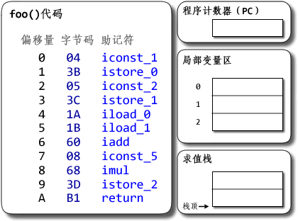
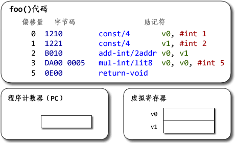

# 以太坊虚拟机（EVM）的存储设计
## 虚拟机的基本要素
我们现在讨论的虚拟机，是针对具体语言所实现的虚拟机。例如在JVM或者CPython中，JAVA或者python源码会被编译成相关字节码，然后
在对应虚拟机上运行，JVM或CPython会对这些字节码进行取指令，译码，执行，结果回写等操作。真实的物理机器上，相对应的二进制指
令是在物理机器上运行，物理机器从内存中取指令，通过总线传输到CPU，然后译码、执行、结果存储。

因此，虚拟机为了能够执行字节码，需要模拟出物理CPU能够执行的相关操作，与虚拟机实现相关的概念如下：
1. 将源码编译成VM所能执行的具体字节码。 
2. 字节码格式（指令格式）（如EVM中，指令后面就跟着操作数）
3. 函数调用相关的栈、寄存器结构，以及这些函数的相关定义。 
4. 一个“指令指针”，指向下一条待执行的指令（内存中，可以和EVM中的指令计数器op相对应）。
5. 一个虚拟“CPU”-指令执行器：
    - 获取下一条指令
    - 对操作数进行解码
    - 执行这条指令
 
## 堆栈虚拟机
虚拟机主要有基于栈和基于寄存器的两种实现方式，无论是哪种虚拟机，它们的具体实现机制都必须有以下内容：

- 取指令，即根据相关的计数器，确定当前应该执行的指令
- 译码，即决定指令类型，包括取出相关操作数（EVM黄皮书有着指令代码和具体指令的一一对应）
- 执行，借助于物理机资源，执行相关指令
- 存储计算结果

**对于堆栈虚拟机，它的核心概念在于真正的指令执行都是直接与*操作数栈*进行交互，而作为一种基本的数据结构，栈的实现可以无视底层
具体的物理架构，并且不需要在指令的执行中指定操作数的地址。**

相对而言，基于寄存器的虚拟机的重要概念则是虚拟寄存器，执行引擎需要对寄存器进行操作，找出操作数的具体位置，然后进行运算

我们可以从具体的例子中，来体验两种架构具体的不同（JVM与Dalvik VM)，有以下简单的代码demo：

    public class Demo {  
        public static void foo() {  
            int a = 1;  
            int b = 2;  
            int c = (a + b) * 5;  
        }  
    }  
    
JVM：



Dalvik VM:



一般而言，基于堆栈的机器需要更多指令，而基于寄存器的机器指令更长。


## EVM存储设计
回到以太坊的EVM中，从以太坊的设计中，我们知道本质上它也是一个基于栈的虚拟机，有着自己的指令集相关的存储结构。在之前的讨论中
我们已经介绍了相关的指令操作方式，我们可以对之前的内容做进一步的总结：
1. 在解释器中执行通过pc计数当前指令的位置，取出应当执行的指令
2. 将字节码和instructions中定义的指令对应
3. 执行相关操作，主要是相关gas值的计算和对stack的操作
4. 存储计算结果，将合约状态保存到stateDB中。

从EVM的设计中，我们知道看出EVM的存储方式主要分为三类：栈、内存和状态存储。

栈的内容很好理解，和JVM中的操作栈没有区别，都是根据相关的指令，对相关的操作数进行入栈和出栈的相关的操作。

内存是虚拟机在运行字节码时分配的临时空间，我们可以将其看成物理机中的易失性存储，会随着合约调用的结束自动释放。

状态存储本质上就是存储合约的状态，将合约中定义的相关的变量永久性的保存在区块链上。

我们来看看执行同样的代码的结果，首先实现一个同样功能的智能合约：
```    
    contract A {
        uint256 a;
        uint256 b;
        uint256 c;
        function A() {
            a = 1;
            b = 2;
            c = (a+b)*2;
        }      
    }
```
通过编译可以得到相关的字节码和对应的合约代码：

    "object": "60606040523415600e57600080fd5b6001600081905550600260018190555060026001546000540102600281905550603580603b6000396000f3006060604052600080fd00a165627a7a72305820b6ac9455705e1dc13f58f4957e5b50c1c0f37eb5b671acf9881f2c9f4e6a88160029",
    "opcodes": "PUSH1 0x60 PUSH1 0x40 MSTORE CALLVALUE ISZERO PUSH1 0xE JUMPI PUSH1 0x0 DUP1 REVERT JUMPDEST
    
    a的赋值：
    PUSH1 0x1 PUSH1 0x0 DUP2 SWAP1 SSTORE POP
    
    b的赋值：
    PUSH1 0x2 PUSH1 0x1 DUP2 SWAP1 SSTORE POP
    
    c的赋值：
    PUSH1 0x2 PUSH1 0x1 SLOAD PUSH1 0x0 SLOAD ADD MUL PUSH1 0x2 DUP2 SWAP1 SSTORE POP PUSH1 0x35 DUP1 PUSH1 0x3B PUSH1 0x0 CODECOPY PUSH1 0x0 RETURN"

这里要注意必须在函数外声明变量才是状态变量，才会写入到Storage中，对应的就是SSTORE命令

### 存疑❓

```diff
基于栈的操作很好理解，但是
1. 内存中到底存的什么？
```


