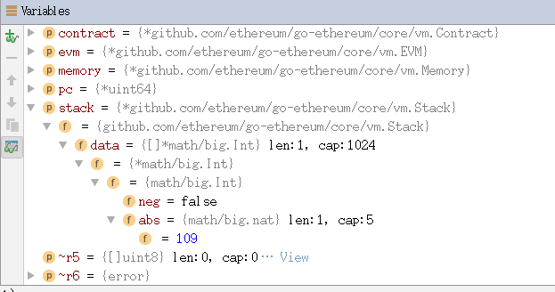

# 以太坊虚拟机（EVM）的存储设计
## 虚拟机的基本要素
我们现在讨论的虚拟机，是针对具体语言所实现的虚拟机。例如在JVM或者CPython中，JAVA或者python源码会被编译成相关字节码，然后
在对应虚拟机上运行，JVM或CPython会对这些字节码进行取指令，译码，执行，结果回写等操作。真实的物理机器上，相对应的二进制指
令是在物理机器上运行，物理机器从内存中取指令，通过总线传输到CPU，然后译码、执行、结果存储。

因此，虚拟机为了能够执行字节码，需要模拟出物理CPU能够执行的相关操作，与虚拟机实现相关的概念如下：
1. 将源码编译成VM所能执行的具体字节码。 
2. 字节码格式（指令格式）（如EVM中，指令后面就跟着操作数）
3. 函数调用相关的栈、寄存器结构，以及这些函数的相关定义。 
4. 一个“指令指针”，指向下一条待执行的指令（内存中，可以和EVM中的指令计数器op相对应）。
5. 一个虚拟“CPU”-指令执行器：
    - 获取下一条指令
    - 对操作数进行解码
    - 执行这条指令
 
## 堆栈虚拟机
虚拟机主要有基于栈和基于寄存器的两种实现方式，无论是哪种虚拟机，它们的具体实现机制都必须有以下内容：

- 取指令，即根据相关的计数器，确定当前应该执行的指令
- 译码，即决定指令类型，包括取出相关操作数（EVM黄皮书有着指令代码和具体指令的一一对应）
- 执行，借助于物理机资源，执行相关指令
- 存储计算结果

**对于堆栈虚拟机，它的核心概念在于真正的指令执行都是直接与*操作数栈*进行交互，而作为一种基本的数据结构，栈的实现可以无视底层
具体的物理架构，并且不需要在指令的执行中指定操作数的地址。**

相对而言，基于寄存器的虚拟机的重要概念则是虚拟寄存器，执行引擎需要对寄存器进行操作，找出操作数的具体位置，然后进行运算

我们可以从具体的例子中，来体验两种架构具体的不同（JVM与Dalvik VM)，有以下简单的代码demo：

    public class Demo {  
        public static void foo() {  
            int a = 1;  
            int b = 2;  
            int c = (a + b) * 5;  
        }  
    }  
    
JVM：


Dalvik VM:


一般而言，基于堆栈的机器需要更多指令，而基于寄存器的机器指令更长。


## EVM存储设计
回到以太坊的EVM中，从以太坊的设计中，我们知道本质上它也是一个基于栈的虚拟机，有着自己的指令集相关的存储结构。在之前的讨论中
我们已经介绍了相关的指令操作方式，我们可以对之前的内容做进一步的总结：
1. 在解释器中执行通过pc计数当前指令的位置，取出应当执行的指令
2. 将字节码和instructions中定义的指令对应
3. 执行相关操作，主要是相关gas值的计算和对stack的操作
4. 存储计算结果，将合约状态保存到stateDB中。

从EVM的设计中，我们知道看出EVM的存储方式主要分为三类：栈、内存和状态存储。

栈的内容很好理解，和JVM中的操作栈没有区别，都是根据相关的指令，对相关的操作数进行入栈和出栈的相关的操作。

内存是虚拟机在运行字节码时分配的临时空间，我们可以将其看成物理机中的易失性存储，会随着合约调用的结束自动释放。

状态存储本质上就是存储合约的状态，将合约中定义的相关的变量永久性的保存在区块链上。

我们来看看执行同样的代码的结果，首先实现一个同样功能的智能合约：
```    
    contract A {
        uint256 a;
        uint256 b;
        uint256 c;
        function A() {
            a = 1;
            b = 2;
            c = (a+b)*2;
        }      
    }
```
通过编译可以得到相关的字节码和对应的合约代码：

    "object": "60606040523415600e57600080fd5b6001600081905550600260018190555060056001546000540102600281905550603580603b6000396000f3006060604052600080fd00a165627a7a72305820ad8e31604359fe73688eb5a3775add6ff51aab0c97b79c6d1fd917e659dd174f0029",
    "opcodes": "PUSH1 0x60 PUSH1 0x40 MSTORE CALLVALUE ISZERO PUSH1 0xE JUMPI PUSH1 0x0 DUP1 REVERT JUMPDEST
    
    a的赋值：
    PUSH1 0x1 PUSH1 0x0 DUP2 SWAP1 SSTORE POP
    
    b的赋值：
    PUSH1 0x2 PUSH1 0x1 DUP2 SWAP1 SSTORE POP
    
    c的赋值：
    PUSH1 0x5 PUSH1 0x1 SLOAD PUSH1 0x0 SLOAD ADD MUL PUSH1 0x2 DUP2 SWAP1 SSTORE POP PUSH1 0x35 DUP1 PUSH1 0x3B PUSH1 0x0 CODECOPY PUSH1 0x0 RETURN"

这里要注意必须在函数外声明变量才是状态变量，才会写入到Storage中，对应的就是SSTORE命令

### 存疑❓

```diff
基于栈的操作很好理解，但是
1. 内存的设计到底用于存储什么内容？
```

## 存储管理
前文中，我们已经提到，EVM中有三类存储方式，分别是Storage，Memory，Stack。在前文的分析中，我们发现，对于合约的状态变量，EVM
会将其存储在Storage中进行永久存储，在需要使用的时候进行LOAD操作；而对于Stack，所有的计算指令相关的操作数都会存放其中，包括
一些临时和本地的变量值。

在之前的探索中，没有发现Memory的相关使用，在以太坊的设计书中（白皮书和黄皮书），只是强调内存是一个易失性存储，拥有保存临时
临时变量值的功能，但是并没有阐述哪些具体的内容会存储到这个虚拟的内存结构。但是，我们从Solidity语言的官方文档中，发现了这样
的描述：

    There are defaults for the storage location depending on which type of variable it concerns:
    - state variables are always in storage
    - function arguments are in memory by default
    - local variables of struct, array or mapping type reference storage by default
    - local variables of value type (i.e. neither array, nor struct nor mapping) are stored in the stack
 
1. 对于第一条，我们之前的探索已经证明，合约的状态变量的修改，最后都体现在对EVM中的StateDB的修改上。
2. 函数的参数将会默认存储在内存之中，这里的函数参数需要分两种情况来讨论：
    - 首先，如果是通过外部调用的方式指定传入的参数，则会通过指令CALLDATALOAD等指令，将相关内容压入栈中,并不是直接存入到
    内存中（相关内容参见...)
    - 因此，我们重点看内部调用的内容我们通过例子来证明：
    ```
    contract C {        
        uint[2] a;        
        function initialize() public {
            set(a);
        }    
        function set(uint[2] d)  {
            d[0] = 1;
            d[1] = 2;
        }
    }
    ```
这个函数功能比较好理解，就是通过initialize()给数组的第0个位置赋值为1，第1个位置赋值为2，当我们调用了initialize()函数后
通过字节码进行编译后，我们重点看涉及到的相关函数操作，主要的步骤有：
 
- 从Storage中load出相关内容存放到栈中；
- 为数组分配内存空间；
- 将相应的值存储到内存指定位置中；
- 最终将相应的结果再存储到Storage中；
    
因此，可以得到一些结论：
1. 由于Stack的存储不需要付费，因此在编译优化中，始终优先选择将值压入栈中，简单的参数与计算都栈中完成。因此，涉及到内存操作
的字节码，通常都对应着一些较为复杂的数据结构。
2. 所有需要中间状态的操作，都会有对于内存的相关操作，必要的时候，可以通过Solidity决定一些变量的存储区域
3. EVM中有一个限制，对于栈的操作深度只有距栈顶的16个（虽然不知道为什么这样设计），这意味着如果要同时对16个变量进行操作
或赋值，则必须采用内存等其他变通的方式。（具体到相关指令为DUP和SWAP，他们只能对16位以内的元素进行交换和复制）

## 通过EMV读取外部数据
从本质上而言，虚拟引擎就是通过实现语言来模拟物理机器的字节码操作，在不考虑上层语言设计的角度下，我们尝试加入新的操作指令，
来验证是否能够通过EVM读取外部数据：
指令：READFILE  功能：读取指定位置（写死）的文件，将其值压入栈中,我们依次需要修改以下内容：
1. 在core/vm/opcodes.go 中加入指令名称和与其绑定的字节码，主要的内容有：
    ```
   定义一个常量，将指令名称和字节码相对应：
    const (
    	// 0xf0 range - closures
    	CREATE OpCode = 0xf0 + iota //常量计数器，后面一次加1
    	CALL
    	CALLCODE
    	RETURN
    	DELEGATECALL
    	READFILE
    	STATICCALL = 0xfa
    
    	REVERT       = 0xfd
    	SELFDESTRUCT = 0xff
    )
    
    操作码和string的对应：
    var opCodeToString = map[OpCode]string{
    ...
    / 0xf0 range
    	CREATE:       "CREATE",
    	CALL:         "CALL",
    	RETURN:       "RETURN",
    	CALLCODE:     "CALLCODE",
    	DELEGATECALL: "DELEGATECALL",
    	READFILE:     "READFILE",
    	STATICCALL:   "STATICCALL",
    	REVERT:       "REVERT",
    	SELFDESTRUCT: "SELFDESTRUCT",
    ...
    }
    
    string和操作码的对应：
    var stringToOp = map[string]OpCode{
    ...
    "RETURN":         RETURN,
    "CALLCODE":       CALLCODE,
    "REVERT":         REVERT,
    "SELFDESTRUCT":   SELFDESTRUCT,
    "READFILE":       READFILE,
    }
    ```
    
2. 在jump_table中，在指令表中加入相关指令，并绑定其执行函数、Gas函数、堆栈检查等相关内容；
```
READFILE:{
			execute:		opReadFile, //定义指令的执行函数
			gasCost:		constGasFunc(GasQuickStep), //定义指令的gas
			validateStack:  makeStackFunc(0,1), //定义指令堆栈资源
			valid:			true, //指示检索到的操作是否有效并且已知
		},
```

3. 在instruction.go 中定义指令执行函数：
```
// read value from disk
func opReadFile(pc *uint64, evm *EVM, contract *Contract, memory *Memory, stack *Stack) ([]byte, error) {
	b, err := ioutil.ReadFile("test.txt") //读取文件内容，暂时只能写死在EVM引擎中
	if err!=nil {
		fmt.Print(err)
	}
	var s = string(b[:])
	i ,err2 := strconv.ParseInt(s, 10, 64)
	if err2 != nil{
		fmt.Print(err2)
	}
	value := big.NewInt(i) // 将读入的字节转化为stack的数据结构 big.Int
	stack.push(value)   // 压入栈中

	return nil, nil
}
```
此时，我们已经新定义了一个指令操作。然后，我们新建一个test.txt，并通过测试文件来检验指令是否可以正常执行。

我们在test文件中写入一个数值109，我们可以来看一下执行结果：



可以发现，我们成功将test.txt文件中的数值压入栈中。


