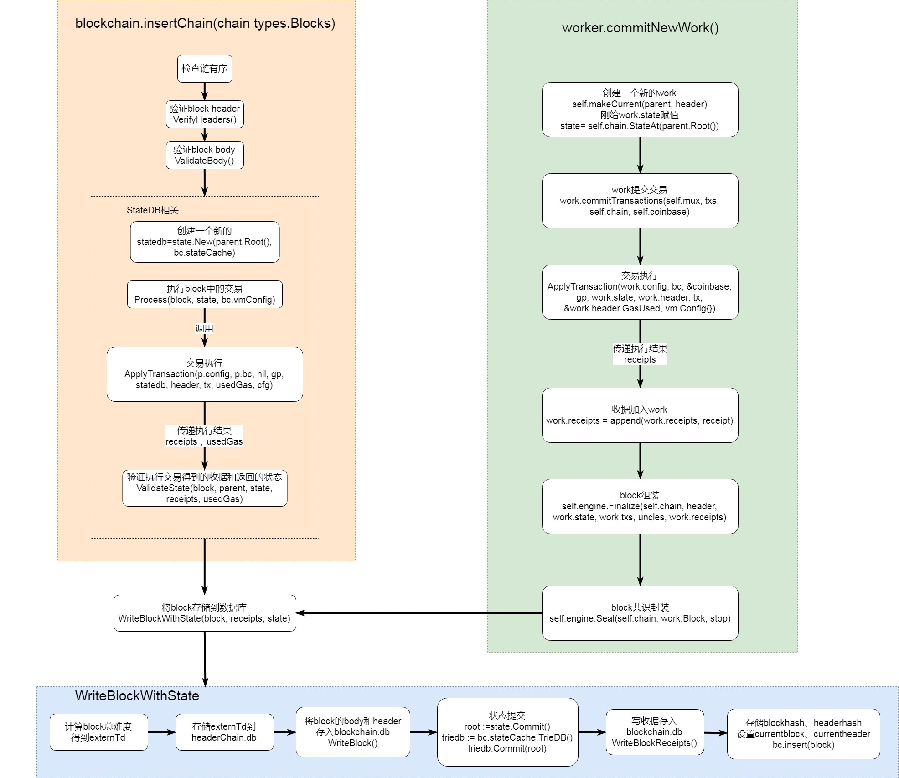

# 区块的验证工作


在之前的学习中，我们有明确两个关键的共识流程：在接受到新的区块之后，在写入到区块链中之前，必须要进行验证和执行。

如果对于自身打包的区块，一旦成功挖坑之后即可写入。而对于接收到的区块，必然也会有着类似的内容。之前的内容中，我们知道
它是在blockchain。insetChain函数中实现，我们也知道了里面的基本流程：



- 检查链有序
- 验证block header
- 验证block body
- 处理block中的交易
- 验证交易状态

在以上五个流程中，检查链有序的本质，是根据接收到的Block，检查其区块号与区块头是否是顺序链接过来的，而
ApplyTransaction在之前的工作中已经做过详细的分析，这里我们主要分析每一步的验证的到底包含一些什么内容。

## VerifyHeader()
在区块头的验证函数中，核心的验证工作有：
- 验证时间戳是否有误，必须确保新区块的时间在父区块之后
- 验证区块产生难度，确保接收的新区块产生难度正确
- 验证Gas Limit
- 验证blocknumber
- 验证block seal。这个内容是共识算法的核心，其本质上就是验证该区块POW结果是否符合要求（里面最终的要是有一个Recompute的操作）

 ```
// verifyHeader checks whether a header conforms to the consensus rules of the
// stock Ethereum ethash engine.
// See YP section 4.3.4. "Block Header Validity"
// 验证一个header是否符合共识规则
func (ethash *Ethash) verifyHeader(chain consensus.ChainReader, header, parent *types.Header, uncle bool, seal bool) error {
	// Ensure that the header's extra-data section is of a reasonable size
	// 验证header的extra-data大小合理
	// TODO：extra干啥的
	if uint64(len(header.Extra)) > params.MaximumExtraDataSize {
		return fmt.Errorf("extra-data too long: %d > %d", len(header.Extra), params.MaximumExtraDataSize)
	}
	// Verify the header's timestamp
	// 验证时间戳
	if uncle {
		if header.Time.Cmp(math.MaxBig256) > 0 {
			return errLargeBlockTime
		}
	} else {
		if header.Time.Cmp(big.NewInt(time.Now().Add(allowedFutureBlockTime).Unix())) > 0 {
			return consensus.ErrFutureBlock
		}
	}
	if header.Time.Cmp(parent.Time) <= 0 {
		return errZeroBlockTime
	}
	// Verify the block's difficulty based in it's timestamp and parent's difficulty
	// 验证block的难度 基于时间戳和父块难度
	expected := ethash.CalcDifficulty(chain, header.Time.Uint64(), parent)

	if expected.Cmp(header.Difficulty) != 0 {
		return fmt.Errorf("invalid difficulty: have %v, want %v", header.Difficulty, expected)
	}
	// Verify that the gas limit is <= 2^63-1
	// 验证gas limit
	cap := uint64(0x7fffffffffffffff)
	if header.GasLimit > cap {
		return fmt.Errorf("invalid gasLimit: have %v, max %v", header.GasLimit, cap)
	}
	// Verify that the gasUsed is <= gasLimit
	// 验证使用的gas小于gaslimit
	if header.GasUsed > header.GasLimit {
		return fmt.Errorf("invalid gasUsed: have %d, gasLimit %d", header.GasUsed, header.GasLimit)
	}

	// Verify that the gas limit remains within allowed bounds
	// 验证gas限制变化在允许的范围
	diff := int64(parent.GasLimit) - int64(header.GasLimit)
	if diff < 0 {
		diff *= -1
	}

	limit := parent.GasLimit / params.GasLimitBoundDivisor

	if uint64(diff) >= limit || header.GasLimit < params.MinGasLimit {
		return fmt.Errorf("invalid gas limit: have %d, want %d += %d", header.GasLimit, parent.GasLimit, limit)
	}
	// Verify that the block number is parent's +1
	// 验证block number = parent number + 1
	if diff := new(big.Int).Sub(header.Number, parent.Number); diff.Cmp(big.NewInt(1)) != 0 {
		return consensus.ErrInvalidNumber
	}
	// Verify the engine specific seal securing the block
	// 验证block的seal
	if seal {
		if err := ethash.VerifySeal(chain, header); err != nil {
			return err
		}
	}
	// If all checks passed, validate any special fields for hard forks
	// 所有检查通过，验证DAO分叉
	if err := misc.VerifyDAOHeaderExtraData(chain.Config(), header); err != nil {
		return err
	}
	if err := misc.VerifyForkHashes(chain.Config(), header, uncle); err != nil {
		return err
	}
	return nil
}
```

## ValidateBody()
相对于区块头的验证涉及到了最为关键的共识验证，区块body的验证相对简单，除去叔区块的相关内容，其本质上的内容是确保区块中所有
交易的哈希计算树根的结果能够和区块头中的哈希相对应

```
// ValidateBody validates the given block's uncles and verifies the the block
// header's transaction and uncle roots. The headers are assumed to be already
// validated at this point.
// 验证区块body 头部的transaction和叔链的roots
func (v *BlockValidator) ValidateBody(block *types.Block) error {
	// Check whether the block's known, and if not, that it's linkable
	// block是否在blockchain，状态是否已经存储
	if v.bc.HasBlockAndState(block.Hash(), block.NumberU64()) {
		return ErrKnownBlock
	}
	if !v.bc.HasBlockAndState(block.ParentHash(), block.NumberU64()-1) {
		if !v.bc.HasBlock(block.ParentHash(), block.NumberU64()-1) {
			// 祖先未知
			return consensus.ErrUnknownAncestor
		}
		return consensus.ErrPrunedAncestor
	}
	// Header validity is known at this point, check the uncles and transactions
	header := block.Header()
	// 检查uncles
	if err := v.engine.VerifyUncles(v.bc, block); err != nil {
		return err
	}

	// 计算uncle的hash
	if hash := types.CalcUncleHash(block.Uncles()); hash != header.UncleHash {
		return fmt.Errorf("uncle root hash mismatch: have %x, want %x", hash, header.UncleHash)
	}

	// 计算出block中Transactions树根的hash与header中比较
	if hash := types.DeriveSha(block.Transactions()); hash != header.TxHash {
		return fmt.Errorf("transaction root hash mismatch: have %x, want %x", hash, header.TxHash)
	}
	return nil
}
```

## ValidateState()
同Body的验证类似，状态验证是确保Gas、收据树和状态树的正确。
```
// ValidateState validates the various changes that happen after a state
// transition, such as amount of used gas, the receipt roots and the state root
// itself. ValidateState returns a database batch if the validation was a success
// otherwise nil and an error is returned.
// 验证一个状态转变后的不同变比，比如gas的使用，收据树root，状态树root。
// 返回数据库batch如果验证成功
func (v *BlockValidator) ValidateState(block, parent *types.Block, statedb *state.StateDB, receipts types.Receipts, usedGas uint64) error {
	header := block.Header()
	// gas使用
	if block.GasUsed() != usedGas {
		return fmt.Errorf("invalid gas used (remote: %d local: %d)", block.GasUsed(), usedGas)
	}
	// Validate the received block's bloom with the one derived from the generated receipts.
	// For valid blocks this should always validate to true.
	// 验证收到的block的bloom和收据得到bloom
	rbloom := types.CreateBloom(receipts)
	if rbloom != header.Bloom {
		return fmt.Errorf("invalid bloom (remote: %x  local: %x)", header.Bloom, rbloom)
	}
	// Tre receipt Trie's root (R = (Tr [[H1, R1], ... [Hn, R1]]))
	// 收据树根验证
	receiptSha := types.DeriveSha(receipts)
	if receiptSha != header.ReceiptHash {
		return fmt.Errorf("invalid receipt root hash (remote: %x local: %x)", header.ReceiptHash, receiptSha)
	}
	// Validate the state root against the received state root and throw
	// an error if they don't match.
	// 状态树根
	if root := statedb.IntermediateRoot(v.config.IsEIP158(header.Number)); header.Root != root {
		return fmt.Errorf("invalid merkle root (remote: %x local: %x)", header.Root, root)
	}
	return nil
}
```
