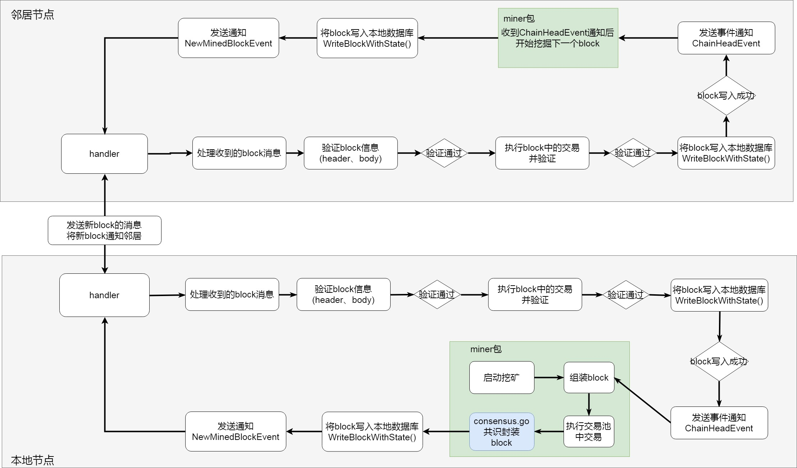

# WriteBlockWithState

此方法用来将block存入本地blockchain中，也就是存入数据库中，新的block会存入blockchain的db，执行交易产生的state会存入statedb。


首先回顾block的数据结构

```
// Block represents an entire block in the Ethereum blockchain.
// 以太坊区块链中一个完整的block
type Block struct {
   header       *Header // 
   uncles       []*Header // 叔链的header
   transactions Transactions // Transaction结构体的数组，存放交易的txdata,hash,size,from

   // caches
   hash atomic.Value
   size atomic.Value

   // Td is used by package core to store the total difficulty
   // of the chain up to and including the block.
   // 当前block的总难度，td大的block将被认可为主链
   td *big.Int

   // These fields are used by package eth to track
   // inter-peer block relay.
   // 接收到block的时间和block来源（peer）
   ReceivedAt   time.Time
   ReceivedFrom interface{}
}
```
header的数据结构
```
// Header represents a block header in the Ethereum blockchain.
type Header struct {
	// 父块hash
   ParentHash  common.Hash    `json:"parentHash"       gencodec:"required"`
   // 叔块hash
   UncleHash   common.Hash    `json:"sha3Uncles"       gencodec:"required"`
   // 挖出区块的节点的地址
   Coinbase    common.Address `json:"miner"            gencodec:"required"`
   // 状态的root
   Root        common.Hash    `json:"stateRoot"        gencodec:"required"`
   // 交易树的root
   TxHash      common.Hash    `json:"transactionsRoot" gencodec:"required"`
   // 收据树 的root
   ReceiptHash common.Hash    `json:"receiptsRoot"     gencodec:"required"`
   // 过滤器
   Bloom       Bloom          `json:"logsBloom"        gencodec:"required"`
   // 难度值
   Difficulty  *big.Int       `json:"difficulty"       gencodec:"required"`
   // block号
   Number      *big.Int       `json:"number"           gencodec:"required"`
   // gas限制
   GasLimit    uint64         `json:"gasLimit"         gencodec:"required"`
   // 使用的gas
   GasUsed     uint64         `json:"gasUsed"          gencodec:"required"`
   // 时间戳
   Time        *big.Int       `json:"timestamp"        gencodec:"required"`
   //
   Extra       []byte         `json:"extraData"        gencodec:"required"`
   // 混合摘要
   MixDigest   common.Hash    `json:"mixHash"          gencodec:"required"`
   // 
   Nonce       BlockNonce     `json:"nonce"            gencodec:"required"`
}
```
blockchain数据结构

```
type  BlockChain struct {
   chainConfig *params.ChainConfig // Chain & network configuration
   cacheConfig *CacheConfig        // Cache configuration for pruning

   // 底层的持久化数据库，存储最终结果
   db     ethdb.Database // Low level persistent database to store final content in
   triegc *prque.Prque   // Priority queue mapping block numbers to tries to gc
   // 累计主链的执行
   gcproc time.Duration  // Accumulates canonical block processing for trie dumping

   hc            *HeaderChain
   rmLogsFeed    event.Feed
   chainFeed     event.Feed
   chainSideFeed event.Feed
   chainHeadFeed event.Feed
   logsFeed      event.Feed
   scope         event.SubscriptionScope
   genesisBlock  *types.Block

   mu      sync.RWMutex // global mutex for locking chain operations
   chainmu sync.RWMutex // blockchain insertion lock
   procmu  sync.RWMutex // block processor lock

   checkpoint       int          // checkpoint counts towards the new checkpoint
   currentBlock     atomic.Value // Current head of the block chain
   currentFastBlock atomic.Value // Current head of the fast-sync chain (may be above the block chain!)

   stateCache   state.Database // State database to reuse between imports (contains state cache)
   bodyCache    *lru.Cache     // Cache for the most recent block bodies
   bodyRLPCache *lru.Cache     // Cache for the most recent block bodies in RLP encoded format
   blockCache   *lru.Cache     // Cache for the most recent entire blocks
   futureBlocks *lru.Cache     // future blocks are blocks added for later processing

   quit    chan struct{} // blockchain quit channel
   running int32         // running must be called atomically
   // procInterrupt must be atomically called
   procInterrupt int32          // interrupt signaler for block processing
   wg            sync.WaitGroup // chain processing wait group for shutting down

   engine    consensus.Engine
   // 区块执行接口
   processor Processor // block processor interface
   validator Validator // block and state validator interface
   vmConfig  vm.Config

   badBlocks *lru.Cache // Bad block cache
}
```

### **分析WriteBlockWithState()方法**

1.计算block难度，得到externTd=当前block难度+parentBlock难度，并写入blockchain.HeaderChain中

2.创建batch，存储block的body和header到blockchain.db

**3.对trie进行处理**

4.WriteBlockReceipts()方法将收据信息存入blockchain.db

5.根据externTd判断加入的block是那种状态NonStatTy，CanonStatTy还是SideStatTy


```
// WriteBlockWithState writes the block and all associated state to the database.
// 写block，数据库相关状态
func (bc *BlockChain) WriteBlockWithState(block *types.Block, receipts []*types.Receipt, state *state.StateDB) (status WriteStatus, err error) {
   bc.wg.Add(1)
   defer bc.wg.Done()

   // Calculate the total difficulty of the block
   // 计算block总难度，不能为空
   ptd := bc.GetTd(block.ParentHash(), block.NumberU64()-1)
   if ptd == nil {
      return NonStatTy, consensus.ErrUnknownAncestor
   }
   // Make sure no inconsistent state is leaked during insertion
   // 确保没有不一致的状态
   bc.mu.Lock()
   defer bc.mu.Unlock()

   // 当前区块
   currentBlock := bc.CurrentBlock()
   // 得到当前块的难度
   localTd := bc.GetTd(currentBlock.Hash(), currentBlock.NumberU64())
   // block难度加上父块难度
   externTd := new(big.Int).Add(block.Difficulty(), ptd)

   // Irrelevant of the canonical status, write the block itself to the database
   // 与主链状态不相干，存储externTd到数据库
   if err := bc.hc.WriteTd(block.Hash(), block.NumberU64(), externTd); err != nil {
      return NonStatTy, err
   }
   // Write other block data using a batch.
   // 用batch写另一个block数据
   batch := bc.db.NewBatch()

   // 写入数据库 写入body和header
   if err := WriteBlock(batch, block); err != nil {
      return NonStatTy, err
   }

   // db状态提交 返回一个root
   root, err := state.Commit(bc.chainConfig.IsEIP158(block.Number()))
   if err != nil {
      return NonStatTy, err
   }
   // 得到状态缓存 默克尔树
   triedb := bc.stateCache.TrieDB()

   // If we're running an archive node, always flush
   // 运行一个打包的node，总是flush
   if bc.cacheConfig.Disabled {
      // 将root存入triedb
      if err := triedb.Commit(root, false); err != nil {
         return NonStatTy, err
      }
   } else {
      // Full but not archive node, do proper garbage collection
      // 满了但是没有打包node，
      // 元数据参考 来保持 trie alive
      triedb.Reference(root, common.Hash{}) // metadata reference to keep trie alive
      bc.triegc.Push(root, -float32(block.NumberU64()))


      // block number 大于 128
      if current := block.NumberU64(); current > triesInMemory {
         // Find the next state trie we need to commit
         // 找到下一个需要提交的状态trie
         header := bc.GetHeaderByNumber(current - triesInMemory)
         chosen := header.Number.Uint64()

         // Only write to disk if we exceeded our memory allowance *and* also have at
         // least a given number of tries gapped.
         // 只写到disk如果我们超过了内存运行
         // 并且也有至少 tries一个数字的缺口
         var (
            size  = triedb.Size()
            limit = common.StorageSize(bc.cacheConfig.TrieNodeLimit) * 1024 * 1024
         )
         // size > limit 或者 bc的时间 > trie 刷新时间
         if size > limit || bc.gcproc > bc.cacheConfig.TrieTimeLimit {
            // If we're exceeding limits but haven't reached a large enough memory gap,
            // warn the user that the system is becoming unstable.
            // 如果超过限制但是没有达到足够大的内存缺口，警告用户系统不稳定
            if chosen < lastWrite+triesInMemory {
               switch {
               case size >= 2*limit:
                  log.Warn("State memory usage too high, committing", "size", size, "limit", limit, "optimum", float64(chosen-lastWrite)/triesInMemory)
               case bc.gcproc >= 2*bc.cacheConfig.TrieTimeLimit:
                  log.Info("State in memory for too long, committing", "time", bc.gcproc, "allowance", bc.cacheConfig.TrieTimeLimit, "optimum", float64(chosen-lastWrite)/triesInMemory)
               }
            }
            // If optimum or critical limits reached, write to disk
            // 到达了限制，写入硬盘
            if chosen >= lastWrite+triesInMemory || size >= 2*limit || bc.gcproc >= 2*bc.cacheConfig.TrieTimeLimit {
               triedb.Commit(header.Root, true)
               lastWrite = chosen
               bc.gcproc = 0
            }
         }
         // Garbage collect anything below our required write retention
         // 垃圾回收
         for !bc.triegc.Empty() {
            root, number := bc.triegc.Pop()
            if uint64(-number) > chosen {
               bc.triegc.Push(root, number)
               break
            }
            triedb.Dereference(root.(common.Hash), common.Hash{})
         }
      }
   }

   // 写收据
   if err := WriteBlockReceipts(batch, block.Hash(), block.NumberU64(), receipts); err != nil {
      return NonStatTy, err
   }
   // If the total difficulty is higher than our known, add it to the canonical chain
   // Second clause in the if statement reduces the vulnerability to selfish mining.
   // Please refer to http://www.cs.cornell.edu/~ie53/publications/btcProcFC.pdf
   // 如果难度高于我们所知，加入主链
   // 减少自私挖矿的弱点

   // 总难度大于当前块难度
   reorg := externTd.Cmp(localTd) > 0
   currentBlock = bc.CurrentBlock()
   if !reorg && externTd.Cmp(localTd) == 0 {
      // Split same-difficulty blocks by number, then at random
      // 通过number分离相同难度的block
      // 要写的block number < 当前链头的block number
      // 或者两者相等，随机数<0.5
      reorg = block.NumberU64() < currentBlock.NumberU64() || (block.NumberU64() == currentBlock.NumberU64() && mrand.Float64() < 0.5)
   }
   if reorg {
      // Reorganise the chain if the parent is not the head block
      // 重组链，如果父块不是头部block
      if block.ParentHash() != currentBlock.Hash() {
         if err := bc.reorg(currentBlock, block); err != nil {
            return NonStatTy, err
         }
      }
      // Write the positional metadata for transaction and receipt lookups
      // 保存一个位置数据，为每个来自block的交易，使hash基于交易和收据
      if err := WriteTxLookupEntries(batch, block); err != nil {
         return NonStatTy, err
      }
      // Write hash preimages
      // 存preimage
      if err := WritePreimages(bc.db, block.NumberU64(), state.Preimages()); err != nil {
         return NonStatTy, err
      }
      // 主链
      status = CanonStatTy
   }else {
      // 否则就是一个叔链
      status = SideStatTy
   }
   if err := batch.Write(); err != nil {
      return NonStatTy, err
   }

   // Set new head.
   // 设置新的头部，如果状态是主链
   if status == CanonStatTy {
      bc.insert(block)
   }
   bc.futureBlocks.Remove(block.Hash())
   return status, nil
}
```


