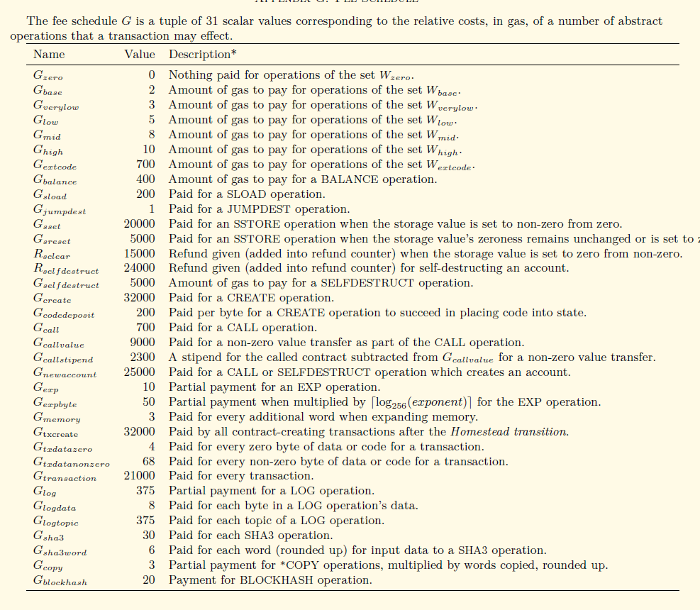

#  一、Gas 的设计
在之前的汇报中，我们提到了有关Gas的设计，它就像整个以太坊的血液系统，每个别执行的合约与交易命令，都必须消耗一定数值的Gas,而Gas又和具备真实价值的以太币关联，使得整个系统再“有偿”使用的前提下，能够健康平稳地运行，避免了网络的滥用。目前，出现的恶意DOS攻击，主要的原因都是通过智能合约的设计，恶意利用系统的漏洞，使得复杂的系统操作仅仅消耗非常少量的Gas,使得大量待处理的交易堵塞系统，增加了正常交易所等待的时间。

根据以太坊黄皮书，Gas设计的基本理念在于，创建交易与合约的固定费用加上执行命令的复杂程度构成一条交易最终的Gas费用。在以太坊黄皮书中，有着明确的命令Gas费用表，如下图所示：


在这个表格中，可以和以太坊源码中Params/protocol_params.go中的定义所对应，如表中倒数第三与第四行的内容，定义了一次SHA3操作的gas费用和每个输入数据单词的SHA3操作额外费用，可以与下图代码段完美契合。

```
Sha3Gas          uint64 = 30    // Once per SHA3 operation.
Sha3WordGas      uint64 = 6     // Once per word of the SHA3 operation's data.
```
但是，表格中前列的集合指令没有在这个代码段中，源码中还会根据实际的情况，定义一些操作集合的gas费用。

# 二、ApplyTransaction()
在之前的汇报中，我们已经从命令行调用一条交易追溯到了矿工提交这条交易到执行的步骤，从work.go中的commitNewWork()组装区块，到调用Env中的commitTransaction，最终发现，在虚拟机外，真实的交易执行代码是在core.state_processor中的ApplyTransaction()，这条命令将会最终执行交易，并返回收据（Receipt,以太坊中数据结构的一种）。它主要的执行步骤有：
1.	根据输入参数分别封装出一个Message和一个EVM对象

2.	然后将Message, EVM以及输入变量GasPool，通过ApplyMessage传递到TransitionDb()执行交易

3.	最后创建并返回Recetip对象，以及整个tx执行过程所消耗Gas数量

随后的内容，我们将分别的阐述数据结构Message，交易的执行函数TransitionDB的流程，以及Receipt的基本数据结构。到目前为止，ApplyTransaction()将会是以太坊中交易在虚拟机外执行的最后一步，按照其架构设计，在此创建虚拟机后，将会在虚拟机执行账户改变，创建合约并执行合约指令数组等操作。
## （一） Message

在ApplyTransaction()中，首先调用的AsMessage(),从上图可以看出，这个方法的主要的作用是返回一个已经对账户地址进行了签名的message，message的数据结构如下：
```
func (tx *Transaction) AsMessage(s Signer) (Message, error) {
	msg := Message{
		nonce:      tx.data.AccountNonce,
		gasLimit:   tx.data.GasLimit,
		gasPrice:   new(big.Int).Set(tx.data.Price),
		to:         tx.data.Recipient,
		amount:     tx.data.Amount,
		data:       tx.data.Payload,
		checkNonce: true,
	}

	var err error
	msg.from, err = Sender(s, tx)
	return msg, err
}
```
    type Message struct {
    	to         *common.Address
    	from       common.Address
    	nonce      uint64
    	amount     *big.Int
    	gasLimit   uint64
    	gasPrice   *big.Int
    	data       []byte
    	checkNonce bool
    }
从数据结构的来看，Message和交易的变量基本相同。在交易执行中，Message由此次待执行的tx对象转化而来，并携带了解析出的tx的(转帐)转出方地址，属于待处理的数据对象。

## (二)  TransitionDB
在ApplyMessage函数中，将会初始化一个StateTransition()对象，并直接调用TransitionDB()方法，最终返回EVM的执行字节**（不懂）**，Gas的实际消耗
和一个错误代码（如果执行失败）。StateTransition是以太坊中状态转换的模型对象，它将会将交易应用到当前世界状态的改变，完成
所有所需的工作并计算出一个新的合法状态树根。它以EVM，Mesage和一个Gaspool对象为输入参数，其中GasPool是之前Block中创建，
是区块中所有交易共享的Gas池，记录的是一个区块中可用的Gas数量（新建时，将一个Block的Gaslimit赋值给它）。

在TransitionDB()将会通过执行当前的Message来完成状态的改变，返回结果和Gas的消耗，其执行的具体流程如下：


1.执行buyGas()。首先从交易(转账)的转出方账户扣除一笔Ether，就是冻结我们为这笔交易所设置的最大Gas消耗费用，其值等于GasLimit
*GasPrice；同时从Gaspool中减去该笔交易所需，设置initialGas和gas变量，分别表示初始可用的Gas和即时可用的Gas,代码如下。
  ```
  if err := st.gp.SubGas(st.msg.Gas()); err != nil {
  		return err
  	}
    st.gas += st.msg.Gas() 
       
    st.initialGas = st.msg.Gas()
    state.SubBalance(sender.Address(), mgval)
   ```

2.执行IntrinsicGas(), 计算tx的固有Gas消耗。它分为两个部分，每一个tx预设的消耗量，这个消耗根据是转账交易还是合约创建而略有
不同；然后，针对tx.data.Payload中的非0字节和0字节长度计算固有消耗，最终，st.gas（当前所剩gas） -= intrinsicGas。**（Payload中具体内容还需要进一步了解）**

3.EVM执行。如果交易的(转帐)转入方地址为空（判断是转账交易还是合约创建），调用EVM的Create()函数；否则，调用Call()函数。无论哪个函数返回后，更新st.gas。

4.执行 refundGas()。在refundGas中，首先将会计算本次执行交易所实际消耗的Gas, 代码为：
    
    func (st *StateTransition) gasUsed() uint64 {
    	return st.initialGas - st.gas
    }
然后，将剩余st.gas 和基于实际消耗量requiredGas，系统提供补偿refundGas立即归还到交易转出方。refundGas 所折算的Ether会被立即加在(转帐)转出方账户上，同时st.gas += refundGas，gp += st.gas，即剩余的Gas加上系统补偿的Gas，被一起归并进GasPool。
**没有看懂这一步设立的原因，为什么会有一个系统的补偿？？？** 目前，根据以太坊黄皮书，猜测的设计原理是如果交易的执行使得存储
空间变大（删除了某些内容的存储），将会获得一定的补偿，这里会取 usedGas/2 和 refund的最小值。

5.奖励所属区块的挖掘者：系统给矿工增加一笔金额，代码如下：

    st.state.AddBalance(st.evm.Coinbase, new(big.Int).Mul(new(big.Int).SetUint64(st.gasUsed()), st.gasPrice))
值得注意的是，这里的st.gas在步骤5中被加上了refundGas, 所以这笔奖励金所对应的Gas，其数量小于该交易实际消耗量requiredGas。


## (三) Receipt
以太坊将会为每笔交易都产生一个收据（Receipt） ，这个收据包含关于交易的特定信息，如下图所示：


从Receipt的数据结构来看，它主要包含交易后的状态，当前区块交易累积使用的Gas数量，以及交易执行过程中创建的日志集合,也会包含这次
交易的一些基本数据，如该次交易使用量。

（具体的作用，尤其是Log的作用，可以在随后的学习中相继补充）

*在Receipt 中有一个Log类型的数组，其中每一个Log对象记录了交易中一小步的操作。所以，每一个tx的执行结果，可以由一个Receipt对象来
表示；更详细的内容，由一组Log对象来记录。这个Log数组很重要，比如在不同Ethereum节点(Node)的相互同步过程中，待同步区块的
Log数组有助于验证同步中收到的block是否正确和完整，所以会被单独同步(传输)。*

*Receipt的PostState保存了创建该Receipt对象时，整个Block内所有“帐户”的当时状态。Ethereum 里用stateObject来表示一个账户
Account，这个账户可转帐(transfer value), 可执行tx, 它的唯一标示符是一个Address类型变量。 这个Receipt.PostState 就是当时
所在Block里所有stateObject对象的RLP Hash值。*

