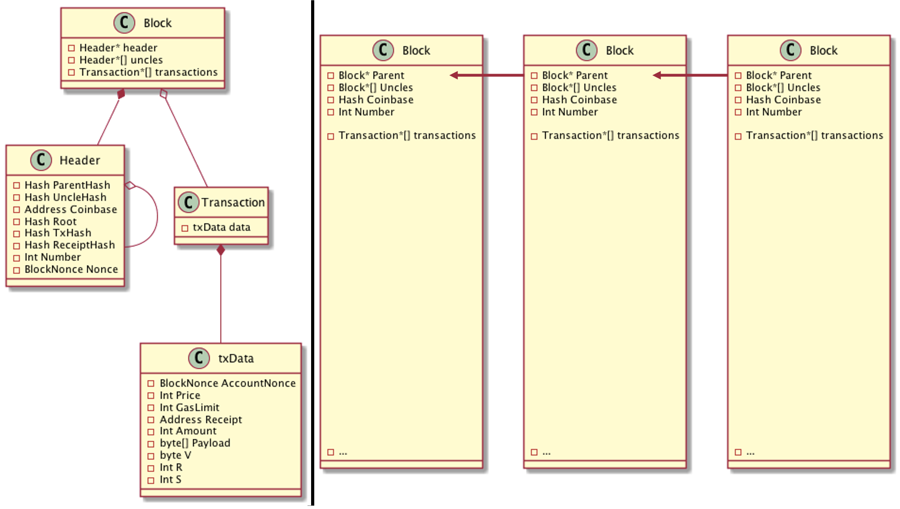
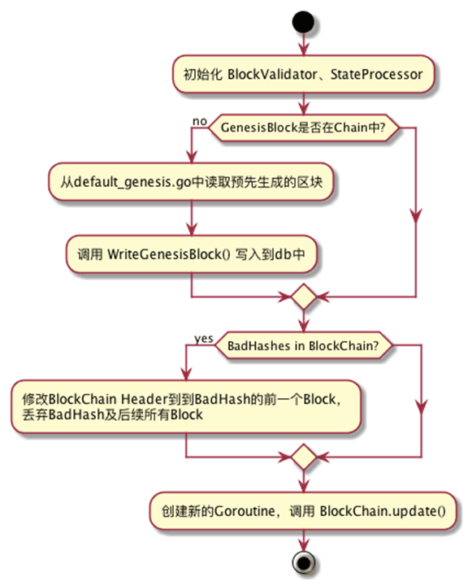
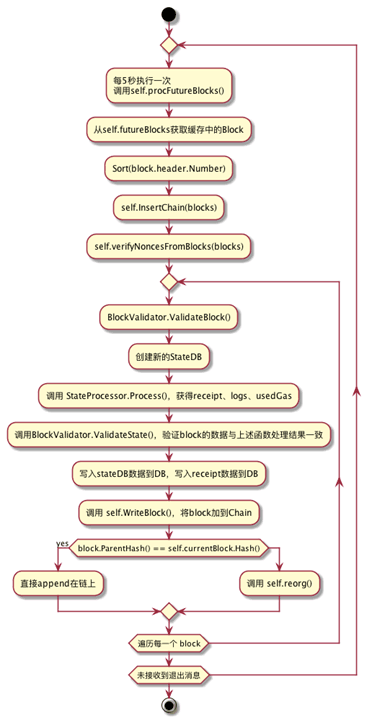
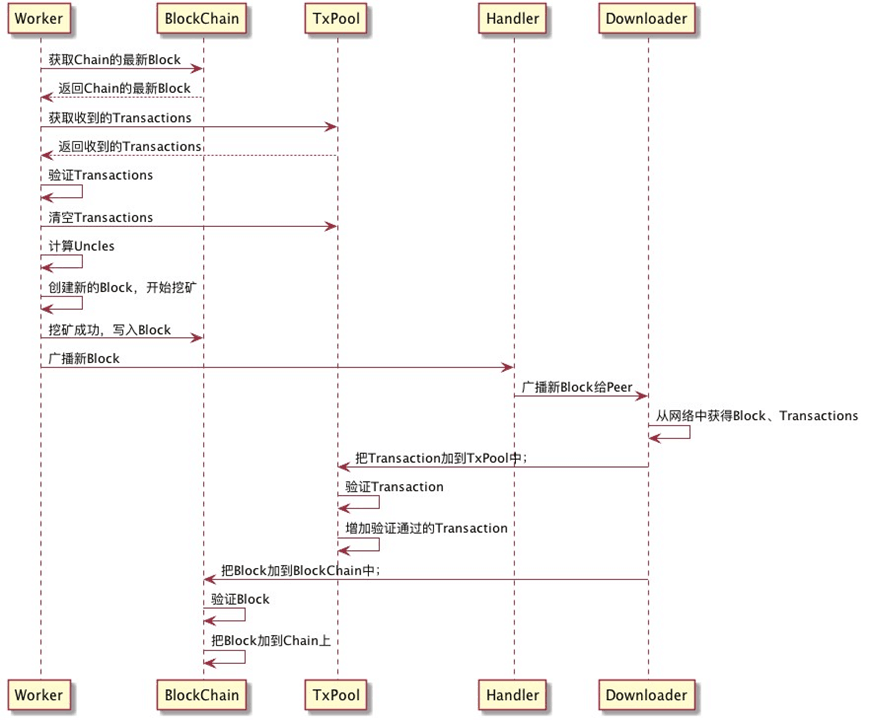

# 区块与交易的数据结构初探

#### Blockchain的数据结构

* 单向链表
    * 每个Block按照生成顺序依次相连
* Transaction存储在Block中
    * 每个Block存储多个Transaction，以提高TPS

    

#### Blockchain的存储方式

* Append only
    * Block依次append
* Key-value数据库：LevelDB
    * 无结构化查询需求
    * 按照hash查找structure
    * 键-值对的存储形式
* 序列化方案
    * 递归长度前缀RLP编码

#### Block和Transaction的验证

* StateDB
    * 记录Transaction的执行情况
    * StateObject中以Account为key，记录Balance、nonce、code和codeHash
* BlockValidator
    * 验证UsedGas、Bloom、RecipientSha和StateDB.IntermediateRoot
* StateProcessor
    * 计算Gas、Receipt和Uncle
* StateTransition
    * 验证、执行Transaction
    * preCheck()：检查Nonce一致，使用sender的balance购买消息中定义的gas
    * 扣除transaction.data.payload计算消耗的gas
    * 执行code（生成/执行contract）
    * 将多余的gas退回到sender.balance

#### Chian的创建及初始化

#### Block加入Chain的过程

#### 时序图

