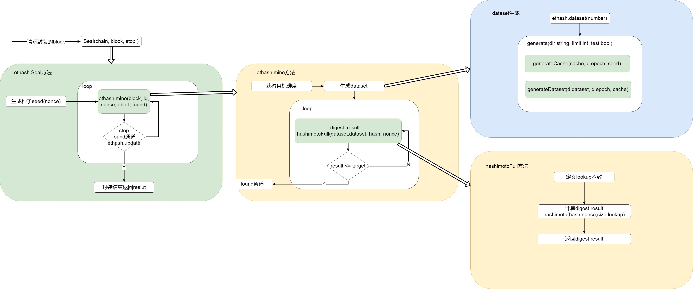

# Ethash

### DAG

Ethash的POW是memory-hard，支持矿机抵御。这意味着POW计算需要选择一个固定的依赖于nonce值和块头的资源的子集。

> 这个资源(大约1G大小)就是DAG!

### 一世epoch

每3万个块会**花几个小时**的时间生成一个有向无环图DAG。这个DAG被称为epoch，一世（为了好记，refer个秦二世）。DAG只取决于区块高度，它可以被预生成，如果没有预生成的话，客户端需要等待预生成流程结束以后才能继续出块操作。除非客户端真实的提前预缓存了DAG，否则在每个epoch的过渡期间，网络可能会经历一个巨大的区块延迟。

> 特例：当你从头启动一个结点时，挖矿工作只会在创建了现世DAG以后启动。


### Ethash算法流程如下：

1. 对于每一个区块，通过扫描区块头的方式计算出下一个种子（seed），该种子只与当前区块有关。
2. 使用种子能产生一个16MB的伪随机缓存，轻客户端会存储缓存。
3. 基于缓存再生成一个1GB的数据集，称其为DAG。数据集中的每一个元素都只依赖于缓存中的某几个元素，也就是说，只要有缓存，就可以快速地计算出DAG中指定位置的元素。挖矿者存储数据集，数据集随时间线性增长。
4. 挖矿可以概括为”矿工“从DAG中随机选择元素并对其进行散列的过程，DAG也可以理解为一个完整的搜索空间，挖矿的过程就是从DAG中随机选择元素（类似比特币挖矿中试探合适nonce的过程）进行散列运算。
5. 验证者只需要花费少量的内存存储缓存就可以了，因为验证者能够基于缓存计算得到DAG中自己需要的指定位置的元素，然后验证这些指定元素的散列是不是小于某个散列值，也就是验证“矿工”的工作是否符合要求 

缓存和DAG中每增加30000个区块更新一次，所以绝大多数“矿工”将把精力放在读取数据集上，而不是改变它



### 源码解析

在本地[挖矿](minerPackage.md)的过程中，但区块打包了交易等信息后，会调用Engine.Seal(block)方法，对block进行共识计算。

ethash和clique中实现了各自的Seal方法，这里我们只讨论ethash的seal方法，在consensus/ethash/sealer.go文件中。

Seal方法会调用mine()方法

``` go
// 实现了共识机制，尝试找一个数满足难度要求
func (ethash *Ethash) Seal(chain consensus.ChainReader, block *types.Block, stop <-chan struct{}) (*types.Block, error) {
   // fake模式立即返回0 nonce ，取消PoW
   if ethash.config.PowMode == ModeFake || ethash.config.PowMode == ModeFullFake {
      header := block.Header()
      header.Nonce, header.MixDigest = types.BlockNonce{}, common.Hash{}
      return block.WithSeal(header), nil
   }
   // 共享pow，则转到它的共享对象执行Seal操作
   if ethash.shared != nil {
      return ethash.shared.Seal(chain, block, stop)
   }
    // 与mine通信的通道
   abort := make(chan struct{})
   found := make(chan *types.Block)

   // 创建一个runner以及它指挥的多重搜索线程
   ethash.lock.Lock()// 线程上锁，保证内存的缓存（包含挖矿字段）安全
   threads := ethash.threads// 挖矿的线程编号
   if ethash.rand == nil {// rand为空，则为ethash的字段rand赋值
      // 获得种子 生成伪随机数 最大为 1<<63 - 1
      seed, err := crand.Int(crand.Reader, big.NewInt(math.MaxInt64))
      if err != nil {
         ethash.lock.Unlock()
         return nil, err
      }
      // 执行成功，拿到合法种子seed，通过其获得rand对象。
      ethash.rand = rand.New(rand.NewSource(seed.Int64()))
   }
   ethash.lock.Unlock()
   if threads == 0 {// 挖矿线程编号为0，则通过方法返回当前物理上可用CPU编号
      threads = runtime.NumCPU()
   }
   if threads < 0 {
      threads = 0 // Allows disabling local mining without extra logic around local/remote
   }
   var pend sync.WaitGroup// 创建一个倒计时锁对象
   // 根据线程数开辟多个挖矿
   for i := 0; i < threads; i++ {
      pend.Add(1)
      go func(id int, nonce uint64) {// 核心代码通过闭包多线程技术来执行。
         defer pend.Done()
         // Seal核心工作 挖矿
         ethash.mine(block, id, nonce, abort, found)
      }(i, uint64(ethash.rand.Int63()))
   }
   // Wait until sealing is terminated or a nonce is found
   // 直到seal操作被中止或者找到了一个nonce值，否则一直等
   var result *types.Block
   select {
   case <-stop:
      // Outside abort, stop all miner threads
      close(abort)
   case result = <-found:
      // 其中一个线程挖到正确块，中止其他所有线程
      // One of the threads found a block, abort all others
      close(abort)
   case <-ethash.update:
      // ethash对象发生改变，停止当前所有操作，重启当前方法
      // Thread count was changed on user request, restart
      close(abort)
      pend.Wait()
      return ethash.Seal(chain, block, stop)
   }
   // Wait for all miners to terminate and return the block
   // 等待所有矿工完成并返回block
   pend.Wait()
   return result, nil
}
```
**mine(block, id, nonce, abort, found)方法**

> block，要计算共识的block
>
> id，线程编号
>
> nonce，用于生成随机数的seed
>
> abort，终止信息的通道
>
> found，找到答案的通道

target的[难度计算](totalDifficult.md)，header.Difficulty与父块难度、时间戳、blocknumber相关

``` go
// mine函数是真正的pow矿工，用来搜索一个nonce值，nonce值开始于seed值，seed值是能最终产生正确的可匹配可验证的区块难度
func (ethash *Ethash) mine(block *types.Block, id int, seed uint64, abort chan struct{}, found chan *types.Block) {
   // 从区块头中提取出一些数据，放在一个全局变量域中
   var (
      header  = block.Header()
      hash    = header.HashNoNonce().Bytes()
      // 这是用来验证的target
      target  = new(big.Int).Div(maxUint256, header.Difficulty)
      number  = header.Number.Uint64()
      dataset = ethash.dataset(number)
   )
   // 开始生成随机nonce值直到我们中止或者成功找到了一个合适的值
   var (
      attempts = int64(0)    // 初始化一个尝试次数的变量，
      nonce    = seed    // 初始化nonce
   )
   logger := log.New("miner", id)
   logger.Trace("Started ethash search for new nonces", "seed", seed)
search:
   // 寻找
   for {
      select {
      case <-abort:
         // 挖矿结束
         logger.Trace("Ethash nonce search aborted", "attempts", nonce-seed)
         ethash.hashrate.Mark(attempts)
         break search

      default:
         // 在尝试了2的15次方nonce值以后更新hash率
         attempts++ // 通过次数attemp来控制
         if (attempts % (1 << 15)) == 0 {
            // attempts满足条件了以后，要更新ethash的hash率字段的状态值
            ethash.hashrate.Mark(attempts)
            attempts = 0
         }
         // 根据nonce 计算PoW的值
         // 调用的hashimotoFull函数
         digest, result := hashimotoFull(dataset.dataset, hash, nonce)

         // 验证result比target值小
         // result在hashimoto算法中最终还经过了crypto.Keccak256(append(seed, digest...)的Keccak256加密，
         if new(big.Int).SetBytes(result).Cmp(target) <= 0 {
            // 找到正确nonce值，创建一个基于它的新的区块头
            header = types.CopyHeader(header)
            header.Nonce = types.EncodeNonce(nonce)// 将输入的整型值转换为一个区块nonce值
            header.MixDigest = common.BytesToHash(digest)// 将字节数组转换为Hash对象

            // 封装返回一个区块
            select {
            // 放入found的通道
            case found <- block.WithSeal(header):
               logger.Trace("Ethash nonce found and reported", "attempts", nonce-seed, "nonce", nonce)
            case <-abort:
               logger.Trace("Ethash nonce found but discarded", "attempts", nonce-seed, "nonce", nonce)
            }
            break search
         }
         nonce++
      }
   }
   // Datasets are unmapped in a finalizer. Ensure that the dataset stays live
   // during sealing so it's not unmapped while being read.
   runtime.KeepAlive(dataset)
}
```


计算hash
hashimotoFull方法

```go
// 在传入的数据集中通过hash和nonce值计算加密值
func hashimotoFull(dataset []uint32, hash []byte, nonce uint64) ([]byte, []byte) {
   // 定义一个lookup函数，用于在数据集中查找数据
   lookup := func(index uint32) []uint32 {
      // hashWords = 16
      offset := index * hashWords
      return dataset[offset : offset+hashWords]
   }
   // hashimotoFull函数做的工作就是将原始数据集进行了读取分割，然后传给hashimoto函数。
   return hashimoto(hash, nonce, uint64(len(dataset))*4, lookup)
}
```
hashimoto方法
```go
// 该函数与hashimotoFull有着相同的愿景：在传入的数据集中通过hash和nonce值计算加密值
func hashimoto(hash []byte, nonce uint64, size uint64, lookup func(index uint32) []uint32) ([]byte, []byte) {

   // 计算数据集的理论的行数
   rows := uint32(size / mixBytes)

   // 合并header+nonce到一个40字节的seed
   seed := make([]byte, 40)
   copy(seed, hash)// 将区块头的hash（Hash对象是32字节大小）拷贝到seed中。
   // 将nonce值填入seed的后（40-32=8）字节中去，nonce本身就是uint64类型，是64位，对应8字节大小，正好把hash和nonce完整的填满了40字节的seed
   binary.LittleEndian.PutUint64(seed[32:], nonce)

   seed = crypto.Keccak512(seed)// seed经历一遍Keccak512加密
   seedHead := binary.LittleEndian.Uint32(seed)// 从seed中获取区块头

   // 开始与重复seed的混合
   mix := make([]uint32, mixBytes/4)
   // mixBytes常量= 128，mix的长度为32，元素为uint32，是32位，对应为4字节大小。所以mix总共大小为4*32=128字节大小
   for i := 0; i < len(mix); i++ {
      mix[i] = binary.LittleEndian.Uint32(seed[i%16*4:])// 共循环32次，前16和后16位的元素值相同
   }

   // 做一个temp，与mix结构相同，长度相同
   temp := make([]uint32, len(mix))

   for i := 0; i < loopAccesses; i++ { // loopAccesses常量 = 64，循环64次
      // mix[i%len(mix)]是循环依次调用mix的元素值，fnv函数在本代码后面详解
      parent := fnv(uint32(i)^seedHead, mix[i%len(mix)]) % rows
      for j := uint32(0); j < mixBytes/hashBytes; j++ {
         // 通过用种子seed生成的mix数据，进行FNV哈希操作以后的数值，作为参数去查找源数据，拷贝到temp中去。
         copy(temp[j*hashWords:], lookup(2*parent+j))
      }
      fnvHash(mix, temp)// 将mix中所有元素都与temp中对应位置的元素进行FNV hash运算
   }
   // mix混淆
   for i := 0; i < len(mix); i += 4 {
      mix[i/4] = fnv(fnv(fnv(mix[i], mix[i+1]), mix[i+2]), mix[i+3])
   }
   // 最后有效数据只在前8个位置，后面的数据经过上面的循环混淆以后没有价值了，所以将mix的长度减到8，保留前8位有效数据。
   mix = mix[:len(mix)/4]
    
   // common.HashLength=32，创建一个长度为32的字节数组digest
   digest := make([]byte, common.HashLength)
   for i, val := range mix {
      binary.LittleEndian.PutUint32(digest[i*4:], val)// 再把长度为8的mix分散到32位的digest中去。
   }
    // 返回digest和result
   return digest, crypto.Keccak256(append(seed, digest...))
}
```


dataset的生成，参数为blocknumber

```go
// 根据特定的block号生成一个数据集
func (ethash *Ethash) dataset(block uint64) *dataset {
   // 每30000个block更新dataset
   epoch := block / epochLength
   // 得到当前和未来的item
   currentI, futureI := ethash.datasets.get(epoch)
   // 得到当前数据集
   current := currentI.(*dataset)

   // 等待生成结束
   current.generate(ethash.config.DatasetDir, ethash.config.DatasetsOnDisk, ethash.config.PowMode == ModeTest)

   // If we need a new future dataset, now's a good time to regenerate it.
   // 如果需要一个新的未来数据集
   if futureI != nil {
      future := futureI.(*dataset)
      go future.generate(ethash.config.DatasetDir, ethash.config.DatasetsOnDisk, ethash.config.PowMode == ModeTest)
   }
   return current
}
```
数据集generate方法

```go
// generate ensures that the dataset content is generated before use.
// 在使用前确定数据集内容
func (d *dataset) generate(dir string, limit int, test bool) {
   d.once.Do(func() {
      csize := cacheSize(d.epoch*epochLength + 1)
      dsize := datasetSize(d.epoch*epochLength + 1)
      seed := seedHash(d.epoch*epochLength + 1)
      if test {
         csize = 1024
         dsize = 32 * 1024
      }
      // If we don't store anything on disk, generate and return
      // 存储位置为空，生成
      if dir == "" {
         cache := make([]uint32, csize/4)
         generateCache(cache, d.epoch, seed)

         d.dataset = make([]uint32, dsize/4)
         generateDataset(d.dataset, d.epoch, cache)
      }
      // Disk storage is needed, this will get fancy
      var endian string
      if !isLittleEndian() {
         endian = ".be"
      }
      // 数据集文件地址
      path := filepath.Join(dir, fmt.Sprintf("full-R%d-%x%s", algorithmRevision, seed[:8], endian))
      logger := log.New("epoch", d.epoch)

      // We're about to mmap the file, ensure that the mapping is cleaned up when the
      // cache becomes unused.
      runtime.SetFinalizer(d, (*dataset).finalizer)

      // Try to load the file from disk and memory map it
      // 尝试从影片或内存中加载
      var err error
      d.dump, d.mmap, d.dataset, err = memoryMap(path)
      if err == nil {
         // 加载到了旧的数据集
         logger.Debug("Loaded old ethash dataset from disk")
         return
      }
      logger.Debug("Failed to load old ethash dataset", "err", err)

      // No previous dataset available, create a new dataset file to fill
      // 创建新的数据集
      cache := make([]uint32, csize/4)
      // 创建cache
      generateCache(cache, d.epoch, seed)


      // 生成新的数据集
      d.dump, d.mmap, d.dataset, err = memoryMapAndGenerate(path, dsize, func(buffer []uint32) { generateDataset(buffer, d.epoch, cache) })
      if err != nil {
         logger.Error("Failed to generate mapped ethash dataset", "err", err)

         d.dataset = make([]uint32, dsize/2)
         generateDataset(d.dataset, d.epoch, cache)
      }
      // Iterate over all previous instances and delete old ones
      // 删除旧的数据集
      for ep := int(d.epoch) - limit; ep >= 0; ep-- {
         seed := seedHash(uint64(ep)*epochLength + 1)
         path := filepath.Join(dir, fmt.Sprintf("full-R%d-%x%s", algorithmRevision, seed[:8], endian))
         os.Remove(path)
      }
   })
}
```

方法
generateCache(cache, d.epoch, seed)
generateDataset(d.dataset, d.epoch, cache)

