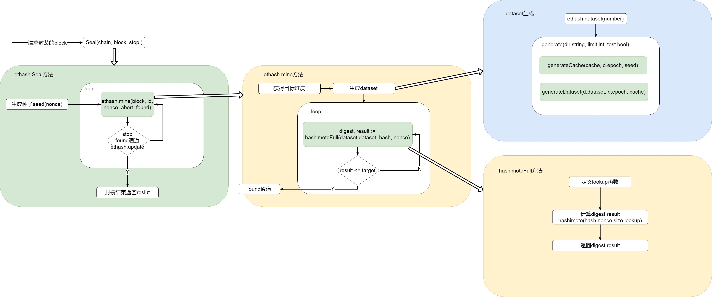
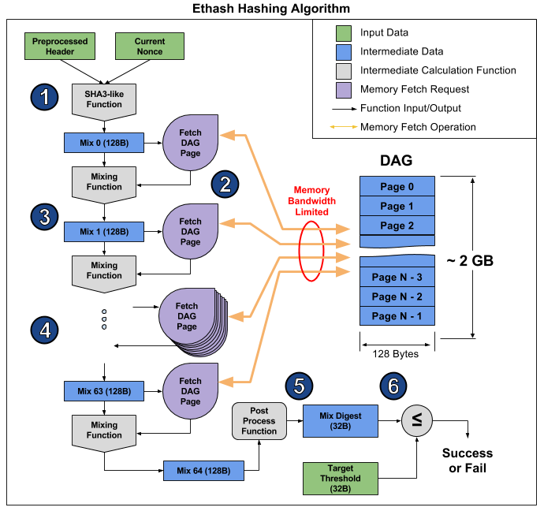

# Ethash

### DAG

Ethash的POW是memory-hard，支持矿机抵御。这意味着POW计算需要选择一个固定的依赖于nonce值和块头的资源的子集。

> 这个资源(大约1G大小)就是DAG!

### 一世epoch

每3万个块会**花几个小时**的时间生成一个有向无环图DAG。这个DAG被称为epoch，一世（为了好记，refer个秦二世）。DAG只取决于区块高度，它可以被预生成，如果没有预生成的话，客户端需要等待预生成流程结束以后才能继续出块操作。除非客户端真实的提前预缓存了DAG，否则在每个epoch的过渡期间，网络可能会经历一个巨大的区块延迟。

> 特例：当你从头启动一个结点时，挖矿工作只会在创建了现世DAG以后启动。

### Ethash算法流程如下：

1. 对于每一个区块，通过扫描区块头的方式计算出下一个种子（seed），该种子只与当前区块有关。
2. 使用种子能产生一个16MB的伪随机缓存，轻客户端会存储缓存。 
3. 基于缓存再生成一个1GB的数据集，称其为DAG。数据集中的每一个元素都只依赖于缓存中的某几个元素，也就是说，只要有缓存，就可以快速地计算出DAG中指定位置的元素。挖矿者存储数据集，数据集随时间线性增长。
4. 挖矿可以概括为”矿工“从DAG中随机选择元素并对其进行散列的过程，DAG也可以理解为一个完整的搜索空间，挖矿的过程就是从DAG中随机选择元素（类似比特币挖矿中试探合适nonce的过程）进行散列运算。
5. 验证者只需要花费少量的内存存储缓存就可以了，因为验证者能够基于缓存计算得到DAG中自己需要的指定位置的元素，然后验证这些指定元素的散列是不是小于某个散列值，也就是验证“矿工”的工作是否符合要求 

缓存和DAG中每增加30000个区块更新一次，所以绝大多数“矿工”将把精力放在读取数据集上，而不是改变它



### 源码解析 sealer.go

在本地[挖矿](minerPackage.md)的过程中，但区块打包了交易等信息后，会调用Engine.Seal(block)方法，对block进行共识计算。

ethash和clique中实现了各自的Seal方法，这里我们只讨论ethash的seal方法，在consensus/ethash/sealer.go文件中。

**Seal方法会调用mine()方法**

```go
// 实现了共识机制，尝试找一个数满足难度要求
func (ethash *Ethash) Seal(chain consensus.ChainReader, block *types.Block, stop <-chan struct{}) (*types.Block, error) {
   // fake模式立即返回0 nonce ，取消PoW
   if ethash.config.PowMode == ModeFake || ethash.config.PowMode == ModeFullFake {
      header := block.Header()
      header.Nonce, header.MixDigest = types.BlockNonce{}, common.Hash{}
      return block.WithSeal(header), nil
   }
   // 共享pow，则转到它的共享对象执行Seal操作
   if ethash.shared != nil {
      return ethash.shared.Seal(chain, block, stop)
   }
    // 与mine通信的通道
   abort := make(chan struct{})
   found := make(chan *types.Block)

   // 创建一个runner以及它指挥的多重搜索线程
   ethash.lock.Lock()// 线程上锁，保证内存的缓存（包含挖矿字段）安全
   threads := ethash.threads// 挖矿的线程编号
   if ethash.rand == nil {// rand为空，则为ethash的字段rand赋值
      // 获得种子 生成伪随机数 最大为 1<<63 - 1
      seed, err := crand.Int(crand.Reader, big.NewInt(math.MaxInt64))
      if err != nil {
         ethash.lock.Unlock()
         return nil, err
      }
      // 执行成功，拿到合法种子seed，通过其获得rand对象。
      ethash.rand = rand.New(rand.NewSource(seed.Int64()))
   }
   ethash.lock.Unlock()
   if threads == 0 {// 挖矿线程编号为0，则通过方法返回当前物理上可用CPU编号
      threads = runtime.NumCPU()
   }
   if threads < 0 {
      threads = 0 // Allows disabling local mining without extra logic around local/remote
   }
   var pend sync.WaitGroup// 创建一个倒计时锁对象
   // 根据线程数开辟多个挖矿
   for i := 0; i < threads; i++ {
      pend.Add(1)
      go func(id int, nonce uint64) {// 核心代码通过闭包多线程技术来执行。
         defer pend.Done()
         // Seal核心工作 挖矿
         ethash.mine(block, id, nonce, abort, found)
      }(i, uint64(ethash.rand.Int63()))
   }
   // Wait until sealing is terminated or a nonce is found
   // 直到seal操作被中止或者找到了一个nonce值，否则一直等
   var result *types.Block
   select {
   case <-stop:
      // Outside abort, stop all miner threads
      close(abort)
   case result = <-found:
      // 其中一个线程挖到正确块，中止其他所有线程
      // One of the threads found a block, abort all others
      close(abort)
   case <-ethash.update:
      // ethash对象发生改变，停止当前所有操作，重启当前方法
      // Thread count was changed on user request, restart
      close(abort)
      pend.Wait()
      return ethash.Seal(chain, block, stop)
   }
   // Wait for all miners to terminate and return the block
   // 等待所有矿工完成并返回block
   pend.Wait()
   return result, nil
}
```

**mine(block, id, nonce, abort, found)方法**

> block，要计算共识的block
>
> id，线程编号
>
> nonce，用于生成随机数的seed
>
> abort，终止信息的通道
>
> found，找到答案的通道

target的[难度计算](totalDifficult.md)，header.Difficulty与父块难度、时间戳、blocknumber相关

```go
// mine函数是真正的pow矿工，用来搜索一个nonce值，nonce值开始于seed值，seed值是能最终产生正确的可匹配可验证的区块难度
func (ethash *Ethash) mine(block *types.Block, id int, seed uint64, abort chan struct{}, found chan *types.Block) {
   // 从区块头中提取出一些数据，放在一个全局变量域中
   var (
      header  = block.Header()
      hash    = header.HashNoNonce().Bytes()
      // 这是用来验证的target
      target  = new(big.Int).Div(maxUint256, header.Difficulty)
      number  = header.Number.Uint64()
      dataset = ethash.dataset(number)
   )
   // 开始生成随机nonce值直到我们中止或者成功找到了一个合适的值
   var (
      attempts = int64(0)    // 初始化一个尝试次数的变量，
      nonce    = seed    // 初始化nonce
   )
   logger := log.New("miner", id)
   logger.Trace("Started ethash search for new nonces", "seed", seed)
search:
   // 寻找
   for {
      select {
      case <-abort:
         // 挖矿结束
         logger.Trace("Ethash nonce search aborted", "attempts", nonce-seed)
         ethash.hashrate.Mark(attempts)
         break search

      default:
         // 在尝试了2的15次方nonce值以后更新hash率
         attempts++ // 通过次数attemp来控制
         if (attempts % (1 << 15)) == 0 {
            // attempts满足条件了以后，要更新ethash的hash率字段的状态值
            ethash.hashrate.Mark(attempts)
            attempts = 0
         }
         // 根据nonce 计算PoW的值
         // 调用的hashimotoFull函数
         digest, result := hashimotoFull(dataset.dataset, hash, nonce)

         // 验证result比target值小
         // result在hashimoto算法中最终还经过了crypto.Keccak256(append(seed, digest...)的Keccak256加密，
         if new(big.Int).SetBytes(result).Cmp(target) <= 0 {
            // 找到正确nonce值，创建一个基于它的新的区块头
            header = types.CopyHeader(header)
            header.Nonce = types.EncodeNonce(nonce)// 将输入的整型值转换为一个区块nonce值
            header.MixDigest = common.BytesToHash(digest)// 将字节数组转换为Hash对象

            // 封装返回一个区块
            select {
            // 放入found的通道
            case found <- block.WithSeal(header):
               logger.Trace("Ethash nonce found and reported", "attempts", nonce-seed, "nonce", nonce)
            case <-abort:
               logger.Trace("Ethash nonce found but discarded", "attempts", nonce-seed, "nonce", nonce)
            }
            break search
         }
         nonce++
      }
   }
   // Datasets are unmapped in a finalizer. Ensure that the dataset stays live
   // during sealing so it's not unmapped while being read.
   runtime.KeepAlive(dataset)
}
```


### 数据集生成与Hash计算


**1. 对于每一个区块，通过扫描区块头的方式计算出下一个种子（seed），该种子只与当前区块号有关。**

```go
// epochLength = 30000
seed := seedHash(d.epoch*epochLength + 1)

// 用来生成验证cache和挖掘dataset的种子
func seedHash(block uint64) []byte {
	seed := make([]byte, 32)
	// block号在30000以内，返回空的种子
	if block < epochLength {
		return seed
	}
	keccak256 := makeHasher(sha3.NewKeccak256())
	// 根据epoch
	for i := 0; i < int(block/epochLength); i++ {
		keccak256(seed, seed)
	}
	return seed
}

// 创造一个重复的hasher，允许重用相同的hash数据结构
// keccak256 hash算法
def serialize_hash(h):
    return ''.join([zpad(encode_int(x), 4) for x in h])
  
def zpad(s, length):
    return s + '\x00' * max(0, length - len(s))

```

**2.使用种子能产生一个16MB的伪随机缓存，轻客户端会存储缓存。** 

```go
// 生成cache
generateCache(cache, d.epoch, seed)
{    
 	...
    
	header := *(*reflect.SliceHeader)(unsafe.Pointer(&dest))
	cache := *(*[]byte)(unsafe.Pointer(&header))

	// Calculate the number of theoretical rows (we'll store in one buffer nonetheless)
	size := uint64(len(cache))
	rows := int(size) / hashBytes

    ...
    
	// Create a hasher to reuse between invocations
	keccak512 := makeHasher(sha3.NewKeccak512())

	// 顺序生成原始数据集
	keccak512(cache, seed)
	// hashBytes = 64
	for offset := uint64(hashBytes); offset < size; offset += hashBytes {
		keccak512(cache[offset:], cache[offset-hashBytes:offset])
		atomic.AddUint32(&progress, 1)
	}
	// Use a low-round version of randmemohash
	temp := make([]byte, hashBytes)
	// cacheRounds = 3
	for i := 0; i < cacheRounds; i++ {
		for j := 0; j < rows; j++ {
			var (
				srcOff = ((j - 1 + rows) % rows) * hashBytes
				dstOff = j * hashBytes
				xorOff = (binary.LittleEndian.Uint32(cache[dstOff:]) % uint32(rows)) * hashBytes
			)
			// 异或
			bitutil.XORBytes(temp, cache[srcOff:srcOff+hashBytes], cache[xorOff:xorOff+hashBytes])
			keccak512(cache[dstOff:], temp)
			atomic.AddUint32(&progress, 1)
		}
	}
	// Swap the byte order on big endian systems and return
	// 如果系统是高字节序
	if !isLittleEndian() {
		swap(cache)
	}
}
```

**3. 基于缓存再生成一个1GB的数据集，称其为DAG。数据集中的每一个元素都只依赖于缓存中的某几个元素，也就是说，只要有缓存，就可以快速地计算出DAG中指定位置的元素。挖矿者存储数据集，数据集随时间线性增长。** 

```go
d.dataset = make([]uint32, dsize/4)
// 生成数据集
generateDataset(d.dataset, d.epoch, cache){
    ...
    
    for i := 0; i < threads; i++ {
        go func(id int) {
            defer pend.Done()
            // 计算本线程应该生成的data片段   hashBytes = 64
            batch := uint32((size + hashBytes*uint64(threads) - 1) / (hashBytes * uint64(threads)))
            first := uint32(id) * batch
            limit := first + batch
            if limit > uint32(size/hashBytes) {
                limit = uint32(size / hashBytes)
            }

            for index := first; index < limit; index++ {
                        // 生成item []byte
                        item := generateDatasetItem(cache, index, keccak512)
                        if swapped {
                            swap(item)
                        }
                        // 放入dataset
                        copy(dataset[index*hashBytes:], item)
            }
        }(i)
	}
    ...
}


// 从256个伪随机的选择的cache nodes组合数据，hash后计算得到一个单独的数据集node
func generateDatasetItem(cache []uint32, index uint32, keccak512 hasher) []byte {
	// Calculate the number of theoretical rows (we use one buffer nonetheless)
	// 计算理论行数 len(cache) / 16
	rows := uint32(len(cache) / hashWords)

	// Initialize the mix
	// 初始化mix 64
	mix := make([]byte, hashBytes)

	// 把cache 放入 mix  ^ 异或
	binary.LittleEndian.PutUint32(mix, cache[(index%rows)*hashWords]^index)
	for i := 1; i < hashWords; i++ {
		binary.LittleEndian.PutUint32(mix[i*4:], cache[(index%rows)*hashWords+uint32(i)])
	}
	keccak512(mix, mix)

	// Convert the mix to uint32s to avoid constant bit shifting
	// 转mix到 uint32
	intMix := make([]uint32, hashWords)
	for i := 0; i < len(intMix); i++ {
		intMix[i] = binary.LittleEndian.Uint32(mix[i*4:])
	}
	// fnv it with a lot of random cache nodes based on index
	// 使用fnvhash
	for i := uint32(0); i < datasetParents; i++ {

		// a*0x01000193 ^ b
		parent := fnv(index^i, intMix[i%16]) % rows
		fnvHash(intMix, cache[parent*hashWords:])
	}
	// Flatten the uint32 mix into a binary one and return
	// 把uint32 的intMix 变成二进制
	for i, val := range intMix {
		binary.LittleEndian.PutUint32(mix[i*4:], val)
	}
	keccak512(mix, mix)
	return mix
}


// fnvHash mixes in data into mix using the ethash fnv method.
func fnvHash(mix []uint32, data []uint32) {
	for i := 0; i < len(mix); i++ {
		mix[i] = mix[i]*0x01000193 ^ data[i]
	}
}
```


**数据集的产生hash验证过程**

挖矿可以概括为”矿工“从DAG中随机选择元素并对其进行散列的过程，DAG也可以理解为一个完整的搜索空间，挖矿的过程就是从DAG中随机选择元素（类似比特币挖矿中试探合适nonce的过程）进行散列运算。

1. 该**预处理的Header**（从最新的块导出）和**当前nonce**（当前推测），组合起来使用SHA3算法来创建我们最初的128字节的混合组合，称为 **Mix 0** 这里。
2. 该**Mix**是用来计算，从DAG获取哪个128字节的page，page代表了**获取的DAG页块**。
3. 该**混合Mix 0与检索DAG页合并。通过使用以太坊特定的混合功能（fnvHash）来生成下一个Mix，这里称为Mix 1**。
4. 2 3 步骤重复了64次，最终得到 **Mix 64**
5. **Mix 64** 被后处理，产生更短的32字节**Mix Digest**。
6. **Mix Digest** 与预定义的32字节**Target进行比较**。如果**Mix Digest**小于或等于**Target**，则**当前随机数nonce**被认为是成功的，并且将被广播到以太网网络。否则，**当前**随机数被认为是无效的，并且该算法重新运行不同的随机数（通过递增当前随机数或随机选取新随机数）。



hashimotoFull方法

```go
// 调用的hashimotoFull函数在本包的算法库中 
// hash    = header.HashNoNonce().Bytes() , nonce 是随机生成的 seed
digest, result := hashimotoFull(dataset.dataset, hash, nonce)

// 在传入的数据集中通过hash和nonce值计算加密值
func hashimotoFull(dataset []uint32, hash []byte, nonce uint64) ([]byte, []byte) {
	// 本函数核心代码段：定义一个lookup函数，用于在数据集中查找数据
	lookup := func(index uint32) []uint32 {
		// hashWords是上面定义的常量值= 16
		offset := index * hashWords
		return dataset[offset : offset+hashWords]
	}
	// hashimotoFull函数做的工作就是将原始数据集进行了读取分割，然后传给hashimoto函数。
	return hashimoto(hash, nonce, uint64(len(dataset))*4, lookup)
}
```

hashimoto方法计算hash

```go
func hashimoto(hash []byte, nonce uint64, size uint64, lookup func(index uint32) []uint32) ([]byte, []byte) {
	
    ...
    // 开始与重复seed的混合  128/4
	mix := make([]uint32, mixBytes/4)
	// mixBytes常量= 128，mix的长度为32，元素为uint32，是32位，对应为4字节大小。所以mix总共大小为4*32=128字节大小
	for i := 0; i < len(mix); i++ {
		mix[i] = binary.LittleEndian.Uint32(seed[i%16*4:])// 共循环32次，前16和后16位的元素值相同
	}
	// Mix in random dataset nodes
	// 做一个temp，与mix结构相同，长度相同
	temp := make([]uint32, len(mix))
    
	for i := 0; i < loopAccesses; i++ { // loopAccesses常量 = 64，循环64次
		// mix[i%len(mix)]是循环依次调用mix的元素值
        // 通过用种子seed生成的mix数据进行FNV哈希操作以后，得到数值parent
		parent := fnv(uint32(i)^seedHead, mix[i%len(mix)]) % rows
		for j := uint32(0); j < mixBytes/hashBytes; j++ {

			// parent作为lookup参数从dataset中查找数据，拷贝到temp中去。
			copy(temp[j*hashWords:], lookup(2*parent+j))
		}
		fnvHash(mix, temp)// 将mix中所有元素都与temp中对应位置的元素进行FNV hash运算
	}
	// Compress mix
	// mix混淆
	for i := 0; i < len(mix); i += 4 {
		mix[i/4] = fnv(fnv(fnv(mix[i], mix[i+1]), mix[i+2]), mix[i+3])
	}
	// 最后有效数据只在前8个位置，后面的数据经过上面的循环混淆以后没有价值了，所以将mix的长度减到8，保留前8位有效数据。
	mix = mix[:len(mix)/4]

	digest := make([]byte, common.HashLength)// common.HashLength=32，创建一个长度为32的字节数组digest
	for i, val := range mix {
		binary.LittleEndian.PutUint32(digest[i*4:], val)// 再把长度为8的mix分散到32位的digest中去。
	}
	return digest, crypto.Keccak256(append(seed, digest...))
}
```


**5.验证者只需要花费少量的内存存储缓存就可以了，因为验证者能够基于缓存计算得到DAG中自己需要的指定位置的元素，然后验证这些指定元素的散列是不是小于某个散列值，也就是验证“矿工”的工作是否符合要求** 

```go
func (ethash *Ethash) VerifySeal(chain consensus.ChainReader, header *types.Header) error {

    ...

    // 根据number算出验证cache
    cache := ethash.cache(number)
    size := datasetSize(number)
    if ethash.config.PowMode == ModeTest {
       size = 32 * 1024
    }
    // 哈希light 根据cache和nonce计算出 result
    digest, result := hashimotoLight(size, cache.cache, header.HashNoNonce().Bytes(), header.Nonce.Uint64())
    // digest与header的MixDigest应相同
	if !bytes.Equal(header.MixDigest[:], digest) {
		return errInvalidMixDigest
	}

	target := new(big.Int).Div(maxUint256, header.Difficulty)
	// 与目标难度进行比较
	if new(big.Int).SetBytes(result).Cmp(target) > 0 {
		return errInvalidPoW
	}
    ...
}

// 验证hash 和 nonce
func hashimotoLight(size uint64, cache []uint32, hash []byte, nonce uint64) ([]byte, []byte) {
	keccak512 := makeHasher(sha3.NewKeccak512())

	// 这里是在数据集中找对应
	lookup := func(index uint32) []uint32 {
		// 根据cache生成数据集的item  []byte
		rawData := generateDatasetItem(cache, index, keccak512)

		data := make([]uint32, len(rawData)/4)
		for i := 0; i < len(data); i++ {
			data[i] = binary.LittleEndian.Uint32(rawData[i*4:])
		}
		return data
	}
	return hashimoto(hash, nonce, size, lookup)
}

```


