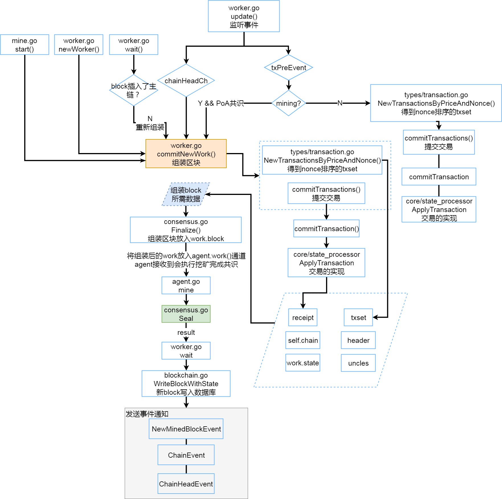

# 本地区块打包--commitNewWork方法,Finalize方法


本地区块打包就是从本地的交易池中取出交易，执行交易后，打包成一个新的block的过程，再由engine去计算共识的随机数，封装在新的block中，将block广播给邻居，这就是一个挖矿的简单过程。

下面的图片大致说明了commitNewWork方法为核心的流程。

1. 在以下情况下，会触发新的区块组装

> 启动挖矿（miner.go start()方法执行）
>
> 自身新block插入但不是主链
>
> 接收到chainHeadEvent事件时
>
> 接收到一条新交易时（处于挖矿状态并且是PoA共识）

2. commitNewWork会从交易池中取出交易，执行后得到收据receipt和交易改变的状态
3. 调用共识engine的finalize方法将区块的信息（收据，状态，交易集，叔链）进行组装，返回一个block赋值给work.block
4. 将work放入agent.Work通道，由agent进行下一步的共识计算



## 源码分析

####  commitNewWork

commitNewWork方法作用是打包一个新的区块（缺少共识），此方法会将self.chain, header, work.state, work.txs, uncles, work.receipts等信息提交给engine.Finalize方法打包，返回一个只差共识步骤的block。

```go
// 提交新work  待挖区块的组装
func (self *worker) commitNewWork() {
   //defer语句会在该函数结束的时候被调用，即使后面的语句运行时出现异常了defer语句仍然会被执行。
   //需要注意的是，如果defer语句中引用了参数，则该参数的值将是程序到defer这一行的时候的值，而与后面的语句没有关系
   self.mu.Lock()
   defer self.mu.Unlock()
   self.uncleMu.Lock()
   defer self.uncleMu.Unlock()
   self.currentMu.Lock()
   defer self.currentMu.Unlock()

   // 准备新区块的时间属性Header.Time
   tstart := time.Now()
   // 父block是当前链的block
   parent := self.chain.CurrentBlock()

   // Unix时间
   tstamp := tstart.Unix()
   // 父block的时间和tstamp比较
   if parent.Time().Cmp(new(big.Int).SetInt64(tstamp)) >= 0 {
      tstamp = parent.Time().Int64() + 1
   }
   // this will ensure we're not going off too far in the future
   // 这将确认我们没有分离的太远
   // tstamp大于当前时间+1
   if now := time.Now().Unix(); tstamp > now+1 {
      // 时间差
      wait := time.Duration(tstamp-now) * time.Second
      // 挖掘太远
      log.Info("Mining too far in the future", "wait", common.PrettyDuration(wait))
      // 等待
      time.Sleep(wait)
   }

   // block号
   num := parent.Number()

   // 创建新区块的Header对象
   header := &types.Header{
      // 父块hash
      ParentHash: parent.Hash(),
      // block 号
      Number:     num.Add(num, common.Big1),
      // gas限制
      GasLimit:   core.CalcGasLimit(parent),
      // EXTRA
      Extra:      self.extra,
      // 时间
      Time:       big.NewInt(tstamp),
   }
   // Only set the coinbase if we are mining (avoid spurious block rewards)
   // 只要在正在挖矿时设置coinbase，避免假的块奖励
   if atomic.LoadInt32(&self.mining) == 1 {
      header.Coinbase = self.coinbase
   }
   // 完成Header对象的准备,用来对Header.Difficulty等属性赋值
   if err := self.engine.Prepare(self.chain, header); err != nil {
      log.Error("Failed to prepare header for mining", "err", err)
      return
   }
   // If we are care about TheDAO hard-fork check whether to override the extra-data or not
   // 根据新区块的位置(Number)，查看它是否处于DAO硬分叉的影响范围内，如果是，则赋值予header.Extra。
   if daoBlock := self.config.DAOForkBlock; daoBlock != nil {
      // Check whether the block is among the fork extra-override range
      limit := new(big.Int).Add(daoBlock, params.DAOForkExtraRange)
      if header.Number.Cmp(daoBlock) >= 0 && header.Number.Cmp(limit) < 0 {
         // Depending whether we support or oppose the fork, override differently
         if self.config.DAOForkSupport {
            header.Extra = common.CopyBytes(params.DAOForkBlockExtra)
         } else if bytes.Equal(header.Extra, params.DAOForkBlockExtra) {
            header.Extra = []byte{} // If miner opposes, don't let it use the reserved extra-data
         }
      }
   }
   // Could potentially happen if starting to mine in an odd state.
   // 赋值给self.current
   err := self.makeCurrent(parent, header)
   if err != nil {
      log.Error("Failed to create mining context", "err", err)
      return
   }
   // Create the current work task and check any fork transitions needed
   // 根据已有的Header对象，创建一个新的Work对象，并用其更新worker.current成员变量
   work := self.current
   // 如果配置信息中支持硬分叉，在Work对象的StateDB里应用硬分叉
   if self.config.DAOForkSupport && self.config.DAOForkBlock != nil && self.config.DAOForkBlock.Cmp(header.Number) == 0 {
      misc.ApplyDAOHardFork(work.state)
   }

   // 准备新区块的交易列表，来源是TxPool.pending，并执行这些交易
   pending, err := self.eth.TxPool().Pending()
   if err != nil {
      log.Error("Failed to fetch pending transactions", "err", err)
      return
   }

   // 返回交易集合
   txs := types.NewTransactionsByPriceAndNonce(self.current.signer, pending)
   // 提交交易
   work.commitTransactions(self.mux, txs, self.chain, self.coinbase)

   // compute uncles for the new block.
   // 准备新区块的叔区块uncles[]，来源是worker.possibleUncles[]
   var (
      uncles    []*types.Header
      badUncles []common.Hash
   )
   // 遍历叔块
   for hash, uncle := range self.possibleUncles {
      if len(uncles) == 2 {
         break
      }
      // 提交uncle进行验证
      if err := self.commitUncle(work, uncle.Header()); err != nil {
         // bad叔块
         log.Trace("Bad uncle found and will be removed", "hash", hash)
         log.Trace(fmt.Sprint(uncle))

         badUncles = append(badUncles, hash)
      } else {
         // 正确的叔块
         log.Debug("Committing new uncle to block", "hash", hash)
         uncles = append(uncles, uncle.Header())
      }
   }
   // 删除所有的badUncles
   for _, hash := range badUncles {
      delete(self.possibleUncles, hash)
   }
   // Create the new block to seal with the consensus engine

   // 调用Engine.Finalize()函数，对新区块“定型”，填充上Header.Root, TxHash, ReceiptHash, UncleHash等几个属性
   if work.Block, err = self.engine.Finalize(self.chain, header, work.state, work.txs, uncles, work.receipts); err != nil {
      log.Error("Failed to finalize block for sealing", "err", err)
      return
   }
   // We only care about logging if we're actually mining.
   // 如果上一个区块(即旧的链头区块)处于unconfirmedBlocks中，意味着它也是由本节点挖掘出来的，尝试去验证它已经被吸纳进主干链中
   // 如果我们正在挖矿
   if atomic.LoadInt32(&self.mining) == 1 {
      log.Info("Commit new mining work", "number", work.Block.Number(), "txs", work.tcount, "uncles", len(uncles), "elapsed", common.PrettyDuration(time.Since(tstart)))

      // 丢弃number-1以前的未确认块
      self.unconfirmed.Shift(work.Block.NumberU64() - 1)
   }
   // 把创建的Work对象，通过channel发送给每一个登记过的Agent，进行后续的挖掘
   self.push(work)
}
```


**Ethash的Finalize方法**

[Ethash](Ethash.md)是PoW的共识计算方法，其算力依赖于内存和带宽，而不是cpu性能

```go
// 累计block和uncle 的汇报，设置最终状态，组装区块
func (ethash *Ethash) Finalize(chain consensus.ChainReader, header *types.Header, state *state.StateDB, txs []*types.Transaction, uncles []*types.Header, receipts []*types.Receipt) (*types.Block, error) {
   // Accumulate any block and uncle rewards and commit the final state root
   // 计算收益
   accumulateRewards(chain.Config(), state, header, uncles)
   // 状态树Root
   header.Root = state.IntermediateRoot(chain.Config().IsEIP158(header.Number))

   // Header seems complete, assemble into a block and return
   return types.NewBlock(header, txs, uncles, receipts), nil
}
```

**Clique的Finalize方法**

Clique是以太坊实现的一个简单的PoA共识机制，通过投票决定委员会节点的加入退出，由委员会节点轮流打包区块

```go
// 实现共识机制，确保没有叔链，没有block奖励被给予，返回最终block
func (c *Clique) Finalize(chain consensus.ChainReader, header *types.Header, state *state.StateDB, txs []*types.Transaction, uncles []*types.Header, receipts []*types.Receipt) (*types.Block, error) {
   // No block rewards in PoA, so the state remains as is and uncles are dropped
   // PoA没有block奖励，所有状态保持不变，并且没有叔链
   header.Root = state.IntermediateRoot(chain.Config().IsEIP158(header.Number))
   header.UncleHash = types.CalcUncleHash(nil)

   // Assemble and return the final block for sealing
   // 组装并返回最终块sealing
   return types.NewBlock(header, txs, nil, receipts), nil
}
```