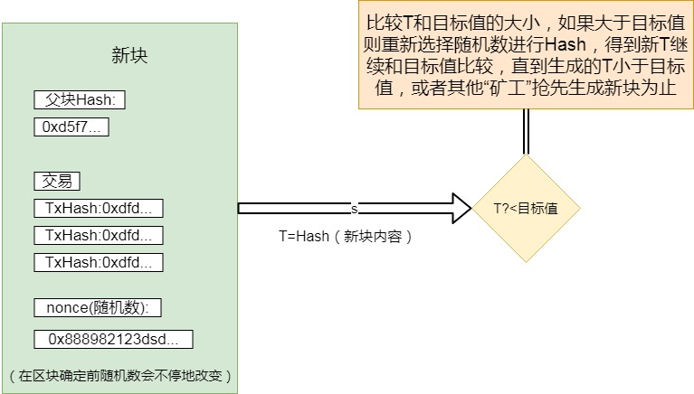
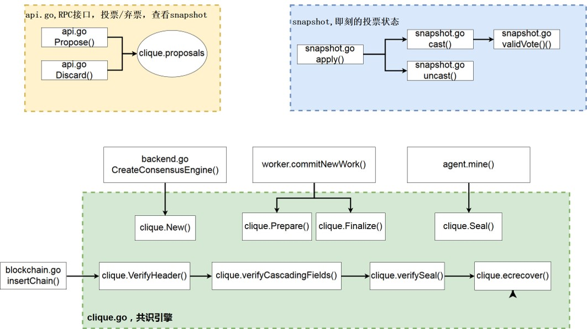

# 以太坊共识机制

### PoW

通过工作结果证明你完成了相应的工作。工作的过程繁琐低效，但是验证者可以在瞬间完成验证，这种方法简介而高效。PoW使得区块的创建变的困难，从而阻止”女巫“攻击(Sybil Attack)者恶意重新生成区块链。

PoW挖矿过程：

### Ethash

为了解决挖矿中心化的问题，以太坊专门设计了一种PoW算法--Ethash算法，Ethash的特点是挖矿的效率基本与CPU无关，而与内存大小、带宽正相关，目的是去除专用硬件的优势，抵抗ASIC。

算法流程如下：

1. 对于每一个区块，通过扫描区块头的方式计算出下一个种子（seed），该种子只与当前区块有关。
2. 使用种子能产生一个16MB的伪随机缓存，轻客户端会存储缓存。
3. 基于缓存再生成一个1GB的数据集，称其为DAG。数据集中的每一个元素都只依赖于缓存中的某几个元素，也就是说，只要有缓存，就可以快速地计算出DAG中指定位置的元素。挖矿者存储数据集，数据集随时间线性增长。
4. 挖矿可以概括为”矿工“从DAG中随机选择元素并对其进行散列的过程，DAG也可以理解为一个完整的搜索空间，挖矿的过程就是从DAG中随机选择元素（类似比特币挖矿中试探合适nonce的过程）进行散列运算。
5. 验证者只需要花费少量的内存存储缓存就可以了，因为验证者能够基于缓存计算得到DAG中自己需要的指定位置的元素，然后验证这些指定元素的散列是不是小于某个散列值，也就是验证“矿工”的工作是否符合要求 

缓存和DAG中每增加30000个区块更新一次，所以绝大多数“矿工”将把精力放在读取数据集上，而不是改变它

### POS

PoS即基于网络参与者目前所持有的数字货币的数量和时间进行利益分配，是一种对货币所有权的证明。PoS可以被描述成虚拟挖矿，一般情况下与PoW一样，用户所得利益与购买成本成比例，即买的越多，收获也就越大。相比PoW机制下的挖矿，PoS消耗的电力可以忽略不计。

在以太坊中，PoS算法可以这样描述：以太坊区块链由一组验证者决定，任何持有以太币的用户都能发起一笔特殊形式的交易，将他们的以太币锁定在一个存储中，从而使自己成为验证者，然后通过一个当前的验证者都能参与的共识算法，完成新区块的产生和验证。

有许多共识算法和方式对验证者进行奖励，以此来激励以太坊用户支持PoS。从算法角度来讲主要用两种：基于链的PoS和BFT风格的PoS。

基于链的PoS:该算法在美国时隙内伪随机地从验证者集合中选择一个验证者（比如每10s一个时隙），给予验证者创建新区块的权利，但是验证者要确保该块指向最多的块（指向的上一个块通常是最长链的最后一个块）。

BFT风格的PoS：分配给验证者相对的权利，让他们有权提出块并且给被提出的块投票，从而决定哪个块是新块，并在每一轮选出一个新块加入区块链。在每一轮中，每个验证者都为某一特定的块进行“投票”，最后所有在线和诚实的验证者都将“商量”被给定的块是否可以加入区块链，并且意见不能改变。

### Clique（PoA）

Clique包

POA****区块数据结构**

POA共识中，区块数据与POW有些区别，主要体现在header结构:

| 序号 | 字段       | PoW          | PoA                                                          |
| ---- | ---------- | ------------ | ------------------------------------------------------------ |
| 1    | Coinbase   | 挖矿奖励地址 | 被提名为矿工的节点地址                                       |
| 2    | Nonce      | 随机数       | 提名分类，添加或删除一个委员                                 |
| 3    | Extra      | 其他数据     | 在Epoch时间点，存储当前委员会集合Signers                     |
| 4    | Difficulty | 挖矿难度     | 优先级，生成该块时矿工的优先级，1或2，同一个Number的区块，只要一个矿工的优先级是2，其他矿工都是1 |

**PoA特点**

- PoA是依靠预设好的授权节点(signers)，负责产生block.
- 可以由已授权的signer选举(投票超过50%)加入新的signer。
- 即使存在恶意signer,他最多只能攻击连续块(数量是 `(SIGNER_COUNT / 2) + 1)` 中的1个,期间可以由其他signer投票踢出该恶意signer。
- 可指定产生block的时间。

