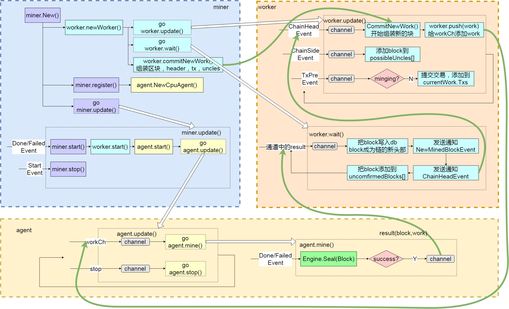
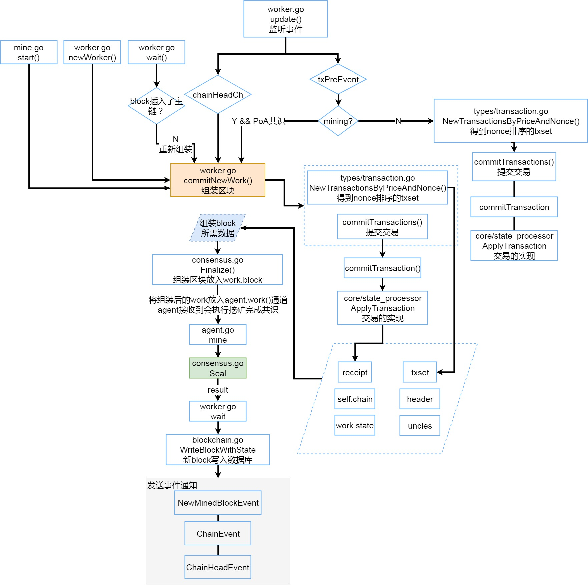

# Miner包中的挖矿流程

miner包(package)负责向外提供一个“挖矿”得到的新区块。

我们这里讲到的**“挖矿**”，是指本节点组装区块，进行封装（共识）操作，最终发布区块的这样一个过程。

**封装（共识）操作**，是指争夺发布下一个区块区块的权利，争夺的方式就是通过共识机制，比如PoW中计算hash值解题的过程，谁计算出满足难度要求的值，就能正确封装一个block并发布出来，率先发布出新block的节点，更有可能成为最终的主链。

miner包中有以下文件

**miner.go** 
>向外提供mine接口，执行开始/停止挖矿等操作，它有一个worker类型的成员变量，负责管理mine的过程

**worker.go**  
>worker内部有一组Agent接口类型对象，每个Agent都可以完成单个区块的"挖掘"，也就是争取block发布权的过程

**agent.go** 
>CpuAgent通过全局的Engine对象，借助共识算法完成最终的区块授权

**remote_agent.go**
>通过eth启动的远程agent

**unconfirmed.go**
>它会以unconfirmedBlock的形式存储最近一些本地挖掘出的区块。在一段时间之后，根据区块的Number和Hash，再确定这些区块是否已经被收纳进主干链(canonical chain)里，以输出Log的方式来告知用户

**unconfirmed_test.go**
>unconfirmed.go的测试文件

### **整体区块组装和挖矿流程图**

这张图主要说明了miner.go，worker.go和agent.go三个文件分别执行的内容，以及相互之间的关系。

黑色箭头代表调用关系

白色箭头代表函数实现

绿色箭头表示一个区块组装、封装（共识）、存入区块链，发布的一个过程。

go的标识，意味着这个函数执行是一个新的线程

- 当“挖矿”启动时，miner.Ner()会新建一个miner，miner会通过worker.newWorker()新建一个worker
- worker会执行commitNewWork()方法，将header，tx，uncles信息通过Engine的Finalize方法组装一个初步的区块放入work.block中，并通过workCh通道交给agent进行封装处理
- agent接收到work后，会调用Engine的Seal方法对block 进行封装（共识）操作，成功后会返回一个Result，放入recv通道。
- worker.wait方法监听recv通道，得到result后会将其中block 写入本地blockchain，并发布NewMinedBlockEvent通知通过广播告诉邻居节点自己完成了一个新的block，发布ChainHeadEvent通知告知worker开始下一次commitNewWork()操作，ChainHeadEvent通知同时会被tx_pool收到并更新交易池。
- NewMinedBlockEvent会触发一个广播消息，告诉邻居自己产生了一个新区块，本地得到一个邻居发来的新区块消息后，会在inserChain方法执行时，发送一个ChainHeadEvent通知，告诉自己的worker重新commitNewWork，同时tx_pool也会收到通知，进行更新。
- 此时一个block就完成了打包，封装，发布的过程。
- 这里的Engine是eth对象初始化时创建的共识引擎，上图中绿色模块，就是通过Engine.Seal方法对block进行封装（Engine就是去争夺发布block权利的模块），如果封装成功，会返回result结构体，其中包含work和block。具体的Engine封装过程，将在consensus模块进行说明。

### Miner.go的主要函数

New()

> 在New()里，针对新对象miner的各个成员变量初始化完成后，会创建worker对象，然后新建Agent对象登记给worker，最后用一个单独线程去运行miner.Update()函数。

Update()

> 这个update()会订阅(监听)几种事件，均跟Downloader相关。当收到Downloader的StartEvent时，意味着此时本节点正在从其他节点下载新区块，这时miner会立即停止进行中的挖掘工作，并继续监听；如果收到DoneEvent或FailEvent时，意味本节点的下载任务已结束(无论下载成功或失败)此时都可以开始挖掘新区块，并且此时会退出Downloader事件的监听。
>
> 从miner.Update()的逻辑可以看出，对于任何一个Ethereum网络中的节点来说，挖掘一个新区块和从其他节点下载、同步一个新区块，根本是相互冲突的。这样的规定，保证了在某个节点上，一个新区块只可能有一种来源，自己挖掘或从邻居节点下载，这可以大大降低可能出现的区块冲突，并避免全网中计算资源的浪费。

Start()

> 启动worker，调用worker.start()和worker.commitNewWork()
>

Stop()

> 停止挖矿，调用worker.stop()
>

Register()

> 调用worker.register()注册agent到worker
>

Unregister()

> 取消注册

### worker.go的主要函数

update()

> worker.update()分别监听ChainHeadEvent，ChainSideEvent，TxPreEvent几个事件，每个事件会触发worker不同的反应。ChainHeadEvent是指区块链中已经加入了一个新的区块作为整个链的链头，这时worker的回应是立即开始准备挖掘下一个新区块；ChainSideEvent指区块链中加入了一个新区块作为当前链头的旁支，worker会把这个区块收纳进possibleUncles[]数组，作为下一个挖掘新区块可能的Uncle之一；TxPreEvent是TxPool对象发出的，指的是一个新的交易tx被加入了TxPool，这时如果worker没有处于挖掘中，那么就去执行这个tx，并把它收纳进Work.txs数组，为下次挖掘新区块备用。
>
> 需要注意的是，ChainHeadEvent可以由邻居节点发送给本节点新block的消息触发，也可以由自身挖掘出了一个新block 触发。

commitNewWork()

> commitNewWork()会在worker内部多处被调用，注意它每次都是被直接调用，并没有以goroutine多线程的方式启动。commitNewWork()内部使用sync.Mutex对全部操作做了隔离。这个函数的基本逻辑如下：
>
> 1. 准备新区块的时间属性Header.Time，一般均等于系统当前时间，不过要确保父区块的时间(parentBlock.Time())要早于新区块的时间，父区块当然来自当前区块链的链头了。
> 2. 创建新区块的Header对象，其各属性中：Num可确定(父区块Num +1)；Time可确定；ParentHash可确定;其余诸如Difficulty，GasLimit等，均留待之后共识算法中确定。
> 3. 调用Engine.Prepare()函数，完成Header对象的准备。
> 4. 根据新区块的位置(Number)，查看它是否处于DAO硬分叉的影响范围内，如果是，则赋值予header.Extra。
> 5. 根据已有的Header对象，创建一个新的Work对象，并用其更新worker.current成员变量。
> 6. 如果配置信息中支持硬分叉，在Work对象的StateDB里应用硬分叉。
> 7. 准备新区块的交易列表，来源是TxPool中那些最近加入的tx，并执行这些交易。
> 8. 准备新区块的叔区块uncles[]，来源是worker.possibleUncles[]，而possibleUncles[]中的每个区块都从事件ChainSideEvent中搜集得到。注意叔区块最多有两个。
> 9. 调用Engine.Finalize()函数，对新区块“定型”，填充上Header.Root, TxHash, ReceiptHash, UncleHash等几个属性。
> 10. 如果上一个区块(即旧的链头区块)处于unconfirmedBlocks中，意味着它也是由本节点挖掘出来的，尝试去验证它已经被吸纳进主干链中。
> 11. 把创建的Work对象，通过channel发送给每一个登记过的Agent，进行后续的挖掘。

wait()

> worker.wait()会在一个channel处一直等待Agent完成挖掘发送回来的result，resutl中包含Block和Work对象。这个Block会被写入数据库，加入本地的区块链试图成为最新的链头。注意，此时区块中的所有交易，都已经在commitNewWork()时和update()监听到新的tx被加入txPool中时被执行过了，所以这里的操作，不会再去执行这些交易对象。

下面的流程图大致说明了commitNewWork()被调用的过程以及执行的操作。

### agent.go的主要函数

update()

> 监听workCh通道和stop通道
>
> worker.commitNewWork()结束后会将组装的block放入workCh通道，update()会监听此通道，如果收到Work对象，就启动mine()函数
>
> 如果stop通道收到停止(mine)的消息，就退出一切相关操作。

mine()

> 会直接调用Engine.Seal()函数，利用Engine实现体的共识算法对传入的Block进行最终的封装授权，如果成功，就将Block同Work一起通过recv通道发还给worker，那边worker.wait()会接收并处理。

