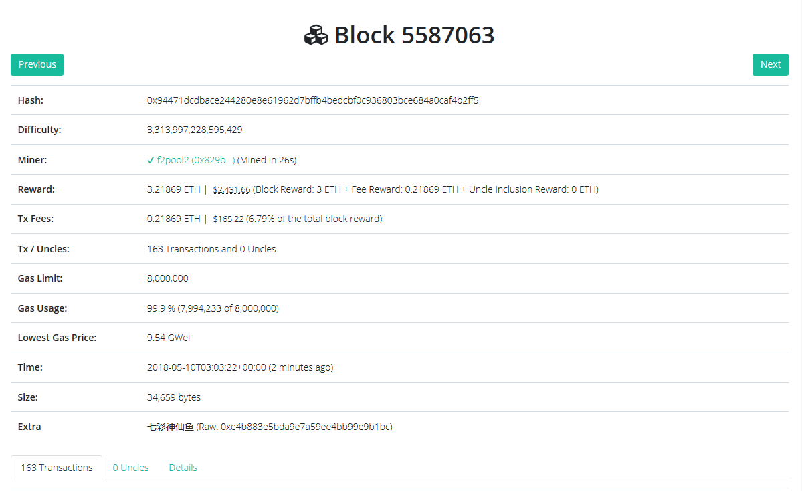
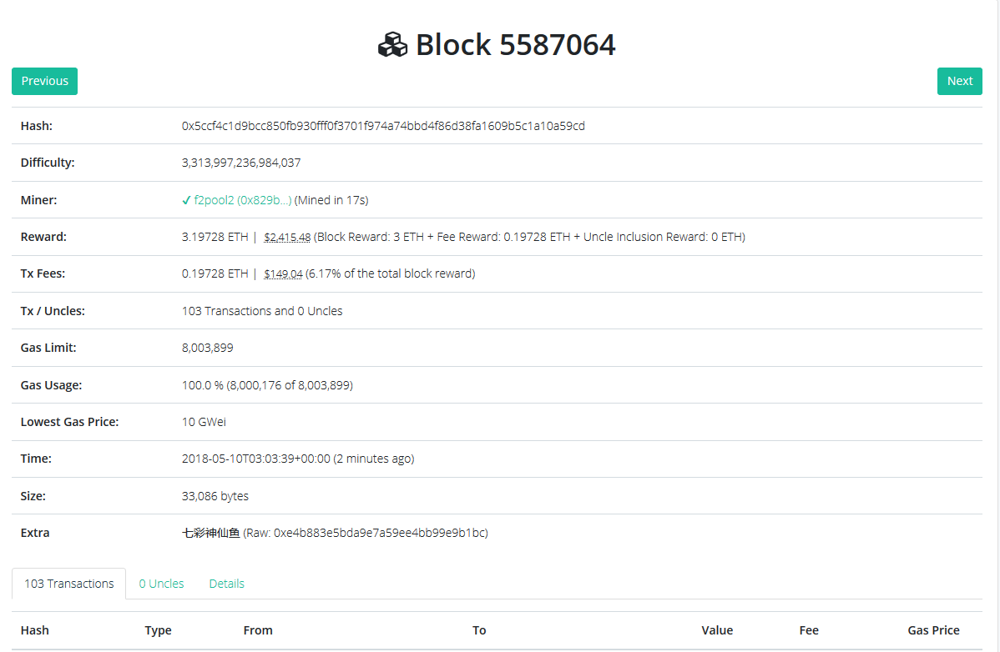

## 以太坊难度（Total Difficulty）计算

对于以太坊来讲，难度值就是计算出Ethash要求的target

#### 以太坊难度计算

根据blocknumber选择不同的难度计算规则

```go
// Ethash难度计算在 consesus/ethash/consensus.go中
func CalcDifficulty(config *params.ChainConfig, time uint64, parent *types.Header) *big.Int {
	// 父块 number + 1
    next := new(big.Int).Add(parent.Number, big1)
   	// 三种计算难度的规则，分别对应以太坊的三个主要版本
	switch {
	case config.IsByzantium(next):
		return calcDifficultyByzantium(time, parent)
	case config.IsHomestead(next):
		return calcDifficultyHomestead(time, parent)
	default:
		return calcDifficultyFrontier(time, parent)
	}
}

// 以太坊区块阶段对于blockNumber
mainnetChainConfig = params.ChainConfig{
		ChainId:        big.NewInt(1),
		HomesteadBlock: big.NewInt(1150000),
		DAOForkBlock:   big.NewInt(1920000),
		DAOForkSupport: true,
		EIP150Block:    big.NewInt(2463000),
		EIP150Hash:     		common.HexToHash("0x2086799aeebeae135c246c65021c82b4e15a2c451340993aacfd2751886514f0"),
		EIP155Block:    big.NewInt(2675000),
		EIP158Block:    big.NewInt(2675000),
		ByzantiumBlock: big.NewInt(4370000),
	}
```

当前以太坊已经有5586882+个block，已进入Byzantium阶段，下面为Byzantium阶段计算难度方法。

计算公式：

block难度 = 父块难度 + 难度调整 + 难度“炸弹”

难度调整 =  (parent_diff / 2048 * max((2 if len(parent.uncles) else 1) - ((timestamp - parent.timestamp)  9), -99)) )

难度“炸弹” = 2^((parent.Number - 2999999)//100000 - 2)

```go
func calcDifficultyByzantium(time uint64, parent *types.Header) *big.Int {
   // https://github.com/ethereum/EIPs/issues/100.
   // 当前时间
   bigTime := new(big.Int).SetUint64(time)
    // 父块时间
   bigParentTime := new(big.Int).Set(parent.Time)
	
   // x 为最终计算的难度 ， y 为难度调整
   x := new(big.Int)
   y := new(big.Int)

   // 和父块时间的差值  x = bigTime - bigParentTime
   x.Sub(bigTime, bigParentTime)
   // x = x / 9
   x.Div(x, big9)
   // 父块叔链hash为空
   if parent.UncleHash == types.EmptyUncleHash {
      // x = 1 - x
      x.Sub(big1, x)
   } else {
      // x = 2 - x
      x.Sub(big2, x)
   }
   // 如果x < -99 , 则x = -99
   if x.Cmp(bigMinus99) < 0 {
      x.Set(bigMinus99)
   }
   // parent_diff + (parent_diff / 2048 * max((2 if len(parent.uncles) else 1) - ((timestamp - parent.timestamp) // 9), -99))
   // y = 父块难度/2048 , params.DifficultyBoundDivisor = 2048
   y.Div(parent.Difficulty, params.DifficultyBoundDivisor)
   
   // x = x * y
   x.Mul(y, x)
   // x = 父块难度 + x
   x.Add(parent.Difficulty, x)

   // 如果x < 131072 ，则 x = 131072， params.MinimumDifficulty = 131072 创世区块的难度为131072
   if x.Cmp(params.MinimumDifficulty) < 0 {
      x.Set(params.MinimumDifficulty)
   }
 
   fakeBlockNumber := new(big.Int)
   // 如果父块号 > 2999999 ， 则fakeBlockNumber = 父块号 - 2999999
   if parent.Number.Cmp(big2999999) >= 0 {
      fakeBlockNumber = fakeBlockNumber.Sub(parent.Number, big2999999) // Note, parent is 1 less than the actual block number
   }
   // for the exponential factor
   // 周期数 = （父块号 - 2999999）/expDiffPeriod , expDiffPeriod = 100000
   periodCount := fakeBlockNumber
   periodCount.Div(periodCount, expDiffPeriod)
   
   // 周期数与产生难度炸弹相关，每100000个区块， y = 2^(周期数 - 2) , x = x + y
   // 返回x即为最终难度
   if periodCount.Cmp(big1) > 0 {
      y.Sub(periodCount, big2)
      y.Exp(big2, y, nil)
      x.Add(x, y)
   }
   return x
}
```


#### 实际计算一个区块的难度

以太坊的区块链是公开的，可以在这里查看：https://link.zhihu.com/?target=https%3A//etherchain.org/

现在将根据5587063区块的难度来计算5587064区块的难度。 

先查看5587063区块的难度和时间戳，难度为3,313,997,228,595,429，时间戳是2018-05-10T03:03:22+00:00 ，同时此区块没有叔块

再来看下5587064区块，难度为3,313,997,236,984,037，时间戳是2018-05-10T03:03:39+00:00 





现在需要的信息都得到了，根据上面的公式计算难度

parent_timestamp = 2018-05-10T03:03:22+00:00 

parent_diff = 3,313,997,228,595,429

block_timestamp = 2018-05-10T03:03:39+00:00 

block_number = 5587064

**先算难度炸弹：**

INT(2^(((5587064-2999999)// 100000) - 2)) =

INT(2^(25 - 2)) = INT(2^53) = 2^23 = 8388608

**再算难度调整：**
block_timestamp - parent_timestamp = 17
3,313,997,228,595,429 // 2048 * MAX(1 - (17) // 10, -99) = 

3,313,997,228,595,429 // 2048 * MAX(0, -99) = 

3,313,997,228,595,429 // 2048 * 0 = 0


**最终的难度为：**

block_diff = 3,313,997,228,595,429 + 0 + 8388608 = 3,313,997,236,984,037

检查下是不是大于创世区块的难度131072，满足条件。

此结果与查到的block难度相同