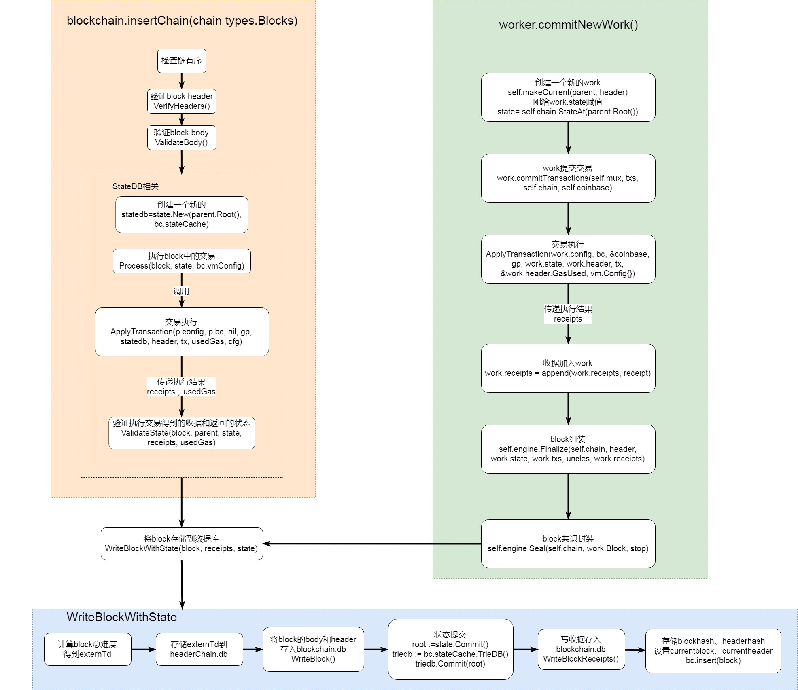
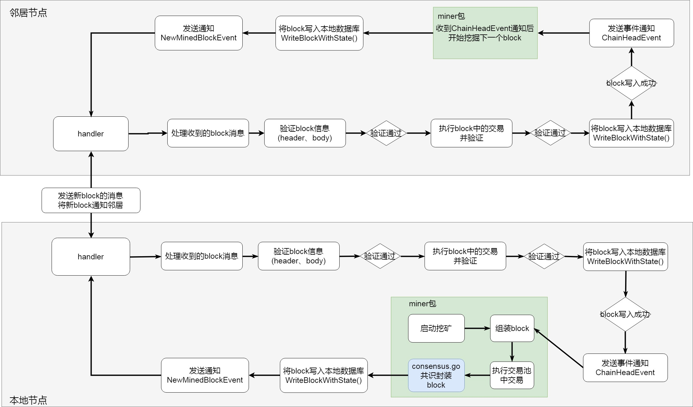

# 新区块插入操作：insertChain()与WriteBlockWithState()

- 当得到**邻居节点**的block后，会调用blockchain.insertChain()方法，对block进行基础验证，再调用WriteBlockWithState()方法，将区块写入数据库当中。
- 如果block来自**节点本地组装**，会在组装好直接调用 WriteBlockWithState()方法，存入本节点数据库。



### 分析blockchain.insertChain()方法

下面详细解释blockchain的insertChain方法

- 检查链有序
- 验证block header
- 验证block body
- 处理block中的交易
- 验证交易结果
- 调用WriteBlockWithState存储block

```
func (bc *BlockChain) insertChain(chain types.Blocks) (int, []interface{}, []*types.Log, error) {
	// Do a sanity check that the provided chain is actually ordered and linked
	// 检查链有序
	for i := 1; i < len(chain); i++ {
		if chain[i].NumberU64() != chain[i-1].NumberU64()+1 || chain[i].ParentHash() != chain[i-1].Hash() {
			// Chain broke ancestry, log a messge (programming error) and skip insertion
			log.Error("Non contiguous block insert", "number", chain[i].Number(), "hash", chain[i].Hash(),
				"parent", chain[i].ParentHash(), "prevnumber", chain[i-1].Number(), "prevhash", chain[i-1].Hash())

			return 0, nil, nil, fmt.Errorf("non contiguous insert: item %d is #%d [%x…], item %d is #%d [%x…] (parent [%x…])", i-1, chain[i-1].NumberU64(),
				chain[i-1].Hash().Bytes()[:4], i, chain[i].NumberU64(), chain[i].Hash().Bytes()[:4], chain[i].ParentHash().Bytes()[:4])
		}
	}
	// Pre-checks passed, start the full block imports
	// 预检查通过，开始全block import
	bc.wg.Add(1)
	defer bc.wg.Done()

	bc.chainmu.Lock()
	defer bc.chainmu.Unlock()

	// A queued approach to delivering events. This is generally
	// faster than direct delivery and requires much less mutex
	// acquiring.
	// 一个发送事件队列
	var (
		stats         = insertStats{startTime: mclock.Now()}
		events        = make([]interface{}, 0, len(chain))
		lastCanon     *types.Block
		coalescedLogs []*types.Log
	)
	// Start the parallel header verifier
	// 开始并行header验证
	headers := make([]*types.Header, len(chain))
	seals := make([]bool, len(chain))

	for i, block := range chain {
		headers[i] = block.Header()
		seals[i] = true
	}

	// 验证头部
	abort, results := bc.engine.VerifyHeaders(bc, headers, seals)

	defer close(abort)

	// Iterate over the blocks and insert when the verifier permits
	// 遍历所有的blocks 在验证通过后插入
	for i, block := range chain {
		// If the chain is terminating, stop processing blocks
		// 一个链终止，停止产生block
		if atomic.LoadInt32(&bc.procInterrupt) == 1 {
			log.Debug("Premature abort during blocks processing")
			break
		}
		// If the header is a banned one, straight out abort
		// header是被禁止的
		if BadHashes[block.Hash()] {
			bc.reportBlock(block, nil, ErrBlacklistedHash)
			return i, events, coalescedLogs, ErrBlacklistedHash
		}
		// Wait for the block's verification to complete
		// 等待block的验证完成
		// TODO : 时间的作用
		bstart := time.Now()

		err := <-results
		if err == nil {
			// 验证body有效性
			err = bc.Validator().ValidateBody(block)
		}
		switch {
		case err == ErrKnownBlock:
			// Block and state both already known. However if the current block is below
			// this number we did a rollback and we should reimport it nonetheless.
			// block和state已经知道
			// 但是如果当前block低于这个数字我们做了回滚我们应该重新导入它
			if bc.CurrentBlock().NumberU64() >= block.NumberU64() {
				stats.ignored++
				continue
			}

		case err == consensus.ErrFutureBlock:
			// Allow up to MaxFuture second in the future blocks. If this limit is exceeded
			// the chain is discarded and processed at a later time if given.
			// 过于超前
			max := big.NewInt(time.Now().Unix() + maxTimeFutureBlocks)
			if block.Time().Cmp(max) > 0 {
				return i, events, coalescedLogs, fmt.Errorf("future block: %v > %v", block.Time(), max)
			}
			bc.futureBlocks.Add(block.Hash(), block)
			stats.queued++
			continue

		case err == consensus.ErrUnknownAncestor && bc.futureBlocks.Contains(block.ParentHash()):
			bc.futureBlocks.Add(block.Hash(), block)
			stats.queued++
			continue

		//祖先已知，但是状态不可用
		case err == consensus.ErrPrunedAncestor:
			// Block competing with the canonical chain, store in the db, but don't process
			// until the competitor TD goes above the canonical TD
			// 得到当前块
			currentBlock := bc.CurrentBlock()
			// 得到本地当前TD
			localTd := bc.GetTd(currentBlock.Hash(), currentBlock.NumberU64())
			externTd := new(big.Int).Add(bc.GetTd(block.ParentHash(), block.NumberU64()-1), block.Difficulty())

			// 本地td更大
			if localTd.Cmp(externTd) > 0 {
				// 写入blocks 不带state
			if err = bc.WriteBlockWithoutState(block, externTd); err != nil {
					return i, events, coalescedLogs, err
				}
				continue
			}
			// Competitor chain beat canonical, gather all blocks from the common ancestor
			// 竞争链击败主链 从共同ancestor收集所有的block
			var winner []*types.Block

			// 得到 父块
			parent := bc.GetBlock(block.ParentHash(), block.NumberU64()-1)
			// 父块的Root 的state有错误
			for !bc.HasState(parent.Root()) {
				winner = append(winner, parent)
				// 继续找父块
				parent = bc.GetBlock(parent.ParentHash(), parent.NumberU64()-1)
			}
			// 逆序？
			for j := 0; j < len(winner)/2; j++ {
				winner[j], winner[len(winner)-1-j] = winner[len(winner)-1-j], winner[j]
			}
			// Import all the pruned blocks to make the state available
			// 导入所有的修剪的block 是的state可用
			bc.chainmu.Unlock()
			// 插入winner到区块链
			_, evs, logs, err := bc.insertChain(winner)
			bc.chainmu.Lock()
			events, coalescedLogs = evs, logs

			if err != nil {
				return i, events, coalescedLogs, err
			}

		case err != nil:
			bc.reportBlock(block, nil, err)
			return i, events, coalescedLogs, err
		}
		// Create a new statedb using the parent block and report an
		// error if it fails.
		// 使用父块创建新的statedb
		var parent *types.Block
		if i == 0 {
			parent = bc.GetBlock(block.ParentHash(), block.NumberU64()-1)
		} else {
			parent = chain[i-1]
		}
		// 新的state
		state, err := state.New(parent.Root(), bc.stateCache)
		if err != nil {
			return i, events, coalescedLogs, err
		}
		
		// Process block using the parent state as reference point.
		// 使用parent state 执行 block
		// 这里会执行ApplyTransaction
		receipts, logs, usedGas, err := bc.processor.Process(block, state, bc.vmConfig)

		if err != nil {
			//log 记录错误
			bc.reportBlock(block, receipts, err)
			return i, events, coalescedLogs, err
		}
		// Validate the state using the default validator
		// 验证state gas使用，收据
		err = bc.Validator().ValidateState(block, parent, state, receipts, usedGas)

		if err != nil {
			bc.reportBlock(block, receipts, err)
			return i, events, coalescedLogs, err
		}
		proctime := time.Since(bstart)

		// Write the block to the chain and get the status.
		// 写block到链上
		status, err := bc.WriteBlockWithState(block, receipts, state)
		if err != nil {
			return i, events, coalescedLogs, err
		}
		
		switch status {
		// 主链
		case CanonStatTy:
			log.Debug("Inserted new block", "number", block.Number(), "hash", block.Hash(), "uncles", len(block.Uncles()),
				"txs", len(block.Transactions()), "gas", block.GasUsed(), "elapsed", common.PrettyDuration(time.Since(bstart)))

			coalescedLogs = append(coalescedLogs, logs...)
			blockInsertTimer.UpdateSince(bstart)
			// 通知block事件
			events = append(events, ChainEvent{block, block.Hash(), logs})
			lastCanon = block

			// Only count canonical blocks for GC processing time
			bc.gcproc += proctime

		//侧链
		case SideStatTy:
			log.Debug("Inserted forked block", "number", block.Number(), "hash", block.Hash(), "diff", block.Difficulty(), "elapsed",
				common.PrettyDuration(time.Since(bstart)), "txs", len(block.Transactions()), "gas", block.GasUsed(), "uncles", len(block.Uncles()))

			blockInsertTimer.UpdateSince(bstart)
			// 侧链通知
			events = append(events, ChainSideEvent{block})
		}
		stats.processed++
		stats.usedGas += usedGas
		stats.report(chain, i, bc.stateCache.TrieDB().Size())
	}
	// Append a single chain head event if we've progressed the chain
	// 加入ChainHeadEvent事件，本地得到此消息会更新txpool，worker重新commiteNewWork
	if lastCanon != nil && bc.CurrentBlock().Hash() == lastCanon.Hash() {
		events = append(events, ChainHeadEvent{lastCanon})
	}
	return 0, events, coalescedLogs, nil
}
```

### **分析WriteBlockWithState()方法**

参数:

> block *types.Block,        要写入的block
>
> receipts []*types.Receipt,        block中交易执行返回的收据
>
> state *state.StateDB			根据(parent.Root(), bc.stateCache)新建的stateDB


1.计算block难度，得到externTd=当前block难度+parentBlock难度，并写入blockchain.HeaderChain中

2.创建batch，存储block的body和header到blockchain.db

3.state.commit，返回root

**4.对trie进行处理，triedb.Commit**

5.WriteBlockReceipts()方法将收据信息存入blockchain.db

6.根据externTd判断加入的block是哪种状态NonStatTy，CanonStatTy还是SideStatTy

7.设置新的headerhash


```
// WriteBlockWithState writes the block and all associated state to the database.
// 写block，数据库相关状态
func (bc *BlockChain) WriteBlockWithState(block *types.Block, receipts []*types.Receipt, state *state.StateDB) (status WriteStatus, err error) {
   bc.wg.Add(1)
   defer bc.wg.Done()

   // Calculate the total difficulty of the block
   // 计算block总难度，不能为空
   ptd := bc.GetTd(block.ParentHash(), block.NumberU64()-1)
   if ptd == nil {
      return NonStatTy, consensus.ErrUnknownAncestor
   }
   // Make sure no inconsistent state is leaked during insertion
   // 确保没有不一致的状态
   bc.mu.Lock()
   defer bc.mu.Unlock()

   // 当前区块
   currentBlock := bc.CurrentBlock()
   // 得到当前块的难度
   localTd := bc.GetTd(currentBlock.Hash(), currentBlock.NumberU64())
   // block难度加上父块难度
   externTd := new(big.Int).Add(block.Difficulty(), ptd)

   // Irrelevant of the canonical status, write the block itself to the database
   // 与主链状态不相干，存储externTd到数据库
   if err := bc.hc.WriteTd(block.Hash(), block.NumberU64(), externTd); err != nil {
      return NonStatTy, err
   }
   // Write other block data using a batch.
   // 用batch写另一个block数据
   batch := bc.db.NewBatch()

   // 写入数据库 写入body和header
   if err := WriteBlock(batch, block); err != nil {
      return NonStatTy, err
   }

   // db状态提交 返回一个root
   root, err := state.Commit(bc.chainConfig.IsEIP158(block.Number()))
   if err != nil {
      return NonStatTy, err
   }
   // 得到状态缓存 默克尔树
   triedb := bc.stateCache.TrieDB()

   // If we're running an archive node, always flush
   // 运行一个打包的node，总是flush
   if bc.cacheConfig.Disabled {
      // 将root存入triedb
      if err := triedb.Commit(root, false); err != nil {
         return NonStatTy, err
      }
   } else {
      // Full but not archive node, do proper garbage collection
      // 满了但是没有打包node，
      // 元数据参考 来保持 trie alive
      triedb.Reference(root, common.Hash{}) // metadata reference to keep trie alive
      bc.triegc.Push(root, -float32(block.NumberU64()))


      // block number 大于 128
      if current := block.NumberU64(); current > triesInMemory {
         // Find the next state trie we need to commit
         // 找到下一个需要提交的状态trie
         header := bc.GetHeaderByNumber(current - triesInMemory)
         chosen := header.Number.Uint64()

         // Only write to disk if we exceeded our memory allowance *and* also have at
         // least a given number of tries gapped.
         // 只写到disk如果我们超过了内存运行
         // 并且也有至少 tries一个数字的缺口
         var (
            size  = triedb.Size()
            limit = common.StorageSize(bc.cacheConfig.TrieNodeLimit) * 1024 * 1024
         )
         // size > limit 或者 bc的时间 > trie 刷新时间
         if size > limit || bc.gcproc > bc.cacheConfig.TrieTimeLimit {
            // If we're exceeding limits but haven't reached a large enough memory gap,
            // warn the user that the system is becoming unstable.
            // 如果超过限制但是没有达到足够大的内存缺口，警告用户系统不稳定
            if chosen < lastWrite+triesInMemory {
               switch {
               case size >= 2*limit:
                  log.Warn("State memory usage too high, committing", "size", size, "limit", limit, "optimum", float64(chosen-lastWrite)/triesInMemory)
               case bc.gcproc >= 2*bc.cacheConfig.TrieTimeLimit:
                  log.Info("State in memory for too long, committing", "time", bc.gcproc, "allowance", bc.cacheConfig.TrieTimeLimit, "optimum", float64(chosen-lastWrite)/triesInMemory)
               }
            }
            // If optimum or critical limits reached, write to disk
            // 到达了限制，写入硬盘
            if chosen >= lastWrite+triesInMemory || size >= 2*limit || bc.gcproc >= 2*bc.cacheConfig.TrieTimeLimit {
               triedb.Commit(header.Root, true)
               lastWrite = chosen
               bc.gcproc = 0
            }
         }
         // Garbage collect anything below our required write retention
         // 垃圾回收
         for !bc.triegc.Empty() {
            root, number := bc.triegc.Pop()
            if uint64(-number) > chosen {
               bc.triegc.Push(root, number)
               break
            }
            triedb.Dereference(root.(common.Hash), common.Hash{})
         }
      }
   }

   // 写收据
   if err := WriteBlockReceipts(batch, block.Hash(), block.NumberU64(), receipts); err != nil {
      return NonStatTy, err
   }
   // If the total difficulty is higher than our known, add it to the canonical chain
   // Second clause in the if statement reduces the vulnerability to selfish mining.
   // Please refer to http://www.cs.cornell.edu/~ie53/publications/btcProcFC.pdf
   // 如果难度高于我们所知，加入主链
   // 减少自私挖矿的弱点

   // 总难度大于当前块难度
   reorg := externTd.Cmp(localTd) > 0
   currentBlock = bc.CurrentBlock()
   if !reorg && externTd.Cmp(localTd) == 0 {
      // Split same-difficulty blocks by number, then at random
      // 通过number分离相同难度的block
      // 要写的block number < 当前链头的block number
      // 或者两者相等，随机数<0.5
      reorg = block.NumberU64() < currentBlock.NumberU64() || (block.NumberU64() == currentBlock.NumberU64() && mrand.Float64() < 0.5)
   }
   if reorg {
      // Reorganise the chain if the parent is not the head block
      // 重组链，如果父块不是头部block
      if block.ParentHash() != currentBlock.Hash() {
         if err := bc.reorg(currentBlock, block); err != nil {
            return NonStatTy, err
         }
      }
      // Write the positional metadata for transaction and receipt lookups
      // 保存一个位置数据，为每个来自block的交易，使hash基于交易和收据
      if err := WriteTxLookupEntries(batch, block); err != nil {
         return NonStatTy, err
      }
      // Write hash preimages
      // 存preimage
      if err := WritePreimages(bc.db, block.NumberU64(), state.Preimages()); err != nil {
         return NonStatTy, err
      }
      // 主链
      status = CanonStatTy
   }else {
      // 否则就是一个叔链
      status = SideStatTy
   }
   if err := batch.Write(); err != nil {
      return NonStatTy, err
   }

   // Set new head.
   // 如果状态是主链,设置新的headhash
   if status == CanonStatTy {
      bc.insert(block)
   }
   bc.futureBlocks.Remove(block.Hash())
   return status, nil
}
```





### 遗留问题

downloader

> 触发以及过程

三种同步方式

> Full，下载所有区块数据信息
>
> Fast
>
> Light，仅获取当前状态(哪些内容)

tx_pool与txpool

> 不同同步模式下使用，具体的交易同步过程


miner

> unconfirmedblock,hashrate

ethash.go

> 计算hash的过程