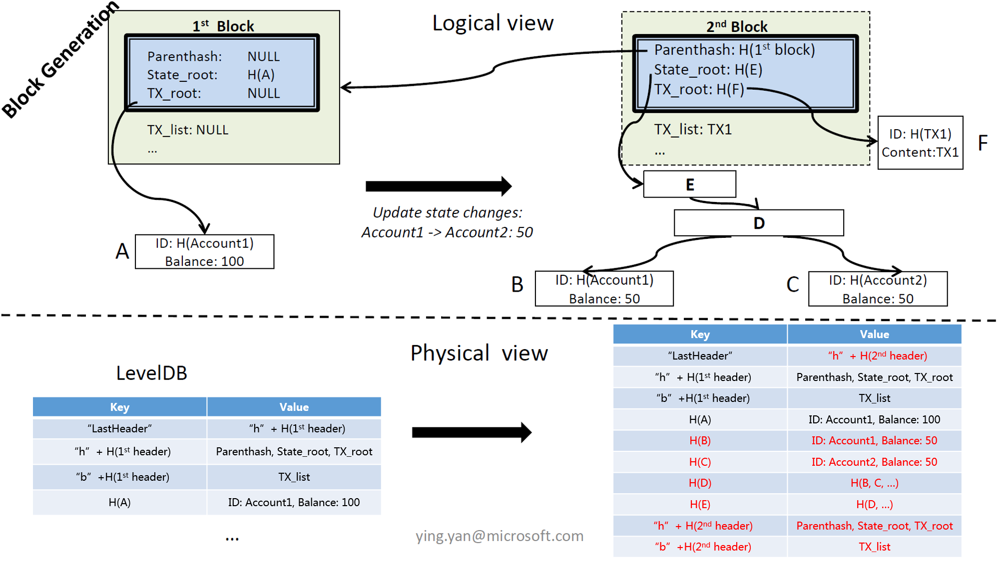
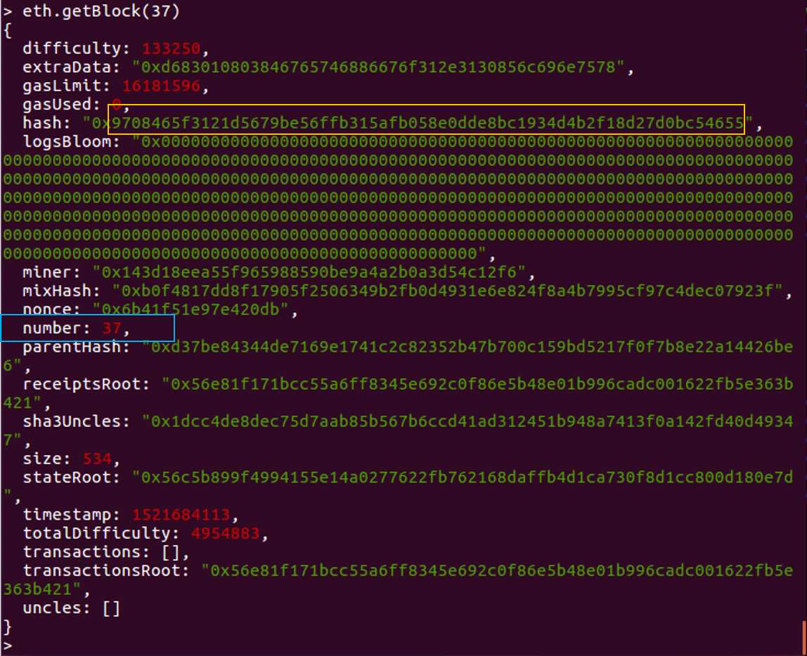
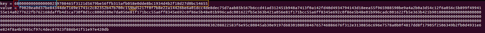

# 以太坊物理存储分析



## Block Header的存储

|  | hash to number mapping |
| :-: | :-- |
| Key | "H" + hash(header)  |
| Value | Block number |




|  | header |
| :-: | :-- |
| Key | "h" + number + hash(header) |
| Value | header |

```go
# core/types/block.go

type Header struct {
	ParentHash  common.Hash    `json:"parentHash"       gencodec:"required"`
	UncleHash   common.Hash    `json:"sha3Uncles"       gencodec:"required"`
	Coinbase    common.Address `json:"miner"            gencodec:"required"`
	Root        common.Hash    `json:"stateRoot"        gencodec:"required"`
	TxHash      common.Hash    `json:"transactionsRoot" gencodec:"required"`
	ReceiptHash common.Hash    `json:"receiptsRoot"     gencodec:"required"`
	Bloom       Bloom          `json:"logsBloom"        gencodec:"required"`
	Difficulty  *big.Int       `json:"difficulty"       gencodec:"required"`
	Number      *big.Int       `json:"number"           gencodec:"required"`
	GasLimit    uint64         `json:"gasLimit"         gencodec:"required"`
	GasUsed     uint64         `json:"gasUsed"          gencodec:"required"`
	Time        *big.Int       `json:"timestamp"        gencodec:"required"`
	Extra       []byte         `json:"extraData"        gencodec:"required"`
	MixDigest   common.Hash    `json:"mixHash"          gencodec:"required"`
	Nonce       BlockNonce     `json:"nonce"            gencodec:"required"`
}
```




## Block Body的存储

|  | body |
| :-: | :-- |
| Key | "b" + number + hash(header) |
| Value | body |

```go
# core/types/block.go

type Body struct {
    Transactions []*Transaction
    Uncles       []*Header
}
```

```go
# core/types/transaction.go

type Transaction struct {
    data txdata
    
    hash atomic.Value
    size atomic.Value
    from atomic.Value
}

type txdata struct {
    AccountNonce uint64          `json:"nonce"    gencodec:"required"`
    Price        *big.Int        `json:"gasPrice" gencodec:"required"`
    GasLimit     uint64          `json:"gas"      gencodec:"required"`
    Recipient    *common.Address `json:"to"       rlp:"nil"`
    Amount       *big.Int        `json:"value"    gencodec:"required"`
    Payload      []byte          `json:"input"    gencodec:"required"`
    
    V *big.Int `json:"v" gencodec:"required"`
    R *big.Int `json:"r" gencodec:"required"`
    S *big.Int `json:"s" gencodec:"required"`
    
    Hash *common.Hash `json:"hash" rlp:"-"`
}
```

|  | transaction Lookup Entries |
| :-: | :-- |
| Key | "l" + hash(tx) |
| Value | Entry |
|  |  |
| Key | 6c91cae53fa2176b5a855a1c654d5f9668a34dfece29a55aecb66e6ec4512fb053 |
|  | "l" + 交易的哈希值 |
| Value | e3a0422ae9ec19018be6dc72a696074e79dcf7594cf140abf729098092ddd3f106ac0a80 |
|  | [<br>	422ae9ec19018be6dc72a696074e79dcf7594cf140abf729098092ddd3f106ac, (hash(header))<br>	0a, (block number)<br>	"", (transaction index)<br>	] |


## 其他存储

|  | number to hash mapping |
| :-: | :-- |
| Key | "h" + number + "n" |
| Value | hash(header) |
|  |  |
| Key | 68000000000000000a6e |
|  | "h" + 第10个区块 + "n" |
| Value | 422ae9ec19018be6dc72a696074e79dcf7594cf140abf729098092ddd3f106ac |
|  | 第10个区块的哈希值 |

|  | block total difficulty |
| :-: | :-- |
| Key | "h" + number + hash(header) + "t" |
| Value | td |
|  |  |
| Key | 68000000000000000a422ae9ec19018be6dc72a696074e79dcf7594cf140abf729098092ddd3f106ac74 |
|  | "h" + 第10个区块 + 第10个区块的哈希值 + "t" |
| Value | 83150900 |
|  | RLP(总难度) |

|  | block receipts |
| :-: | :-- |
| Key | "r" + number + hash(header) |
| Value | Receipt |

|  | Last header's hash |
| :-: | :-- |
| Key | "LastHeader" |
| Value | hash(header) |

|  | ... |
| :-: | :-- |

## 附录

```go
# core/database_util.go

var (
	headHeaderKey = []byte("LastHeader")
	headBlockKey  = []byte("LastBlock")
	headFastKey   = []byte("LastFast")
	trieSyncKey   = []byte("TrieSync")

	headerPrefix        = []byte("h")
	tdSuffix            = []byte("t")
	numSuffix           = []byte("n")
	blockHashPrefix     = []byte("H")
	bodyPrefix          = []byte("b")
	blockReceiptsPrefix = []byte("r")
	lookupPrefix        = []byte("l")
	bloomBitsPrefix     = []byte("B")

	preimagePrefix = "secure-key-"
	configPrefix   = []byte("ethereum-config-")

	BloomBitsIndexPrefix = []byte("iB")

	oldReceiptsPrefix = []byte("receipts-")
	oldTxMetaSuffix   = []byte{0x01}

	ErrChainConfigNotFound = errors.New("ChainConfig not found")

	preimageCounter    = metrics.NewRegisteredCounter("db/preimage/total", nil)
	preimageHitCounter = metrics.NewRegisteredCounter("db/preimage/hits", nil)
)
```


