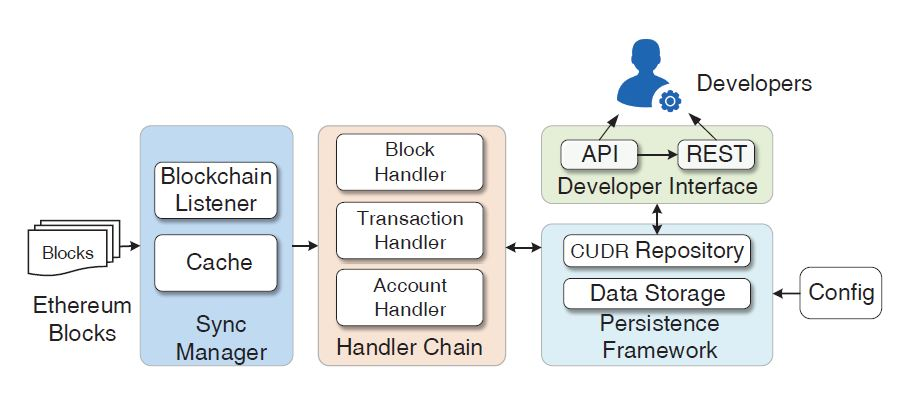

# 以太坊上数字资产的发行和流通
## 数字资产
以太坊的设计目标就是让各种数字资产以智能合约的形式运行在以太坊的虚拟机上。虽然以太坊中有统一的以太币，但是对于大多数的
实际应用而言，都希望能够设计一种属于自身的“数字资产”。为此，以太坊社区专门指定了“代币合约”的相关标准。

代币合约的本质就是在以太坊上管理账户及其拥有的代币的智能合约，本质上就是一张账户地址和对应账户代币余额的映射表，这种所谓
“代币”就可以用更加宽泛的“数字资产”概念去理解，可以是虚拟货币、持有者的荣誉值、积分或者证书等某种象征实际物理量的标识值。不
同于又区块链直接记录的加密货币，这种数字资产是以以太坊区块链为平台，记录在更高一层的代币合约之中，具体来讲就是存储在以太坊
交易消息数据字段的可执行代码中。它的产生无须经过基于“挖矿”的共识流程，可以直接在合约中定义“铸币”
## 代币合约标准
理解了数字货币的基本概念，我们来简单看看一个代币合约标准（ERC20)所规定的内容：
```
contract ERC20Interface {
    // 代币名称
    string public constant name = "Token Name";
    // 代币符号
    string public constant symbol = "SYM";
    // 代币小数点位数
    uint8 public constant decimals = 18;  // 18 is the most common number of decimal places

    // 总供应量（查看代币当前的总供应量）
    function totalSupply() public constant returns (uint);
    // 余额 （查看指定账户地址的代币余额） 
    function balanceOf(address tokenOwner) public constant returns (uint balance);
    // 查询限额
    function allowance(address tokenOwner, address spender) public constant returns (uint remaining);
    // 从当前账户向其他账户转账
    function transfer(address to, uint tokens) public returns (bool success);
    // 设置当前账户允许转账的量值 
    function approve(address spender, uint tokens) public returns (bool success);
    // 从他人账户向其他账户进行转账
    function transferFrom(address from, address to, uint tokens) public returns (bool success);
    
    // 记录转账事件
    event Transfer(address indexed from, address indexed to, uint tokens);
    // 记录限额设置
    event Approval(address indexed tokenOwner, address indexed spender, uint tokens);
}
```
通常而言，一个基于DApp实现的代币合约，在实现标准接口之后，都会有关于自身“铸币”、价值转移等相关功能的函数。例如，允许
用户将以太币兑换为等值的该DApp代币等功能。

# 以太坊数据分析工具 ETHERQL
我们知道，以太坊将区块数据存储在LevelDB中，LevelDB拥有极佳的写入性能，但是它的查询接口极为有限，只能通过key值对有关记录
进行简单的检索，而无法完成诸如范围查询、涉及排序的top-K查询等操作。针对这些问题，EtherQL提出**在区块链的数据层之上，构建
一层专门的查询层来解决区块链数据查询的效率问题**，满足如分页查询和top-K查询等传统数据分析领域的常见需求

## 结构框架

EtherQL结构如图所示，它的基本思路是将区块导入到一个其他的后端数据库中，主要有以下内容：
1. 构建一个同步管理器作为区块链的监听器来持续监听最新的区块数据变化，并将相关内容放到缓存中
2. 构建处理程序，将区块链的数据解析为三种结构：区块、交易与账户
3. 将数据存储到支持SQL等查询的数据库中，并且实现增删改查的模板。
4. 为用户提供查询接口与服务
### 同步管理器
同步管理器主要作用是监听整个以太坊网络中的区块链，并处理分叉问题。由于在关系型等数据库中的回滚操作会带来明显的额外开销，同步
管理器会将同步的区块放入到缓存中。EtherQL中通过内置以太坊JAVA客户端EtherumJ来同步区块，实现的
缓存器中将会维护最新的5个区块并自动鉴别分叉风险，在发生分叉时重构主链。

### 处理程序链
处理程序链的主要功能是分解和转换原始的区块链数据，使得其可以存入关系型数据库中（实际中使用的是MongoDB,正在开发MySQL的版本）。
处理程序链中主要是三个模块，分别负责block,transaction和Account相关信息的提取。
- Block Handler:将传入的区块链数据作为一个整体，保存区块实体
- Transaction Handler: 跟踪包含在当前区块数据中的交易列表，并保存里表中的交易实体
- Account Handler:更新账户状态

这一步我的理解，就是将相关数据保存类似于关系数据库的表结构

### 持久化框架
在这一层中，作者说明将解析得到的数据持久化的保存在底层数据库中，并且底层数据库应当可以灵活的支持查询与扩展，并且方便于其上
提供抽象接口。

### 开发者接口
这一模块的功能，则是根据实际需求，封装功能接口，提供相应服务
- 以太坊支持的基础查询
- 以太坊客户端不支持的扩展查询（例如，根据指定账户检索交易）
- 范围查询（例如，给定时间段列出交易）
- top-k 查询（例如，根据余额查找前k个账户）
