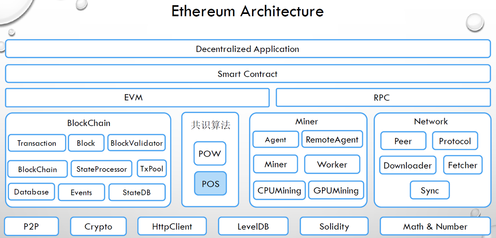
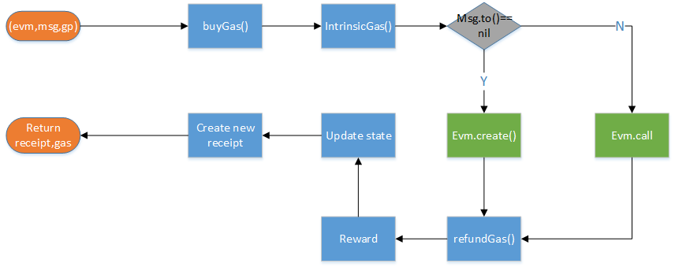
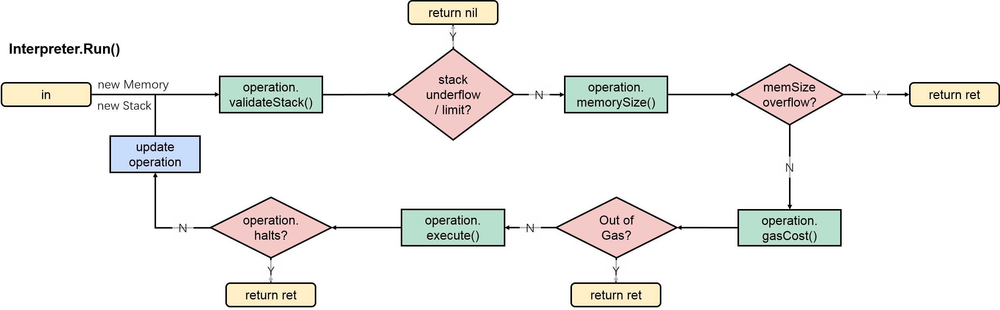

# 以太坊代码架构
相较于被称为区块链1.0的比特币系统所建立的虚拟货币体系，以太坊的定义是下一代智能合约和去中心化应用平台。从本质上而言，以太坊是
将区块链视作底层的数据库，在其上建立了一个可以编码任意状态转化功能的智能合约虚拟机，用以操作区块链中所记录的交易信息。

下图所示，是go-ethereum以太坊源码中的基本架构：


从学习的角度，我们重点希望弄清楚以太坊整个运行的流程，主要的内容有：
 1. 以太坊客户端中共识机制的具体流程
 2. 一笔交易如何从产生到执行、再到记录到底层数据库之中？
 3. 底层数据是以怎样的形式存储到数据库之中？

# 以太坊中的共识机制

下图说明了一个以太坊节点运行中的主要流程


[新区块插入](/newBlockInsert.md)

一个本地节点获得新的block的三种途径，以及处理方式

[miner挖矿](/minerPackage.md)

本地节点挖掘一个新的block的过程

[新区块写入区块链](/insertChainAndWriteBlockWithState.md)

一个block写入到区块链的过程

[以太坊中三棵树的存储](/threeTrees.md)

以太坊中交易、收据、状态三棵树在区块链上的存储

[共识机制](/docs/consensus.md)

具体的共识算法

# 以太坊中的交易执行
一个交易从产生到执行到最终写入区块链的流程如下：


## 交易的基础验证
在work.go中，会通过commitNewWork()将接收到的交易打包为区块。同时，对于接受到的未打包交易，每一个矿工会维护一个交易池，对应
到代码中，就是tx_pool中的add函数，它会将交易加入到交易池中，主要的流程是：


1. 正常提交不会有问题
2. 验证交易是否合法：
   - 大小不超过（32KB）
   - 金额不能小于0
   - gas量不能超过交易池限制
   - 验证签名
   - 验证非本地交易gas费用
   - 验证交易Nonce
   - 验证账户余额
   - 验证交易金额是不是小于当前账户的金额
3. 验证交易池是否超量
   - 总数量不超过4096+1024
   - 若超过，将会比较Gas大小，保留交易费用较大的一个交易
4. 检查交易Nonce值
   - 相同Nonce替换掉pending队列中的交易
   - 否则，加入到queue队列等待执行
   - 仍然以gas费用决定是否抛弃交易

在交易池中的验证流程中，矿工会将交易列表中的交易根据发送账户进行划分，每个账户的交易根据这些交易的nonce来排序。每个账户
的交易排序完成后，再通过比较每个账户的第一条交易，选出最高价格的交易

## 虚拟机外的交易执行
在之前的汇报中，我们已经从命令行调用一条交易追溯到了矿工提交这条交易到执行的步骤，从work.go中的commitNewWork()组装区块，
到调用Env中的commitTransaction，最终发现，在虚拟机外，真实的交易执行代码是在core.state_processor中的ApplyTransaction()，
这条命令将会最终执行交易，并返回收据（Receipt,以太坊中数据结构的一种）。它主要的执行步骤有：
1.	根据输入参数分别封装出一个Message和一个EVM对象

	.	然后将Message, EVM以及输入变量GasPool，通过ApplyMessage传递到TransitionDb()执行交易

	.	最后创建并返回Recetip对象，以及整个tx执行过程所消耗Gas数量

### TransitionDB
在ApplyMessage函数中，将会初始化一个StateTransition()对象，并直接调用TransitionDB()方法，最终返回EVM的执行字节**（不懂）**，Gas的实际消耗
和一个错误代码（如果执行失败）。StateTransition是以太坊中状态转换的模型对象，它将会将交易应用到当前世界状态的改变，完成
所有所需的工作并计算出一个新的合法状态树根。它以EVM，Mesage和一个Gaspool对象为输入参数，其中GasPool是之前Block中创建，
是区块中所有交易共享的Gas池，记录的是一个区块中可用的Gas数量（新建时，将一个Block的Gaslimit赋值给它）。

在TransitionDB()将会通过执行当前的Message来完成状态的改变，返回结果和Gas的消耗，其执行的具体流程如下：


1.执行buyGas()。首先从交易(转账)的转出方账户扣除一笔Ether，就是冻结我们为这笔交易所设置的最大Gas消耗费用，其值等于GasLimit
*GasPrice；同时从Gaspool中减去该笔交易所需，设置initialGas和gas变量，分别表示初始可用的Gas和即时可用的Gas,代码如下。
  ```
  if err := st.gp.SubGas(st.msg.Gas()); err != nil {
  		return err
  	}
    st.gas += st.msg.Gas() 
       
    st.initialGas = st.msg.Gas()
    state.SubBalance(sender.Address(), mgval)
  ```

2.执行IntrinsicGas(), 计算tx的固有Gas消耗。它分为两个部分，每一个tx预设的消耗量，这个消耗根据是转账交易还是合约创建而略有
不同；然后，针对tx.data.Payload中的非0字节和0字节长度计算固有消耗，最终，st.gas（当前所剩gas） -= intrinsicGas。

3.EVM执行。如果交易的(转帐)转入方地址为空（判断是转账交易还是合约创建），调用EVM的Create()函数；否则，调用Call()函数。无论哪个函数返回后，更新st.gas。

4.执行 refundGas()。在refundGas中，首先将会计算本次执行交易所实际消耗的Gas, 代码为：
    
    func (st *StateTransition) gasUsed() uint64 {
    	return st.initialGas - st.gas
    }
然后，将剩余st.gas 和基于实际消耗量requiredGas，系统提供补偿refundGas立即归还到交易转出方。refundGas 所折算的Ether会被立即加在(转帐)转出方账户上，同时st.gas += refundGas，gp += st.gas，即剩余的Gas加上系统补偿的Gas，被一起归并进GasPool。

5.奖励所属区块的挖掘者：系统给矿工增加一笔金额，代码如下：

    st.state.AddBalance(st.evm.Coinbase, new(big.Int).Mul(new(big.Int).SetUint64(st.gasUsed()), st.gasPrice))
值得注意的是，这里的st.gas在步骤5中被加上了refundGas, 所以这笔奖励金所对应的Gas，其数量小于该交易实际消耗量requiredGas。

## 虚拟机中的交易执行
### 虚拟机（EVM）的基本数据结构
根据以太坊黄皮书的介绍，交易执行是以太坊协议中最复杂的部分，因为它的核心在于定义了状态转换函数。根据我们之前的学习中，我们
追踪命令行调用交易的命令，从交易的基本数据结构，到交易创建、入池验证、打包验证，到最后创建虚拟机执行交易，还原了整个虚拟机
外交易的执行流程。从本次学习开始，我们深入到以太坊虚拟机内部，从虚拟机的基本结构开始，继续追踪交易与合约的执行。

首先，在go语言代码中，虚拟机的基本结构如下(core/vm/evm.go)：

    type EVM struct {
    	// Context provides auxiliary blockchain related information 提供区块链中的相关信息
    	Context
    	// StateDB gives access to the underlying state 获取当前状态的信息
    	StateDB StateDB
    	// Depth is the current call stack 当前的堆栈
    	depth int
    
    	// chainConfig contains information about the current chain 当前链的信息
    	chainConfig *params.ChainConfig
    	// chain rules contains the chain rules for the current epoch 当前时间的 chain rule
    	chainRules params.Rules
    	// virtual machine configuration options used to initialise the
    	// evm. 初始化新建配置选项
    	vmConfig Config
    	// global (to this context) ethereum virtual machine
    	// used throughout the execution of the tx. 解释器，用于执行EVM中的合约代码
    	interpreter *Interpreter
    	// abort is used to abort the EVM calling operations
    	// NOTE: must be set atomically 终止虚拟机操作命令
    	abort int32
    	// callGasTemp holds the gas available for the current call. This is needed because the
    	// available gas is calculated in gasCall* according to the 63/64 rule and later
    	// applied in opCall*.  当前操作的gas
    	callGasTemp uint64
    }

## 交易执行函数 evm.call(core/vm/evm.go)
## 交易执行函数 evm.call(core/vm/evm.go)
1. 检查堆栈深度（不超过1024），以及账户是否能够转账（当前账户余额是否充足）
2. 执行Transfer(),本质上就是一个转入与转出操作
```
    // Transfer subtracts amount from sender and adds amount to recipient using the given Db
    func Transfer(db vm.StateDB, sender, recipient common.Address, amount *big.Int) {
    	db.SubBalance(sender, amount)
    	db.AddBalance(recipient, amount)
    }
```
所有关于状态信息的操作，均在StateDB中完成，这个对象是在work执行交易时传入,目前为止，相关的改变并没有提交到写到链上！
3. 创建合约并赋值合约code
```
    // Initialise a new contract and set the code that is to be used by the EVM.
	// The contract is a scoped environment for this execution context only.
	contract := NewContract(caller, to, value, gas)
	contract.SetCallCode(&addr, evm.StateDB.GetCodeHash(addr), evm.StateDB.GetCode(addr))
```
合约是EVM用来执行虚拟机指令的结构体

4. 调用该合约指令（core/vm/evm.go)
```
    ret, err = run(evm, contract, input)
```
在run函数中，首先会判断contract待执行的指令是否是一组预编译的合约集合，否则调用解释器进行执行预编译的合约主要是 SHA-3和一些加密算法
最后，将会调用Interpreter来执行code。我们看看Interpreter的结构：
```
// Interpreter is used to run Ethereum based contracts and will utilise the
// passed evmironment to query external sources for state information.
// The Interpreter will run the byte code VM or JIT VM based on the passed
// configuration.
type Interpreter struct {
	evm      *EVM
	cfg      Config
	gasTable params.GasTable //表示很多操作的Gas价格
	intPool  *intPool

	readOnly   bool   // Whether to throw on stateful modifications
	returnData []byte // Last CALL's return data for subsequent reuse
}

```

Interpreter结构体通过一个**Config类型的成员变量，间接持有一个包括256个operation对象在内的数组JumpTable**。而Interpreter的Run()函数就很好理解了，其核心流程就是逐个byte遍历入参Contract对象的Code变量，将其解释为一个已知的operation，然后依次调用该operation对象中的函数，



我们看看Operation的数据结构：
```
type operation struct {
	// op is the operation function
	execute executionFunc
	// gasCost is the gas function and returns the gas required for execution
	gasCost gasFunc
	// validateStack validates the stack (size) for the operation
	validateStack stackValidationFunc
	// memorySize returns the memory size required for the operation
	memorySize memorySizeFunc

	halts   bool // indicates whether the operation should halt further execution
	jumps   bool // indicates whether the program counter should not increment
	writes  bool // determines whether this a state modifying operation
	valid   bool // indication whether the retrieved operation is valid and known
	reverts bool // determines whether the operation reverts state (implicitly halts)
	returns bool // determines whether the operations sets the return data content
}
```
核心内容是4个函数操作，分别对应执行、gas消耗，堆栈检查和内存信息

相较而言，evm.create()方法中会常见新的地址作为转入方地址，对应的就是新合约地址。
call 函数中 在进入evm.call()之前就已经完成了nonce+=1，而create()会在方法中完成

在我们的学习中，我们更加深入的去追溯了以太坊虚拟机的设计、交易与智能合约字节码的执行，相关的内容可以参见：
 * [虚拟机基本内容](./docs/evm学习.md)
 * [以太坊虚拟机解释器](./docs/evmInterpreter.md)
 * [EVM存储设计](./docs/evm存储.md)

# 以太坊中的数据存储


