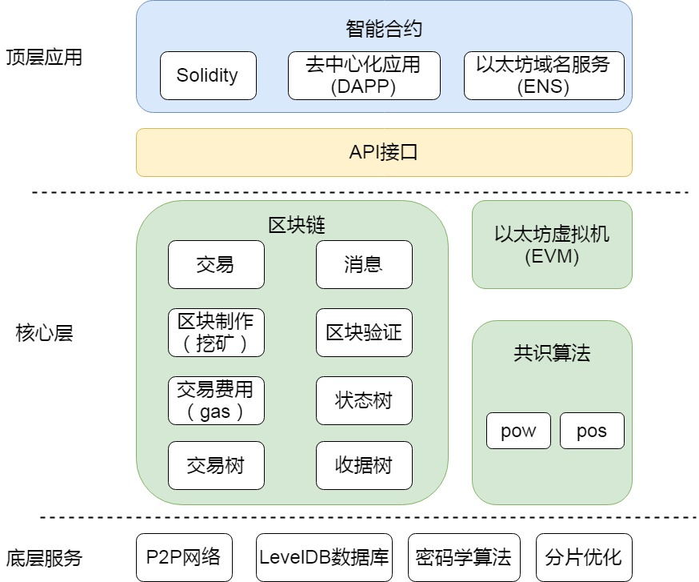

## 《以太坊技术详解与实战》-- 以太坊整体架构

#### 底层服务

- P2P网络服务
- LevelDB数据库
- 密码学算法
- <u>分片优化</u>

#### 核心层

- 区块链
- 共识算法
- 以太坊虚拟机

#### 顶层应用

- API接口
- 智能合约
- 去中心化应用

#### 雷电网络

雷电网络（Raiden Network）是一种脱机缩放解决方案，用于在Ethereum块链中执行符合ERC20标准的令牌传输。 它是Ethereum的Bitcoin闪电网络版本，可实现近即时，低费用，可扩展和隐私保护的付款。

Raiden网络允许在参与者之间安全地转移令牌，而不需要全球共识。 这是通过数字签名和哈希锁定传输实现的，称为余额证明，通过先前设置的链接存款完全抵押。 这个概念，如下图所示，被称为支付渠道技术。 付款渠道允许两个参与者之间几乎无限制的双向转移，只要其转账的净额不超过存入的令牌。 这些传输可以立即执行，而不需要实际的块链本身的任何参与，除了最初的一次性链接创建和最终关闭通道。

（1）通道

雷电网络的通道是一个智能合约，对于经常需要相互转账的A和B来说，A可以在链上部署一个智能合约，然后A和B向合约中转入一定数额的以太币，相当于网络中有该数量的以太币锁定在该合约通道中，AB也就可以在他们的通道中流通这些数量的以太币。

（2）网络

更多情况下，一笔转账交易的双方不一定经常进行交易来往，在这种情况下，每两人之间建立一个雷电网络通道肯定是不合适的。雷电网络通过散列锁的机制使得两个用户之间可以通过中间节点进行转账。

（3）优势

近即时

低费用

可扩展

隐私保护

（4）局限性

需锁定一定的token在智能合约中

#### 分片技术

每个节点只需要存储、处理一部分交易，从而解决区块链面临的扩展性问题。

#### 一个交易在以太坊中的“旅程”

**一笔普通的转账或合约调用的交易**

1. 发送者（用户A）按照格式要求在以太坊网络中发起一个交易请求，该请求被传向用户A的对等节点
2. 网络上的节点（用户B）同步到此交易，检查交易是否有效，格式是否正确。如果符合要求，计算可能的最大交易费用（最大交易费用 = Gas Limit x GasPrice），确定发送方的地址，并在本地区块链上从发送方账户中减去相应费用，如果账户余额不足，则返回错误，此交易直接被丢弃。符合要求的交易请求，用户B将其放在交易存储池中，并向其他节点转发。其他收到交易请求的节点重复用户B的处理过程。
3. 对于转账交易，获得记账权的节点将该交易和其他交易一起打包到区块中；对于合约调用交易，矿工将该交易和其他交易一起打包到区块中，并在本地的EVM上运行被调用的合约代码，直到代码运行结束或者Gas用完。如果代码未结束而Gas已用完，那么因代码运行而改变的状态回滚到代码运行之前，但是已经支付的交易费用不可收回，由矿工获得。
4. 执行智能合约花费的Gas数量由合约的计算步骤决定，而GasPrice由交易发起方决定。一般来说，每个矿工会根据交易费用（Gas x GasPrice）的高低来决定是否要将执行智能合约的交易请求打包到区块中。也就是说，如果希望矿工尽快运行你的合约，最好提供高一点的GasPrice。
5. 其他共识节点收到该区块后，验证区块的合法性，验证区块中的交易，如果通过验证，节点将交易池中原来用户A的交易删除（如果交易池中有此交易）

**一笔创建智能合约的交易在以太坊中的“旅程”**

1. 发送者（用户A）按照格式要求在以太坊网络中发起一个创建智能合约的交易请求。
2. 网络上的节点B同步到此交易，检查交易有效、格式正确，验证交易签名合肥。如果符合要求，计算可能的最大交易费用（StartGas x GasPrice），查看发送者余额，若余额不足以支付最大交易费用，返回错误
3. 符合要求的交易请求，用户B将其放在交易池中，并向其他节点转发，其他收到交易请求的节点重复用户B的处理过程。
4. 获得记账权的节点将该交易和其他交易一起打包到区块链，会根据交易费用和合约代码，创建合约账户，并在账户空间部署合约。智能合约账户的地址是由发送者的地址（address）和交易随机数（nonce）作为输入，通过加密算法生成的、交易确认后智能合约的地址返回给发送者
5. 包含用户A创建智能合约的交易请求的区块，被生成区块的节点（用户B） 发送至对等节点，并在全网广播。
6. 共识节点接收到该区块，验证区块，如果区块通过验证，节点从内存池中将原来用户A创建智能合约的交易（如果交易池中存在此交易）请求删掉，同步区块链，将智能合约部署在各种的本地区块链。