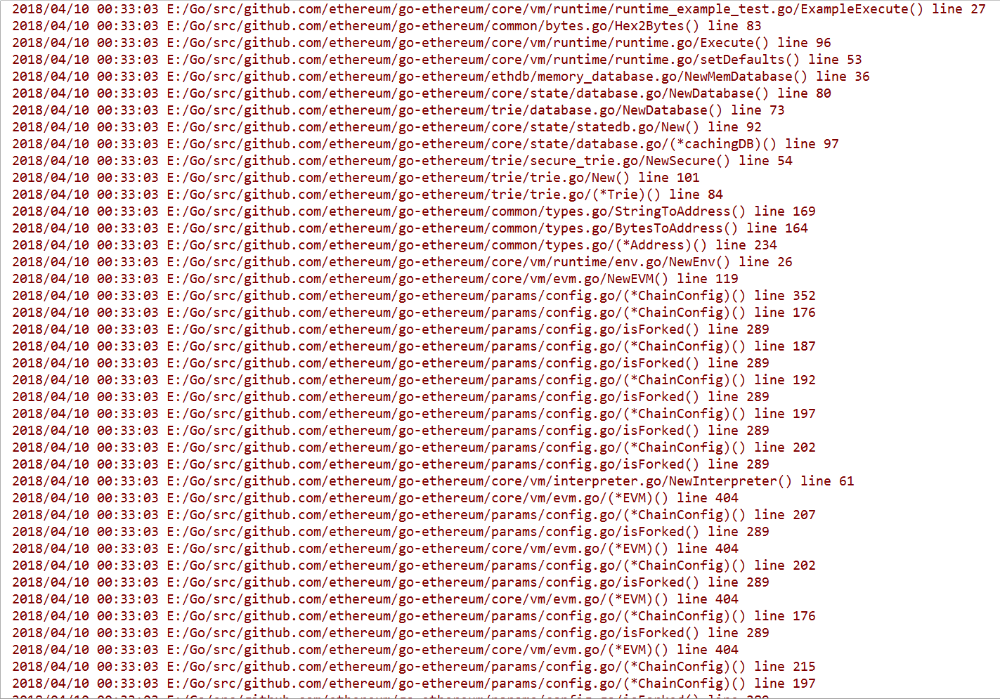

# Log4go-ethereum

[Log4go-ethereum](https://github.com/WenyanLiu/log4go-ethereum.git)是针对[Go Ethereum](https://github.com/ethereum/go-ethereum.git)的日志记录工具。

#### 使用Log4go-ethereum

参见本文档库中[以太坊的安装说明](./%E5%BC%80%E5%A7%8B%E4%BD%BF%E7%94%A8%E4%BB%A5%E5%A4%AA%E5%9D%8A.md#2-go-ethereum%E5%AE%89%E8%A3%85)。

:warning: 克隆命令中源代码的git仓库地址是

```
git clone https://github.com/WenyanLiu/log4go-ethereum.git
```

#### 日志等级

| 级别 | 描述  |
| :-: | :-: |
| DEBUG | 流经函数的信息，同时打印到控制台并记录到日志文件中。 |

#### 消息格式

采用以下模式：

```
[%Prefix] %LstdFlags %Llongfile %Func %line
```

其中，


| 参数 | 描述 |
| :-: | :-: |
| `%Prefix` | 用于输出日志事件的前缀 |
| `%LstdFlags` | `= Ldate \| Ltime`，用于输出日志事件的日期和时间 |
| `%Llongfile` | 用于输出函数事件的绝对路径和文件名 |
| `%Func`| 用于输出函数事件的函数名 |
| `%line`| 用于输出函数事件的行号 |

**示例输出**

`[Debug] 2018/04/03 19:07:07 /Users/WenyanLiu/log4go-ethereum/cmd/geth/main.go/main() line 220`

## Version History

- [1.2-RELEASE](https://github.com/WenyanLiu/log4go-ethereum/releases/tag/1.2-RELEASE)
    - 10 Apr, 2018
    - 增加了获取函数名的方法

- [1.1-RELEASE](https://github.com/WenyanLiu/log4go-ethereum/releases/tag/1.1-RELEASE)
    - 10 Apr, 2018
    - 修复了字符串分割指定值错误的bug
    - 优化了log输出的格式

- [1.0-RELEASE](https://github.com/WenyanLiu/log4go-ethereum/releases/tag/1.0-RELEASE)
    - 9 Apr, 2018
    - 现在可以追踪`abigen`、`bootnode`、`evm`、`gethrpctest`、`rlpdump`、`swarm`和`puppeth`的栈上函数调用信息了

- [1.0-SNAPSHOT](https://github.com/WenyanLiu/log4go-ethereum/releases/tag/1.0-SNAPSHOT)
    - 3 Apr, 2018
    - 现在可以追踪`geth`的栈上函数调用信息了

## Preview



## Code

在输出日志事件中，允许自定义：

* `Prefix`：日志事件的前缀；
* `Flags`：日志事件的标准日期和时间；
* `File`：
    * `name`:日志文件的文件名；
    * `flag`：`O_WRONLY`只写、`O_APPEND`追加、`O_CREATE`若无创建和`os.O_TRUNC`若开关闭；
    * `mode`：日志文件的权限；
* `Output`：`Stdout`控制台打印和`file`文件输出。

```go
# cmd/geth/main.go
package main

import (
    ...
	"github.com/ethereum/go-ethereum/log"
	...
)

func init() {
	oslog.SetPrefix("[Debug] ")
	oslog.SetFlags(oslog.LstdFlags)

	file, err := os.OpenFile("Debug.log",os.O_WRONLY|os.O_APPEND|os.O_CREATE|os.O_TRUNC, 0666)
	if err != nil {
		oslog.Fatalln("Fail to create Debug.log file.")
	}
	oslog.SetOutput(io.MultiWriter(os.Stdout, file))
	...
}

func main() {
	log.DebugLog()
    ...
}
```

在输出函数事件中，允许自定义包含但不限于：

* `pc`：当前程序计数器的值；
* `file`：文件名；
* `line`：行号。

```go
# log/debuglog.go
package log

import (
	"runtime"
	"strings"
	"log"
)

func DebugLog() {
	pc, file1, line, _ := runtime.Caller(1)
	f := strings.Split(runtime.FuncForPC(pc).Name(), ".")[1]

	log.Println(file1, "/", f, "()", "line", line)
}
```


