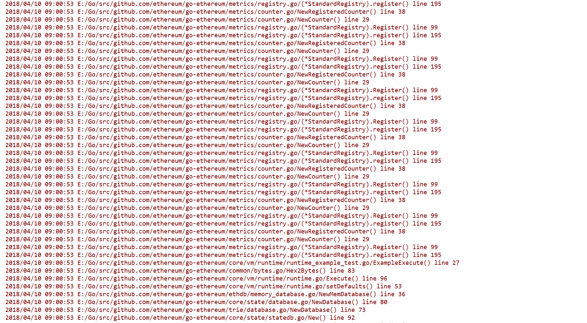

# Log4go-ethereum

[Log4go-ethereum](https://github.com/WenyanLiu/log4go-ethereum.git)是针对[go-ethereum](https://github.com/ethereum/go-ethereum.git)的日志记录工具。

#### 使用Log4go-ethereum

参见本文档库中[以太坊的安装说明](./%E5%BC%80%E5%A7%8B%E4%BD%BF%E7%94%A8%E4%BB%A5%E5%A4%AA%E5%9D%8A.md#2-go-ethereum%E5%AE%89%E8%A3%85)。

:warning: 克隆命令中源代码的git仓库地址是

```
git clone https://github.com/WenyanLiu/blockchain-group.git
```

#### 日志等级

| 级别 | 描述  |
| :-: | :-: |
| DEBUG | 流经函数的信息，同时打印到控制台并记录到日志文件中。 |

#### 消息格式

采用以下模式：

```
[%Prefix] %LstdFlags %Llongfile %Func %line
```

其中，


| 参数 | 描述 |
| :-: | :-: |
| `%Prefix` | 用于输出日志事件的前缀 |
| `%LstdFlags` | `= Ldate | Ltime`，用于输出日志事件的日期和时间 |
| `%Llongfile` | 用于输出函数事件的绝对路径和文件名 |
| `%Func`| 用于输出函数事件的函数名 |
| `%line`| 用于输出函数事件的行号 |

**示例输出**

`[Debug] 2018/04/03 19:07:07 /Users/WenyanLiu/log4go-ethereum/cmd/geth/main.go/main() line 220`

## What's New

- [1.0-SNAPSHOT](https://github.com/WenyanLiu/log4go-ethereum/releases/tag/1.0-SNAPSHOT)
    - 3 Apr, 2018
    - 现在可以追踪`geth`的栈上函数调用信息了

## Preview




