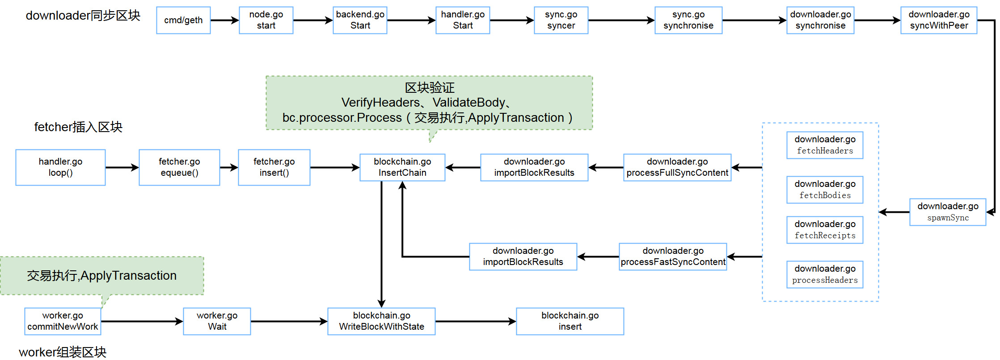

# 区块插入具体过程

以太坊本地节点获得一个新的block有三种途径，fetcher和downloader以及自身挖矿，都可以得到新的block，并插入本地区块链中。

#### fetcher的方式

- fetcher用来处理单个block的消息的添加，只能添加本地当前chainHeight范围（chainHeight-6 至chainHeight+32）的区块。

- handler.go会执行loop循环会处理邻居发送的NewBlockMsg消息，其中有新的block信息，交给fetcher的插入队列f.queue
- fetcher会对block的number进行验证后调用自身的insert方法
- insert方法中会调用f.verifyHeader验证block头部，验证通过后会执行f.insertChain方法，f.insertChain方法会调用blockchain.InsertChain方法插入区块

#### downloader的方式
- downloader方法用来和邻居节点进行区块同步，在有新邻居加入或每10秒会强制同步一次
- handler.go会执行loop循环会处理邻居发送的NewBlockMsg消息，如果调用sync.go的synchronise方法，sync.go的synchronise方法会设置downloader的模式，FullSync或FastSync，调用downloader.Synchronise方法
- downloader.Synchronise方法会调用d.syncWithPeer方法
- d.syncWithPeer会创建fetchers函数数组，调用d.spawnSync(fetchers)方法
- d.spawnSync方法会执行fetchers中的函数：fetchHeaders，fetchBodies，fetchReceipts，processHeaders，processFullSyncContent或者processFastSyncContent
- 获取到block之后会执行blockchain.InsertChain方法插入区块

#### 本节点挖矿组装block的方式

- miner包负责向外提供一个“挖矿”得到的新区块。
- miner.start()启动挖矿后，会从交易池中取出交易，执行后组装以新的block
- 同时使用相应的共识机制（Ethash或Clique），对block进行封装
- 完成后将block 写入本地区块并发送给邻居节点

#### 




#### chainHeadEvent通知

当节点挖掘或者收到邻居的block并插入到链上时，会发送chainHeadEvent通知。

tx_pool会执行reset方法，更新交易池中的交易

```
tx_pool.go
func (pool *TxPool) loop() {
for {
		select {
		// Handle ChainHeadEvent
		// 处理新链头事件
		case ev := <-pool.chainHeadCh:
			if ev.Block != nil {
				pool.mu.Lock()
				// 家园阶段
				if pool.chainconfig.IsHomestead(ev.Block.Number()) {
					pool.homestead = true
				}

				// 重置当前交易池，确保其中交易有效
				pool.reset(head.Header(), ev.Block.Header())
				head = ev.Block

				pool.mu.Unlock()
			}
    }
}
```

txpool会执行setNewHead()方法，更新

```
//txpool.go
func (pool *TxPool) eventLoop() {
	for {
		select {
		case ev := <-pool.chainHeadCh:

			// 设置新的head
			pool.setNewHead(ev.Block.Header())
			// hack in order to avoid hogging the lock; this part will
			// be replaced by a subsequent PR.
			//
			time.Sleep(time.Millisecond)

		// System stopped
		case <-pool.chainHeadSub.Err():
			return
		}
	}
}
```


worker会执行commitNewWork方法，组装新的block

```
// wroker.go  注册监听
func (self *worker) update() {
	defer self.txSub.Unsubscribe()
	defer self.chainHeadSub.Unsubscribe()
	defer self.chainSideSub.Unsubscribe()

	for {
		// A real event arrived, process interesting content
		select {
		// Handle ChainHeadEvent
		// 得知已经有新的链头 就组装下一个块
		case <-self.chainHeadCh:
			self.commitNewWork()
	}
}
```