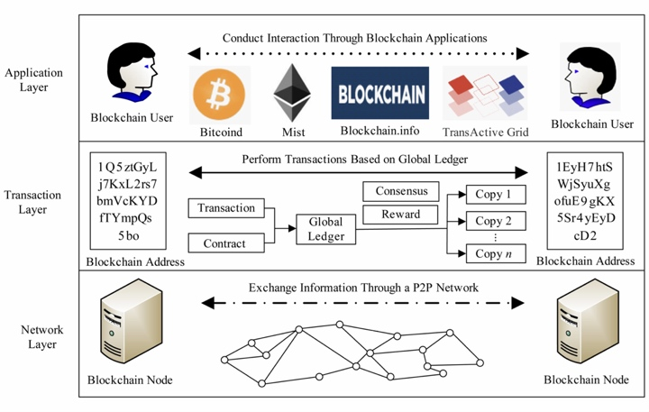

# 区块链隐私保护研究综述

> | Title: | 区块链隐私保护研究综述 |
> | --- | --- |
> | Authors: | 祝烈煌, 高峰, 沈蒙, 李艳东, 郑宝昆, 毛洪亮, 吴震 |
> | Institution: | 北京理工大学, 中国政法大学, 国家计算机网络应急技术处理协调中心 |
> | Hournal: | 计算机研究与发展’ 17 |

## 区块链隐私保护的特点

* 传统IT架构
    * 数据通常存储在中心化服务器
    * **确保数据不被外泄**
    * 管理者通过提高中心节点的防御能力来抵抗各种攻击
        * 使用高性能服务器
        * 部署入侵检测设备
        * 安装专用的数据泄密软件
* 区块链技术
    * 数据存储在分散的节点，没有统一的管理者，节点的性能和安全能力参差不齐，攻击者容易攻陷其中一些节点；攻击者伪装成合法节点直接获得交易数据
    * **确保交易的匿名性**，即虽然所有的交易细节都是可见的，但是攻击者无法通过分析交易数据获得交易双方真实的身份信息
    * 针对性的隐私保护机制？
        * 特殊的信息传递机制
        * 共识机制
        * 激励机制 
* 存在的差异
    * 隐私保护的侧重点不同
        * 保护数据在存储阶段和传输阶段不被外泄
        * 保护交易的匿名性
    * 隐私保护面临很多限制条件
        * 复杂的隐私保护算法在区块链中是不实用的
        * 设计隐私保护算法时避免破坏区块链的共识机制

## 区块链隐私保护背景知识

#### 区块链技术概述

###### 区块链技术的架构

* 在架构上通常分为
    * 数据层
    * 网络层
    * 共识层
    * 激励层
    * 合约层
    * 应用层

* 网络层
    * 确保区块链节点之间可以通过P2P网络进行有效通信
        * 区块链网络的组网方式
            * P2P组网技术
        * 节点之间的通信机制
            * 为了维持节点与区块链网络之间的连接而进行的通信
                * 索取其他节点的地址信息
                * 广播自己的地址信息
            * 为了完成上层业务而进行的通信
                * 转发交易信息
                    * 中继转发
                * 同步区块信息
                    * 请求响应

* 交易层
    * 实现区块链的核心业务，即在2个“地址”之间进行可靠的、具有公信力的数据传递
        * 地址格式
            * 用户参与区块链业务时使用的假名
        * 交易格式
            * 用户之间数据交互的过程
        * 智能合约
            * 特殊的数据交换方式
        * 全局账本
            * 数据存储结构，用于存储所有的交易记录、合约以及相关的参数信息
        * 共识机制
            * 保证所有合法节点维持的全局账本是相同的
        * 激励机制
            * 奖励参与共识的用户

* 应用层
    * 提供针对各种应用场景的程序和接口
        * 数字货币应用
        * 数据存证应用

#### 区块链隐私定义

* 隐私泄漏的风险
    * 为了在分散的区块链节点之间维持数据同步并对交易达成共识，区块链中所有的交易记录必须公开给所有节点

* 身份隐私
    * 用户身份信息和区块链地址之间的关联关系
        * 攻击者在分析交易数据的基础上，通过结合背景知识获得交易者的身份信息
* 交易隐私
    * 区块链中存储的交易记录和交易记录背后的知识
        * 攻击者通过分析交易记录获得有价值的信息

## 区块链隐私威胁

#### 区块链隐私保护存在的优势和缺陷

| Layer | Advantages | Disadvantages |
| --- | --- | --- |
| **Network** | P2P network is difficult to monitor               | Nodes in blockchain network have a low performance and are vulnerable to being taken over |
| **Transaction** | Blockchain technology supports anonymous transactions | The correlation among transactions can be used to derive sensitive information |
| **Application** | Decentralized application can effectively counter cyber attacks | Blockchain applications face various security vulnerabilities |

#### 网络层面临的隐私威胁

* 恶意节点可以轻易接入网络，监听整个网络的通信信息
    * 节点的IP地址
        * 部署探针节点
    * 节点之间的拓扑关系
        * 主动获取
        * 被动监听
    * 网络传输信息
* 交易溯源技术
    * 攻击者将网络层捕获的交易信息和始发节点的IP地址关联
        * 如何从众多的信息中找到由始发节点转发的交易数据

#### 交易层面临的隐私威胁

* 潜在攻击者分析完整的、公开的全局账本中的交易记录
    * 任何一笔资金的使用情况
    * 任何一个比特币地址的相关交易
* 交易隐私威胁
    * 对具有关联性的区块链地址进行聚类分析
        * 发现不同地址之间的资金关系
        * 跟踪特殊交易
        * 发现交易规律
* 身份隐私威胁
    * 比特币本身的设计
        * 同一个交易中的所有输入地址都隶属于同一个用户集合
        * 在同一个coinbase交易中的多个输出地址属于同一个用户集合
        * 找零地址和输入地址隶属于同一个用户
    * 用户使用区块链时产生的规律信息
        * 交易特征
        * 交易规律

#### 应用层面临的隐私威胁

* 用户不规范的操作行为
* 区块链服务商的漏洞

## 区块链隐私保护机制

* 网络层的隐私保护
    * 限制节点的权利，对抗被动监听和主动攻击
* 交易层的隐私保护
    * 满足区块链基本共识机制条件下，尽可能隐藏数据信息和数据背后的知识
* 应用层的隐私保护
    * 提高用户的安全意识
    * 提高区块链服务商的安全防护水平

#### 网络层的隐私保护机制

* 增加攻击者搜集网络层数据的难度
    * 限制接入
    * 恶意节点检测和屏蔽
    * 网络层数据混淆
        * 洋葱网络Tor
        * 匿名通信协议I2P

#### 交易层的隐私保护机制

* 在满足区块链正常运行的基础上，防止恶意节点获得准确的交易数据
    * 基于数据失真的保护方案
        * 不破坏交易结果的条件下，对交易内容进行混淆，增加攻击者发现不同地址之间的交易关系的分析难度
        * “混币”机制，即采取中间人中转信息的机制隐藏交易中输入地址和输出地址之间的关系
            * 基于中心节点混币方法
                * 混币过程由第三方节点执行
                    * 额外的收费和较慢的混币过程
                    * 存在盗窃资金的风险
                    * 中间节点可能泄漏混币过程
            * 去中心化的混币方法
                * 混币过程不需要第三方节点执行
                    * 在寻找参与混币用户的过程中，可能能够需要中心节点
                    * 在节点协商的过程中，参与混币的节点可能会发现其他节点的混币信息
                    * 在执行混币过程中，如果部分节点违规操作，可能导致混币过程失败
                        * 拒绝服务攻击
                    * 用户无法抵赖曾经参与过混币
    * 基于数据加密机制的保护方案
        * 保证节点在加密数据上完成交易验证任务
        * 减少加密机制对验证效率的影响
            * 门罗币的加密方案
                * 输出地址是由接收方的公钥和发送方产生的随机参数加密后得到的新地址信息
            * Zcash的加密方案
                * 使用承诺函数将每一笔交易的来源、去向和金额封装到若干参数中
                * 使用零知识证明技术zk-SNARK来证明交易
    * 基于限制发布的保护方案
        * 直接将涉及隐私的数据从公开数据库中移除
            * 闪电网络
                * 微支付技术，用于提供可靠的链外交易
            * 联盟链和私有链
                * 只有联盟内的成员/内部用户能够维护区块链数据，其他非授权节点不能接触区块链数据

Comparison of Mix Mechanism in Blockchain

| Protocol | Rely onThird Party | MixCost | Risk of Theft | Risk ofDOS |
| --- | --- | --- | --- | --- |
| **Mix** | √ | √ | High | Low |
| **Mixcoin** | √ | √ | Middle, Support Auditing | Low |
| **BlindCoin** | √ | √ | Middle, Blind Signature | Low |
| **DASH** | √ | √ | Middle, Deposit | Low |
| **CoinJoin** | ⅹ | ⅹ | Low | High |
| **CoinShuffle** | ⅹ | ⅹ | Low | High |
| **Xim** | ⅹ | √ | Low | Low |
| **CoinParty** | ⅹ | ⅹ | Low | Low |
| **Monero** | ⅹ | ⅹ | Low | Low |     

#### 应用层的隐私保护机制

* 从用户的角度提升保护能力
    * 使用具有隐私保护机制的区块链应用
    * 使用具有隐私保护机制的区块链程序

Comparison of Blockchain Wallet

| Category | Secret KeySaving Mode | Major Threats | Protection Mechanism |
| --- | --- | --- | --- |
| **ColdWallet** | Offline device,Paper walletBrain wallet | Device lostor damaged | Redundant backup,Encrypted storage |
| **LocalWallet** | Save on the hostor mobile device | Cyber attackor device failure | Encrypt wallet,Wallet backup |
| **OnlineWallet** | Save in server | Server was attacked | Multiple signature |

## 未来研究方向

#### 目前的隐私保护方案的缺陷

* 网络层
    * 限制接入的方案
        * 只适用于联盟链和私有链，在公有链中很难实施
    * 恶意节点检测和屏蔽机制
        * 事后的补救措施
        * 必须配合限制接入机制
    * 匿名通信协议
        * 在效率、性能、易用性上存在缺陷
        * 过于繁琐的使用方法

* 交易层
    * 基于数据失真的隐私保护方案
        * 保护效果有限，分析人员仍有可能通过分析交易之间的关联性发现隐藏的信息
    * 基于加密机制的保护方案
        * 对底层协议进行大幅改动
        * 耗费更多的计算资源，在效率上存在瓶颈
    * 基于限制发布的保护方案
        * 修改底层协议，实施难度较大
        * 改变传统区块链技术中所有交易数据公开的特点，需要解决交易可靠性和共识机制面临的问题

* 应用层
    * 当用户数量增加时，很难保证所有用户具有相同的安全意识和防护能力

#### 未来的研究方向

* 按需配置的网络层安全防护机制
    * 针对联盟链和私有链
        * 访问控制策略
        * 传统中心化架构中成熟的安全措施
    * 针对公有链网络
        * **异常节点检测**
    * 在效率、性能、易用性方面更好的匿名通信机制
* 基于密码学算法的交易层隐私保护机制
    * 考虑区块链服务器在计算性能和存储性能上的缺陷，涉及通用性更高的加密方法
* 安全密钥技术
    * 在应用层
        * **钱包的密钥保护技术**
            * 基于口令、硬件以及生物特征等多因素认证机制

