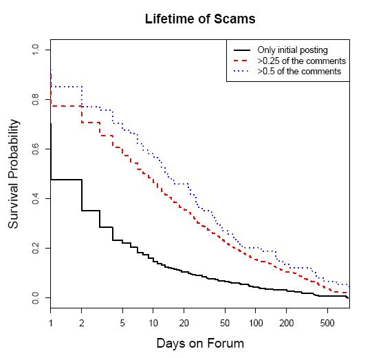
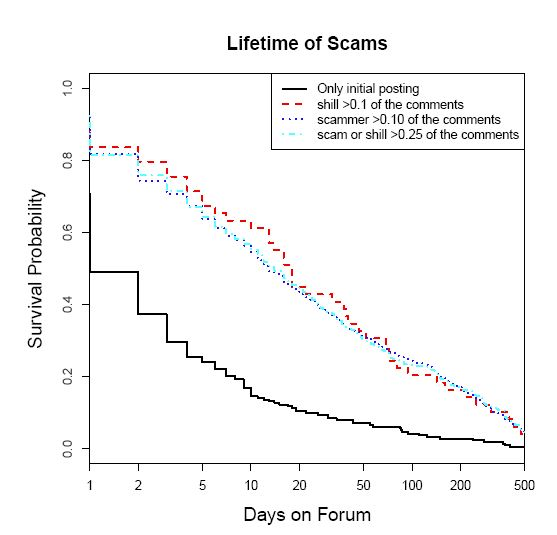

# 比特币旁氏骗局模式生态系统分析

> | Title: |  Analyzing the Bitcoin Ponzi Scheme Ecosystem |
> | --- | --- |
> | Authors: | Marie Vasek and Tyler Moore |
> | Institution: |Computer Science, University of New Mexico，Tandy School of Computer Science, The University of Tulsa |

## Topic

比特币；犯罪分析

## Motivation
本文同之前的文章不同，更多的是将旁氏骗局的产生、发展和消亡同链下舆论的讨论进行结合，目的在于分析比特币论坛中的相关信息
和链上旁氏骗局之间的联系。

## Approach
首先，作者定义了一个旁氏骗局存在的周期：从诈骗者第一次在比特币论坛中发布“广告”，到最后一次有关这个骗局的评论为止。（这个
定义存在明显的不足，因为网络中旁氏骗局的“消亡”并不是一个确定性的事件，并不能确定性的定义一次评论的事件。换句话说，在研
究周期之外，随时可能会有一个新的评论导致旁氏骗局存在时间的延长）

在这个定义的基础之上，作者分别研究了诈骗者、受害者以及“托”（人工分辨一些可能存在问题的帖子）三类人群对旁氏骗局存在周期的影响，
主要的特征并不涉及到对于旁氏链上骗局的鉴别和交易特征的分析，因此没有研究分类和检测旁氏骗局的问题，而重点在于论坛讨论对于旁氏骗局
生存周期的影响。

从结论上来看，论坛讨论的活跃程度、诈骗者和“托”的发言频率，能够明显增加庞氏骗局的生存周期，如下图所示

## 经验总结
1. 本文更多的是一个描述性的分析文章，重点在于对论坛中的内容和庞氏骗局进行关联分析，本质上而言不涉及链上数据的分析。
2. 对于旁氏骗局的生存分析，缺少一个明确目标。我们研究一个旁氏骗局什么时候奔溃是否有意义？更多的应该是在产生时，作出及时的预警。
3. 不过，无论是比特币还是以太坊，旁氏骗局必然伴随一定的宣传，这些相关的宣传特征对于区分旁氏骗局存在明显意义。