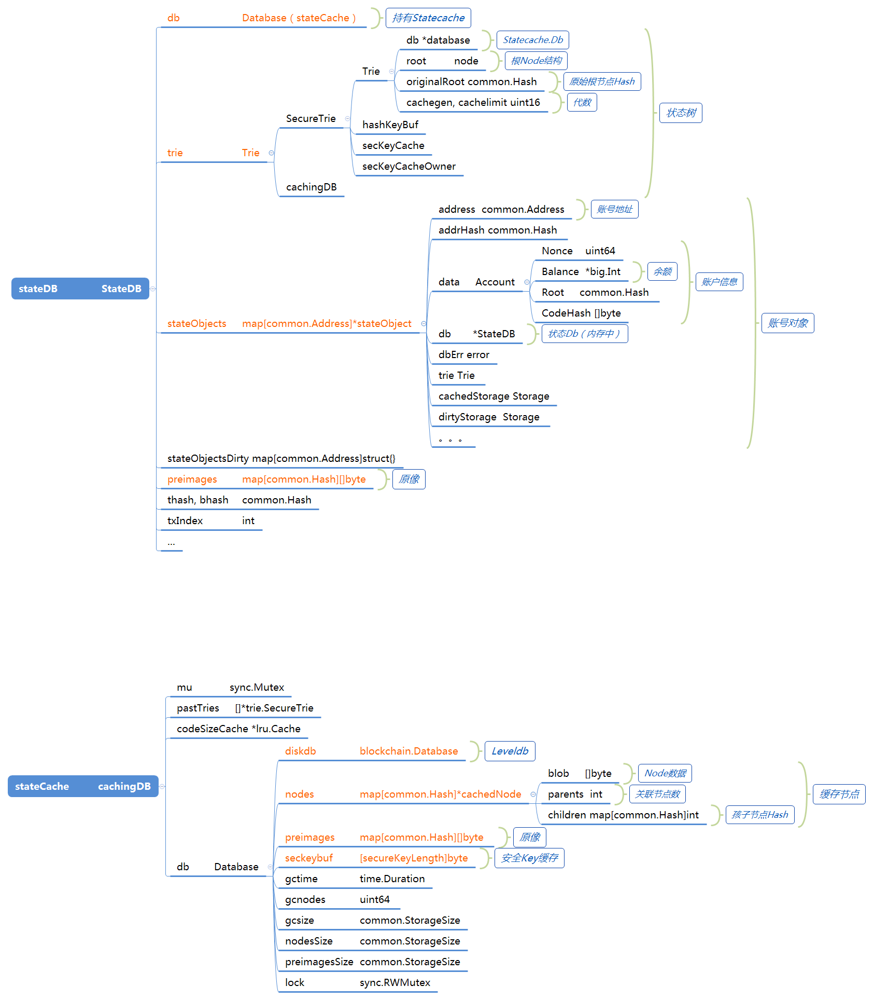

# 以太坊三棵树

以太坊中有三颗MPT树，分别为交易所、状态树、收据树。

以太坊header结构体中保存了三棵树的树根，因为树根是从叶子节点逐步hash计算出，通过比对树根可以知道两棵树是否一致


### 一、交易与收据的存储

```go
// Header 结构体
type Header struct {

	...
	
   // 状态的root
   Root        common.Hash    `json:"stateRoot"        gencodec:"required"`
   // 交易树的root
   TxHash      common.Hash    `json:"transactionsRoot" gencodec:"required"`
   // 收据树的root
   ReceiptHash common.Hash    `json:"receiptsRoot"     gencodec:"required"`

	...
}
```

每个block产生的**交易**会存储在block结构体中

```go
type Block struct {
   // header  叔链 交易
   header       *Header
   uncles       []*Header
   transactions Transactions
	...
}
```

每个block交易执行后生成的收据，会存储在blockchain.db中

```go
batch := bc.db.NewBatch()
...
WriteBlockReceipts(batch, block.Hash(), block.NumberU64(), receipts)
...
```
收据写入数据库的方法
```go
// 存储一个block所有的交易收据为一个收据slice，这个用来在链重组时，重新规划丢弃的交易
func WriteBlockReceipts(db ethdb.Putter, hash common.Hash, number uint64, receipts types.Receipts) error {
   // Convert the receipts into their storage form and serialize them
   // 转变收据为他们的存储形式，序列化
   storageReceipts := make([]*types.ReceiptForStorage, len(receipts))
   for i, receipt := range receipts {
      storageReceipts[i] = (*types.ReceiptForStorage)(receipt)
   }
   // 编码
   bytes, err := rlp.EncodeToBytes(storageReceipts)
   if err != nil {
      return err
   }
   // Store the flattened receipt slice
   // 存储收据slice
   key := append(append(blockReceiptsPrefix, encodeBlockNumber(number)...), hash.Bytes()...)
   if err := db.Put(key, bytes); err != nil {
      log.Crit("Failed to store block receipts", "err", err)
   }
   return nil
}
```


### 二、状态的存储


#### 数据结构

> StateDB 持有状态树trie，状态改变的对象stateObjects
>
> Trie	状态树
>
> cachingDB	
>
> cacheNode

数据结构如下图




#### stateCache的创建

```go
// backend.go 创建Ethereum对象
func New(ctx *node.ServiceContext, config *Config) (*Ethereum, error) {
	
	...
	
	// 创建数据库
	chainDb, err := CreateDB(ctx, config, "chaindata")
	
	...
	
	eth := &Ethereum{
		config:         config,
		chainDb:        chainDb,
		chainConfig:    chainConfig,
		eventMux:       ctx.EventMux,
		accountManager: ctx.AccountManager,
		engine:         CreateConsensusEngine(ctx, &config.Ethash, chainConfig, chainDb),
		shutdownChan:   make(chan bool),
		stopDbUpgrade:  stopDbUpgrade,
		networkId:      config.NetworkId,
		gasPrice:       config.GasPrice,
		etherbase:      config.Etherbase,
		bloomRequests:  make(chan chan *bloombits.Retrieval),
		bloomIndexer:   NewBloomIndexer(chainDb, params.BloomBitsBlocks),
	}
	
	...
	
	// 新建BlockChain
	eth.blockchain, err = core.NewBlockChain(chainDb, cacheConfig, eth.chainConfig, eth.engine, vmConfig)
	
	...

}


// blockchain.go 创建新的BlockChain对象
func NewBlockChain(db ethdb.Database,...)
{
    bc := &BlockChain{
		...
		db:           db,
		stateCache:   state.NewDatabase(db),
		...
	}
}

// state\database.go
func NewDatabase(db ethdb.Database) Database {
	csc, _ := lru.New(codeSizeCacheSize)
	return &cachingDB{
		db:            trie.NewDatabase(db),
		codeSizeCache: csc,
	}
}

// trie
func NewDatabase(diskdb ethdb.Database) *Database {
	return &Database{
		diskdb: diskdb,
		nodes: map[common.Hash]*cachedNode{
			{}: {children: make(map[common.Hash]int)},
		},
		preimages: make(map[common.Hash][]byte),
	}
}
```


#### state在insertChain()方法插入时的作用

1.在将block插入链中时，使用insertChain()方法，首先创建一个新的state(stateDB类型)，参数为父块的状态root和blockchain的stateCache（cachingDB类型）

```go
// insertChain()
// 新的stateDB
state, err := state.New(parent.Root(), bc.stateCache)
```

使用root打开一个返回了一个tr

返回一个StateDB结构体

```go
// statedb.go
// 根据给的trie创建一个新的stateDB
func New(root common.Hash, db Database) (*StateDB, error) {

	// tr  cachedTrie{SecureTrie tr, db}
	tr, err := db.OpenTrie(root)
	if err != nil {
		return nil, err
	}
	return &StateDB{
		db:                db,
		trie:              tr,
		stateObjects:      make(map[common.Address]*stateObject),
		stateObjectsDirty: make(map[common.Address]struct{}),
		logs:              make(map[common.Hash][]*types.Log),
		preimages:         make(map[common.Hash][]byte),
	}, nil
}
```


2.在交易的执行中会使用到新建的state

```go
// insertChain()
receipts, logs, usedGas, err := bc.processor.Process(block, state, bc.vmConfig)
```

Process方法会调用ApplyTransaction方法，会使用state创建新的EVM，此后交易执行的结果会修改EVM中的state

```go
// ApplyTransaction()
vmenv := vm.NewEVM(context, statedb, config, cfg)
```
在交易执行结束，会设置账户nonce，修改账号余额，此过程会修改或创建stateObject，添加到stateDB.stateObjects中
```
// 设置账户nonce
st.state.SetNonce(sender.Address(), st.state.GetNonce(sender.Address())+1)

// 添加到余额
st.state.AddBalance(st.evm.Coinbase, new(big.Int).Mul(new(big.Int).SetUint64(st.gasUsed()), st.gasPrice))
```


3.验证交易state方法ValidateState中，会验证block的header.Root，和执行过交易后得到的stateDB返回的状态Root是否相等。

```go
// insertChain()
err = bc.Validator().ValidateState(block, parent, state, receipts, usedGas)
```


4.至此，根据交易执行的结果，stateDB的内容就已设置完毕，会调用WriteBlockWithState()将block和state进行存储

```go
// insertChain()
status, err := bc.WriteBlockWithState(block, receipts, state)
```


#### WriteBlockWithState()中state处理

**1.状态提交，返回root**

首先会进行stateDB的提交，执行state.Commit()方法，这里会做两件事情：

（1）遍历stateDB.stateObjects中的stateObject，更新securreTrie中的trie树结构中的每个node

（2）更新stateCache.db.nodes和stateCache.db.preimages

```go
// WriteBlockWithState()
// db状态提交 返回一个root
root, err := state.Commit(bc.chainConfig.IsEIP158(block.Number()))
```

statedb.go 文件 Commit()方法
```go
// 写state到 内存中的trie db
func (s *StateDB) Commit(deleteEmptyObjects bool) (root common.Hash, err error) {

   // 清理s的journal和refund
   defer s.clearJournalAndRefund()

   // Commit objects to the trie.
   // 提交objects到trie，遍历s中的状态对象
   for addr, stateObject := range s.stateObjects {
      _, isDirty := s.stateObjectsDirty[addr]
      switch {
      case stateObject.suicided || (isDirty && deleteEmptyObjects && stateObject.empty()):
         // If the object has been removed, don't bother syncing it
         // and just mark it for deletion in the trie.
         // 如果对象被移除了，不同步，只标记已经在trie中删除
         s.deleteStateObject(stateObject)
      case isDirty:
         // Write any contract code associated with the state object
         // 写任何与状态对象相关的合约代码
         if stateObject.code != nil && stateObject.dirtyCode {
            // 插入合约二进制码
            s.db.TrieDB().Insert(common.BytesToHash(stateObject.CodeHash()), stateObject.code)
            stateObject.dirtyCode = false
         }
         // Write any storage changes in the state object to its storage trie.
         // 写任何stateobject的存储变化到存储trie树
         if err := stateObject.CommitTrie(s.db); err != nil {
            return common.Hash{}, err
         }
         // Update the object in the main account trie.
         // 在主账号trie中更新object
         s.updateStateObject(stateObject)
      }
      delete(s.stateObjectsDirty, addr)
   }
   // Write trie changes.
   // 写入trie的变化 主要更新triedb.db.nodes
   root, err = s.trie.Commit(func(leaf []byte, parent common.Hash) error {
      var account Account
      // 解码叶子
      if err := rlp.DecodeBytes(leaf, &account); err != nil {
         return nil
      }
      // 根非空
      if account.Root != emptyState {
         // 建立根和parent的链接
         s.db.TrieDB().Reference(account.Root, parent)
      }
      code := common.BytesToHash(account.CodeHash)
      // code 不空 建立code和parent的联系
      if code != emptyCode {
         s.db.TrieDB().Reference(code, parent)
      }
      return nil
   })
   log.Debug("Trie cache stats after commit", "misses", trie.CacheMisses(), "unloads", trie.CacheUnloads())
   return root, err
}
```


**2.创建triedb，提交**

（1）将stateCache.db.preimages中的preimage写入leveldb数据库

（2）trie树根节点以及孩子节点写入leveldb数据库

```go
// WriteBlockWithState()
triedb := bc.stateCache.TrieDB()
```

区分trie的写入是否有缓存设置

```go
//  WriteBlockWithState()
if bc.cacheConfig.Disabled {
   // 将root存入triedb
   if err := triedb.Commit(root, false); err != nil {
      return NonStatTy, err
   }
} else {
	triedb.Reference(root, common.Hash{}) // metadata reference to keep trie alive
	...
	triedb.Commit(header.Root, true)
	...
}
```

trie\database.go，Commit()方法

```go
func (db *Database) Commit(node common.Hash, report bool) error {
   // 创建一个db batch来flush out持久化数据
   // 重要的是外部的code不能看到一个非持久化的状态（在提交期间从内存缓存中删除的引用数据，但在持久存储中还没有）
   // 这确保了只有在数据库写完之后，才会对现有数据进行uncaching的处理
   db.lock.RLock()

   start := time.Now()
   batch := db.diskdb.NewBatch()

   // Move all of the accumulated preimages into a write batch
   // 移动所有的累加 preimages到一个写batch
   for hash, preimage := range db.preimages {
      // 存储db.preimages中的preimage
      if err := batch.Put(db.secureKey(hash[:]), preimage); err != nil {
         log.Error("Failed to commit preimage from trie database", "err", err)
         db.lock.RUnlock()
         return err
      }
      if batch.ValueSize() > ethdb.IdealBatchSize {
         if err := batch.Write(); err != nil {
            return err
         }
         batch.Reset()
      }
   }
   // Move the trie itself into the batch, flushing if enough data is accumulated
   // 移动trie到batch，如果数据足够就flushing
   nodes, storage := len(db.nodes), db.nodesSize+db.preimagesSize
   // triedb的commit，提交node和batch
   if err := db.commit(node, batch); err != nil {
      log.Error("Failed to commit trie from trie database", "err", err)
      db.lock.RUnlock()
      return err
   }
   // Write batch ready, unlock for readers during persistence
   // 准备写batch，解锁
   if err := batch.Write(); err != nil {
      log.Error("Failed to write trie to disk", "err", err)
      db.lock.RUnlock()
      return err
   }
   db.lock.RUnlock()

   // Write successful, clear out the flushed data
   // 写入成功，清理flushed的数据
   db.lock.Lock()
   defer db.lock.Unlock()

   db.preimages = make(map[common.Hash][]byte)
   db.preimagesSize = 0

   db.uncache(node)

   logger := log.Info
   if !report {
      logger = log.Debug
   }
   logger("Persisted trie from memory database", "nodes", nodes-len(db.nodes), "size", storage-db.nodesSize, "time", time.Since(start),
      "gcnodes", db.gcnodes, "gcsize", db.gcsize, "gctime", db.gctime, "livenodes", len(db.nodes), "livesize", db.nodesSize)

   // 重置垃圾回收变量
   db.gcnodes, db.gcsize, db.gctime = 0, 0, 0

   return nil
}
```


**trie\database.go ，   commit()方法**
```
func (db *Database) commit(hash common.Hash, batch ethdb.Batch) error {
   // If the node does not exist, it's a previously committed node
   // node不存在，则是一个提交过的node
   node, ok := db.nodes[hash]
   if !ok {
      return nil
   }
   // 递归提交node.children
   for child := range node.children {
      if err := db.commit(child, batch); err != nil {
         return err
      }
   }
   // 放入batch
   if err := batch.Put(hash[:], node.blob); err != nil {
      return err
   }
   // If we've reached an optimal match size, commit and start over
   // 到达一个batch的合适size，写入提交
   if batch.ValueSize() >= ethdb.IdealBatchSize {
      if err := batch.Write(); err != nil {
         return err
      }
      batch.Reset()
   }
   return nil
}
```


### 疑问

>《以太坊技术详解与实战》：
>
> 以太坊中共有三个LevelDB数据库，分别是BlockDB、StateDB和ExtrasDB。BlockDB保存了块的主体内容，包括块头和交易；StateDB保存了账户的状态数据；ExtrasDB保存了收据信息和其他辅助信息。

我们发现，以太坊节点文件夹中，只有chainData、nodes、lightchainData文件夹下有数据库文件，其中nodes文件夹中为p2p邻居节点信息，lightchainData为轻节点使用的数据库，只有chainData为我们创建的全节点存储位置。


而从代码中看，以太坊的交易信息、状态信息和收据信息，最终都存在了一个数据库当中，就是blockchain.db

我们认为书中所讲BlockDB就是blockchain.db，StateDB是一个处于内存中的结构体，而ExtrasDB并没有找到对应的内容。


