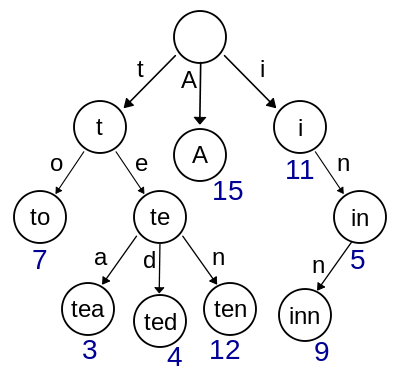
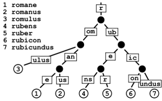
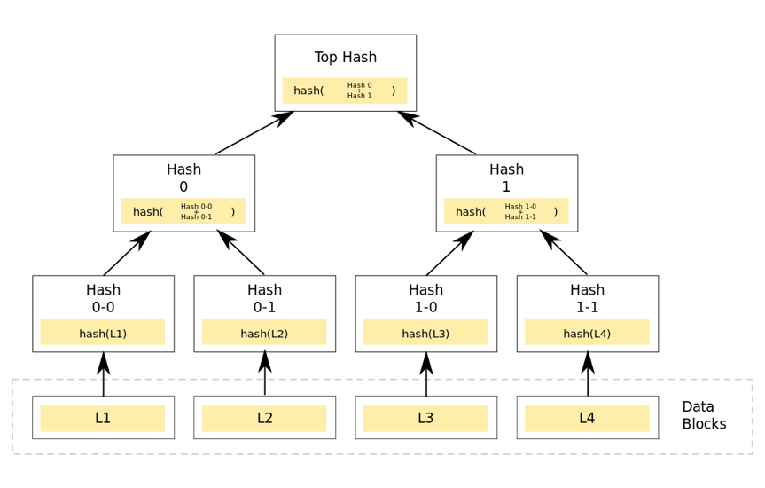
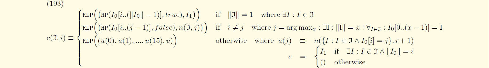
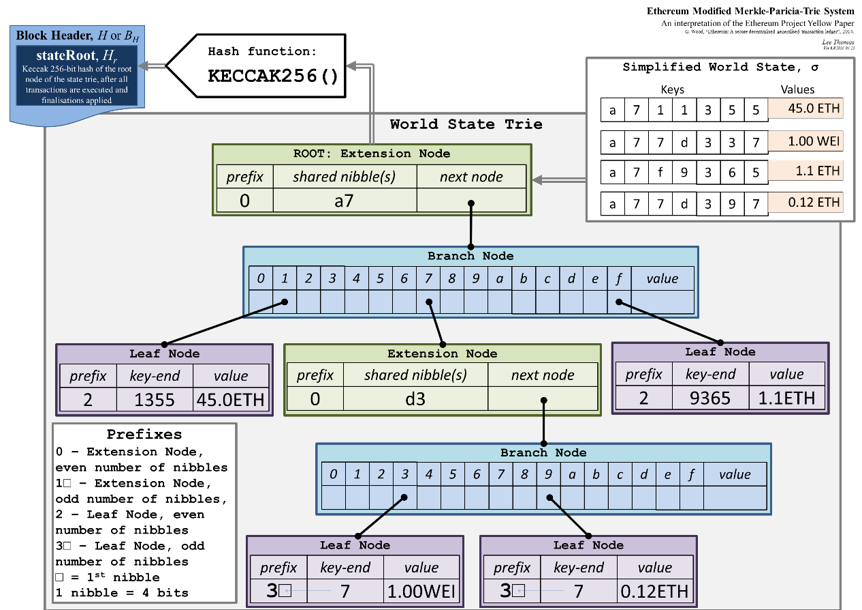

# 改进的默克尔・帕特里夏树

trie包实现了改进的默克尔・帕特里夏树（Modified Merkle Patricia Tree, MPT），提供了任意长度的二进制数据（字节数组）之间的映射的持久化存储。

以太坊的区块头部中的`stateRoot`、`transacionsRoot`、`receiptsRoot`使用MPT存储。

## 预备知识

MPT是一种前缀树的变种，基本思想来自[前缀树](#前缀树)、[压缩前缀树](#压缩前缀树)和[哈希树](#哈希树)。

#### 前缀树

前缀树（trie）是一种用于快速搜索的数据结构。如图所示，该前缀树存储了key为"A"、"to"、"tea"、"ted"、"ten"、"in"和"inn"，每个完整的英语单词都有与其对应的整数值。



前缀树的性质归纳为：
1. 根结点不包含字符，其他节点包含一个字符；
1. 从根节点到某个节点遍历时经过的字符连接起来，构成该节点的字符串；
1. 每个节点的子节点包含的字符串均不相同。

#### 压缩前缀树

压缩前缀树（Patricia Trie）是一种用于快速搜索，并对空间进行优化的数据结构。如图展示了一棵存储了7个key的压缩前缀树。

由于前缀树为每个节点分配一个字符，在字符串没有公共前缀的情况下，前缀树退化成一条链。与前缀树不同，压缩前缀树将唯一的子节点与父节点合并，允许使用多个元素标记边。



#### 哈希树

哈希树（Merkle Tree）是一种用于高效验证数据内容的数据结构。如图所示，哈希树的叶子节点是数据块的哈希值，非叶子节点是其子节点串联字符串的哈希值。



## 理论基础

详见[以太坊黄皮书](https://ethereum.github.io/yellowpaper/paper.pdf)Appendix D、[以太坊Wiki](https://github.com/ethereum/wiki/wiki/Patricia-Tree)和[StackExchange](https://ethereum.stackexchange.com/questions/268/ethereum-block-architecture)。

#### Modified Merkle Patricia tree。

假设有输入值`J`，包含字节数组对的集合：


处理该集合时，使用数值下表标识元组的key或者value，有：


给定字节存储顺序，任意字节可以被表示为半字节（nibbles）。假设使用高位优先的存储顺序，有：


定义表示集合的trie的根节点`TRIE`函数：


当节点的RLP少于32字节时，直接存储其RLP编码；否则，存储字节数组的Keccak哈希值。定义节点的容量`n`函数：


在MPT中有三种类型的节点：

* **叶子节点（Leaf）：**`RLP(HP(尚未串联的key的半字节编码, true), value)`
* **扩展节点（Extension）：**`RLP(HP(至少2个尚未累加的key公共半子节编码, false), 剩余部分)`
* **分支节点（Branch）：**`{0, 1, ..., f, $}`

定义节点的结构组成函数`c`：


如图展示了一颗MPT树。假设MPT包含四个key-value对`('a711355', '45.0 ETH')`、`('a77d337', '1.00 WEI')`、`('a7f9365', '1.1 ETH')`和`('a77d397', '0.12 ETH')`。



首次，将key和value转换为`bytes`。*注：为了方便理解，key使用`<>`、value使用`''`标记，在实现中他们都是字节数组。*

然后，构建如下MPT：

```
root:   [<a7>, HASH(A)]
HASH(A):[<>, HASH(B), <>, <>, <>, <>, <>, HASH(C), <>, <>, <>, <>, <>, <>, <>, HAHS(D), <>]
HASH(B):[<1355>, '45.0 ETH']
HAHS(C):[<dc>, HASH(E)]
HASH(D):[<9365>, '1.1 ETH']
HASH(E):[<>, <>, <>, HASH(F), <>, <>, <>, <>, <>, HASH(G), <>, <>, <>, <>, <>, <>, <>]
HASH(F):[<7>, '1.00 WEI']
HASH(G):[<7>, '0.12 ETH']
```

#### 存疑❓

```diff
+ 类似前缀树，从根节点到叶子节点遍历MPT树，构建唯一的key-value对。key通过遍历从每个分支节点获取单个半字节。
+ 与前缀树不同，当多个key共享相同的前缀或者单个key拥有唯一的后缀时，使用优化节点，在遍历时从扩展节点和叶子节点获取多个半字节。
- MPT如何体现哈希树的性质？
```

> ...; we simply define the identity function mapping the key-value set `J` to a 32-byte hash and assert that only a single such hash exists for any `J`, which though not strictly true is accurate within acceptable precision given the Keccak hash's collision resistance. In reality, a sensible implementation will not fully recompute the trie root hash for each set.

释疑：[trie包的hasher go文件的`hashChildren`函数](#trie/hasher.go)

## 源码解读

trie包的内容如下：

```
trie
  ├─database.go
  ├─encoding.go
  ├─errors.go
  ├─hasher.go
  ├─iterator.go
  ├─node.go
  ├─proof.go
  ├─secure_trie.go
  ├─sync.go
  └─trie.go
```  

#### trie/database.go

`Database`是在MPT数据结构和磁盘数据库间的中间件。

#### trie/encoding.go

`encoding`主要处理编码格式的相互转换。这三种编码分别是：

* **KEYBYTES编码：**包含原生key的字节数组，多用于API的输入；
* **HEX编码：**包含key的半字节数组和可选尾终止符，多用于节点在内存中的表示；
* **COMPACT编码：**即Hex-prefix编码，包含key的半字节数组和flag，用于磁盘存储。

#### trie/errors.go

在`errors`中，如果MPT节点不存在，`TryGet`、`TryUpdate`和`TryDelete`函数返回`MissingNodeError`。

#### trie/hasher.go

`hash`函数主要:
1. 计算原有树形结构的哈希值；
2. 保留原有树形结构。

计算原有树形结构的哈希值调用`hashChildren`计算所有子节点的哈希值，将原有的子节点替换成子节点的哈希值。

```go
func (h *hasher) hash(n node, db *Database, force bool) (node, node, error) {
	if hash, dirty := n.cache(); hash != nil {
		if db == nil {
			return hash, n, nil
		}
		if n.canUnload(h.cachegen, h.cachelimit) {
			cacheUnloadCounter.Inc(1)
			return hash, hash, nil
		}
		if !dirty {
			return hash, n, nil
		}
	}
	collapsed, cached, err := h.hashChildren(n, db)
	if err != nil {
		return hashNode{}, n, err
	}
	hashed, err := h.store(collapsed, db, force)
	if err != nil {
		return hashNode{}, n, err
	}
	cachedHash, _ := hashed.(hashNode)
	switch cn := cached.(type) {
	case *shortNode:
		cn.flags.hash = cachedHash
		if db != nil {
			cn.flags.dirty = false
		}
	case *fullNode:
		cn.flags.hash = cachedHash
		if db != nil {
			cn.flags.dirty = false
		}
	}
	return hashed, cached, nil
}
```

`hashChildren`函数递归地从叶子节点向上计算到根节点。

```go
func (h *hasher) hashChildren(original node, db *Database) (node, node, error) {
	var err error

	switch n := original.(type) {
	case *shortNode:
		collapsed, cached := n.copy(), n.copy()
		collapsed.Key = hexToCompact(n.Key)
		cached.Key = common.CopyBytes(n.Key)

		if _, ok := n.Val.(valueNode); !ok {
			collapsed.Val, cached.Val, err = h.hash(n.Val, db, false)
			if err != nil {
				return original, original, err
			}
		}
		if collapsed.Val == nil {
			collapsed.Val = valueNode(nil)
        }
		return collapsed, cached, nil

	case *fullNode:
		collapsed, cached := n.copy(), n.copy()

		for i := 0; i < 16; i++ {
			if n.Children[i] != nil {
				collapsed.Children[i], cached.Children[i], err = h.hash(n.Children[i], db, false)
				if err != nil {
					return original, original, err
				}
			} else {
				collapsed.Children[i] = valueNode(nil)
			}
		}
		cached.Children[16] = n.Children[16]
		if collapsed.Children[16] == nil {
			collapsed.Children[16] = valueNode(nil)
		}
		return collapsed, cached, nil

	default:
		return n, original, nil
	}
}
```

#### trie/iterator.go

`Iterator`是遍历MPT的key-value迭代器。

#### trie/node.go

在`node`中，`fullNode`是分支节点，`shortNode`根据`Val`分为叶子节点和扩展节点。

```go
type (
    fullNode struct {
        Children [17]node
        flags    nodeFlag
    }
    shortNode struct {
        Key   []byte
        Val   node
        flags nodeFlag
   }
    hashNode  []byte
    valueNode []byte
)
```

#### trie/proof.go

`Prove`为指定的key构建默克尔证明，包含遍历路径上所有节点的哈希值。

`VerifyProof`验证默克尔证明。

#### trie/secure_trie.go

`secure_trie`中所有的访问操作的key使用Keccak256的哈希值，避免增加访问时间的节点的长链。

#### sync.go

`TrieSync`是MPT同步调度器。

#### trie.go

在`trie`中，`db`指向数据库存储，`root`包含了当前的根节点，`originalRoot`记录了启动加载时的哈希值。

```go
type Trie struct {
    db           *Database
    root         node
    originalRoot common.Hash
    
    cachegen, cachelimit uint16
}
```

`New`函数构造MPT。如果`root`不为空，就从数据库中加载MPT；否则，新建MPT。

```go
func New(root common.Hash, db *Database) (*Trie, error) {
    if db == nil {
       panic("trie.New called without a database")
    }
    trie := &Trie{
        db:           db,
        originalRoot: root,
    }
    if (root != common.Hash{}) && root != emptyRoot {
        rootnode, err := trie.resolveHash(root[:], nil)
        if err != nil {
            return nil, err
        }
        trie.root = rootnode
    }
    return trie, nil
}
```

`insert`函数向MPT递归插入节点。

**输入：**`n`是待插入的节点，`prefix`是已处理的前缀，`key`是剩余未处理的前缀，`value`是待插入的节点的值。

**输出：**`bool`标识着操作是否改变了MPT，`node`是插入完成后的子树的根节点，`error`是错误信息。

* 如果`n`是`shortNode`，
    * 计算公共前缀，
    * 如果全key匹配
        * 如果value相同，即`dirty == false`
            * 返回错误
        * 更新`shortNode`的value
    * 公共前缀不完全匹配
        * 插入扩展节点和分支节点
        * 递归调用`insert`
* 如果`n`是`fullNode`
    * 递归调用`insert`
* 如果`n`是`nil`，即一棵新的MPT
    * 返回`shortNode`
* 如果`n`是`hashNode`，即节点尚未载入内存
    * 调用`resolveHash`将节点加载到内存
    * 递归调用`insert`

```go
func (t *Trie) insert(n node, prefix, key []byte, value node) (bool, node, error) {
    if len(key) == 0 {
        if v, ok := n.(valueNode); ok {
            return !bytes.Equal(v, value.(valueNode)), value, nil
        }
        return true, value, nil
    }
    switch n := n.(type) {
    case *shortNode:
        matchlen := prefixLen(key, n.Key)
        if matchlen == len(n.Key) {
            dirty, nn, err := t.insert(n.Val, append(prefix, key[:matchlen]...), key[matchlen:], value)
            if !dirty || err != nil {
                return false, n, err
            }
            return true, &shortNode{n.Key, nn, t.newFlag()}, nil
        }
        branch := &fullNode{flags: t.newFlag()}
        var err error
        _, branch.Children[n.Key[matchlen]], err = t.insert(nil, append(prefix, n.Key[:matchlen+1]...), n.Key[matchlen+1:], n.Val)
        if err != nil {
            return false, nil, err
        }
        _, branch.Children[key[matchlen]], err = t.insert(nil, append(prefix, key[:matchlen+1]...), key[matchlen+1:], value)
        if err != nil {
            return false, nil, err
        }
        if matchlen == 0 {
            return true, branch, nil
        }
        return true, &shortNode{key[:matchlen], branch, t.newFlag()}, nil

    case *fullNode:
        dirty, nn, err := t.insert(n.Children[key[0]], append(prefix, key[0]), key[1:], value)
        if !dirty || err != nil {
            return false, n, err
        }
        n = n.copy()
        n.flags = t.newFlag()
        n.Children[key[0]] = nn
        return true, n, nil

    case nil:
        return true, &shortNode{key, value, t.newFlag()}, nil

    case hashNode:
        rn, err := t.resolveHash(n, prefix)
        if err != nil {
            return false, nil, err
        }
        dirty, nn, err := t.insert(rn, prefix, key, value)
        if !dirty || err != nil {
            return false, rn, err
        }
        return true, nn, nil

    default:
        panic(fmt.Sprintf("%T: invalid node: %v", n, n))
    }
}
```

`TryGet`函数根据MPT的key获取value。

`TryUpdate`函数更新或者删除MPT的节点。

`Delete`函数删除MPT的节点。


