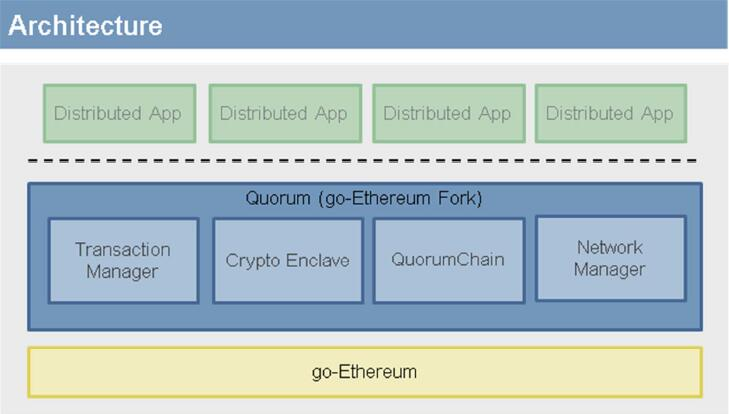
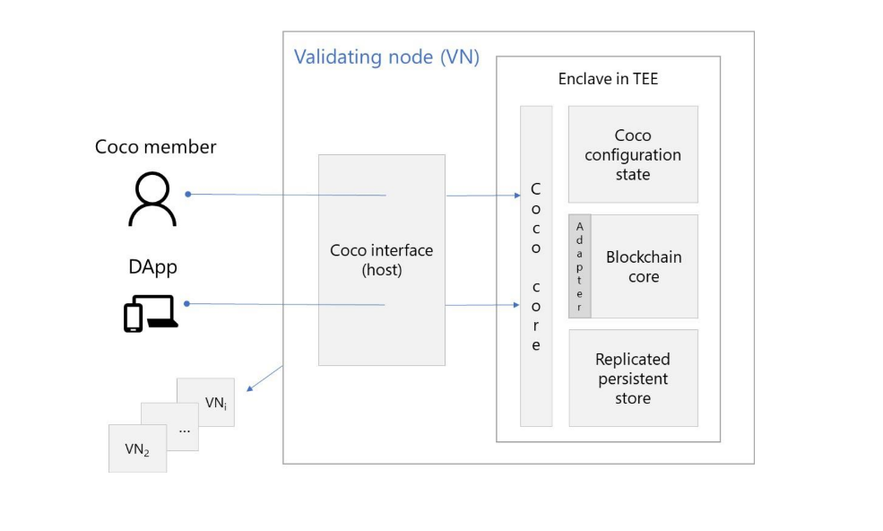

# 《以太坊技术详解与实战》隐私保护与数据安全

## 第3章 不同类型的以太坊区块链及其部署

### 3.1 区块链类型

#### 3.1.2 联盟链

[Page 62-66]
下面将主要介绍一个基于以太坊协议开发的联盟区块链——Quorum。

**(1) Quorum简介**

[Quorum](https://www.jpmorgan.com/global/Quorum)是基于以太坊协议开发的一个联盟区块链。Quorum在Go语言版本以太坊架构的基础上进行改进，添加了隐私保护功能，通过引入私有状态、私有交易等机制以及对交易数据进行加密，使私有交易的数据只对指定的交易方可见，从而实现对交易数据的隐私保护功能。

从逻辑层面看，Quorum所添加的隐私保护等功能均实现在标准以太坊协议层之上。下图展示了Quorum区块链平台架构及其各部分模块的逻辑概况。

* 交易管理：为私有交易提供加密交易数据，管理本地数据并与其他节点的交易管理模块通信以提供加密的私有交易数据。
* 加密模块：负责私钥管理以及数据的加解密过程。
* Quorum链：使用智能合约实现的投票共识机制。
* 网络管理：控制网络接入，建立一个授权网络以供联盟链运行。

Quorum的核心功能是利用加密功能使得与交易无关的节点无法看到交易中的敏感数据，其实现方案包含一条单一共享的区块链和一套由智能合约软件构成的体系结构，以及对以太坊公有链机制的改造。其中智能合约结构提供了隐私数据的字段；对以太坊的改造包括在区块提交和区块验证方面的修改。区块验证过程被改为所有节点只验证公有交易和与该节点相关的私有交易，而对于其他与之无关的私有交易，该节点则略过执行合约代码的过程。

由于交易分为公有和私有，并且各节点无法执行所有私有交易的合约代码，因此这会造成各节点数据库中存储的状态“分节”。比如说节点的状态数据库会被分成一个私有状态数据库和一个公有状态数据库。网络中所有节点都能在以太坊原有协议的基础上对公有状态达成共识，但私有状态的数据库就各不相同。与其他基于多条区块链的状态分节策略不同的是，尽管节点数据库中没有存储全局的状态，但实际上所有的交易包括加密的交易数据都记录在一条链上，并被复制存储到所有节点中。

**(2) Quorum交易隐私保护**

交易隐私保护是Quorum的关键特性之一，为了实现这一功能，Quorum引入了公有交易和私有交易的概念。公有交易是指数据对授权网络内的所有节点可见的交易，其生成与执行的过程与标准的以太坊交易一致。私有交易则是指数据仅对网络内指定的与交易相关的节点可见的交易。

公有交易以标准以太坊协议中所规定的方法执行，如果公有交易中包含调用一个智能合约的代码，则交易消息中数据字段里代码会被送入以太坊虚拟机（Ethereum Virtual Machine，EVM）中执行，执行结果会相应地修改状态数据库中的公有状态。

私有交易的生成和执行过程有所不同。在交易消息被交易发起方发送之前，数据字段中的代码会被替换为加密代码的散列值。交易的相关方可在节点的交易管理模块中由散列值获得相应的加密代码，并将加密代码送至加密模块进行解密，再将解密后的代码送至以太坊虚拟机中执行，最后根据执行结果更新相应的私有状态数据库。与该交易无关的其他节点仅能得到交易消息中的散列值，而无法获知交易细节，其略过代码执行过程，也不会更新状态数据库。

私有交易的生成流程如图所示。

1) 交易发起方的去中心化应用（DApp）向其Quorum框架的接口发送私有交易的交易相关方和交易数据。

2) Quorum节点的网络管理模块向交易管理模块发送交易数据，并指明该交易为私有交易。

3) 交易管理模块向加密模块发送交易相关方和交易数据。

4) 加密模块采用PGP方式对数据进行加密，具体过程如下。

① 随机生成一串对称密钥。

② 使用对称密钥对数据进行加密。

③ 获取所有交易相关方的RSA公钥，分别对对称密钥进行加密。

④ 计算加密数据的散列值。

加密模块将处理过的加密数据包装成交易数据消息（TxPayloadMsg）传回交易管理模块，交易数据消息包括加密数据、加密数据的散列值以及各个交易相关方公钥加密过的对称密钥。

5) 交易管理模块存储交易数据消息，并将其发送至其他交易相关方节点的交易管理模块中。

6) 交易管理模块将加密数据的散列值传回网络管理模块。

7) 网络管理模块将加密数据的散列值作为Quorum交易消息的数据字段，在交易消息中指明该交易的相关方，然后将交易发送至Quorum授权网络。

私有交易的验证流程如图所示。

1) 节点A接收到新的区块，其中包括与其相关的私有交易，并验证该私有交易。

2) 网络管理模块发送交易数据请求至交易管理模块。

3) 交易管理模块发送交易发送方的签名至加密模块。

4) 加密模块验证签名，确认该交易消息是由发送方发出。

5) 交易管理模块根据交易消息中的散列值搜索对应的加密数据。

6) 交易管理模块将加密数据和被本节点的公钥加密过的对称密钥送至加密模块。

7) 加密模块使用本节点的私钥解密获得对称密钥，再用对称密钥解密获得交易数据代码。

8) 加密模块将解密的交易数据传回至网络管理模块。

9) 网络管理模块将交易数据代码送至以太坊虚拟机中执行。

10) 根据交易代码执行结果更新相应的私有状态数据库。

**(3) Quorum应用**

目前，Quorum主要应用在各银行、企业内的记账以及银行间的清算等场景中，充分发挥了区块链的分布式去中心化特点，也利用了联盟链和Quorum私有交易机制的私密性和安全性。

不过，由于Quorum中的私有交易数据所更新的私有状态无法被非交易相关方节点所获知，因此一笔私有交易执行的结果和节点私有状态的更新无法被其他无关节点认可。比如，A通过私有交易转给B十元钱，C不是该交易的相关方，则A、B的私有状态改变，A的账户少了十元，B的账户多了十元。但是由于C无法看到这笔交易的细节，因此C无法确认A是否转账给B以及具体转了多少。当下一次B想把这十元钱转给C时，C无法确认B账户中是否有足够的余额可以转账，因为C的状态数据库中没有记录先前B获得十元钱的状态。

为了解决各节点无法对私有状态达成共识的问题，Quorum在应用层上设计了一套解决方案。其在网络中引入一个监督节点，所有私有交易均将该节点列入交易相关方，使得监督节点备份了所有私有交易以及所有节点的私有状态，从而该监督节点可以为其他节点提供其私有状态的第三方证明，使私有状态在其他交易中生效。

一个简单的案例。在Quorum授权网络中，三家银行A、B、C分别控制各自的Quorum节点，每个节点分别维护记录所有节点状态的合约账本，但由于存在不可见的私有交易，因此各节点所维护的账本中只有对自身的状态记录是完整的，对其他节点的状态记录并不完全。除了A、B、C三个节点，网络中还有一个监督节点，监督节点同样维护着记录其他三个节点状态的三个合约账本。A、B、C各节点间发送的所有私有交易均将监督节点列入交易相关方，使得监督节点能够获得所有交易信息，其三个合约账本均能记录下对应节点的完整状态。

回到前述例子中C无法确认B是否有足够的余额可以转账的问题。在加入监督节点之后，C可以向监督节点维护的B状态账本查询节点B的完整状态，从而可以确认节点B的余额超过十元钱，即可以向其发起转账。

## 第10章 隐私保护和数据安全

### 10.3 Hawk：保护合约数据私密性

[Page 216-218]
一个经典的例子就是用智能合约在区块链上进行匿名竞拍，如果采用Vickrey拍卖，第二出价的密封竞拍，那么合约执行过程中需要保证两个条件：① 参与竞拍的各方都是匿名的；② 各方出价是私密的。显然，合约私密性对于以太坊来说也是很需要的。

为了解决这个问题，马里兰大学以及康奈尔大学的Ahmed Kosba等人提出了Hawk这一方案。在他们的方案中，结合了zkSNARK和多方计算（secure computation）或者可信计算（trusted computation）来解决匿名安全计算的问题。多方计算是密码学中一类经典算法，专门用于解决多实体在互不透露秘密的情况下合作利用秘密来计算的问题，例如著名的姚期智百万富翁问题。而可信计算是一种利用硬件来实现一个可信的黑盒子，用以进行多方计算的技术，例如Intel SGX。Hawk项目是基于以太坊的智能合约平台进行的测试，包括合约部分用的也是Serpent语言。

为了给合约提供一个隐私保护的执行环境，矿工在收到交易以后，会利用多方计算或者可信计算来执行智能合约，算出正确的结果。相比于多方计算，可信计算的效率更高。但是由于需要使用专门的可信计算硬件，后者的普适性和去中心化不如前者。与以太坊不同的是，Hawk中还提出了如何将智能合约划分为公开合约部分和私有合约部分。前者用于保证公平性，后者用于保证合约的执行和私密性。不过值得注意的是，Hawk并不能保证合约代码的私密性，只能保证合约代码的输入的私密性，合约代码实际上也是会泄漏用户信息的。

### 10.4 Coco框架

[Page 218-221]
为了解决Quorum通用性不强和Hawk无法加密合约代码的弊端，同时又兼顾两者的优势，微软提出了Coco框架（Coco是Confidential Consortium Blockchain的简写），理论上可以用来保护任意区块链系统的隐私性。

Coco框架充分利用了可信执行环境TEE。利用TEE的证明（attestation）和黑箱性质，如果经过证明的区块链代码被完全放入可信硬件这个黑箱中去运行，那么区块链的运行状态将变得可信且完全不被外界所获知。与传统的区块链网络相比，Coco网络中的所有节点都利用TEE的环境将区块链的代码和数据进行保护。Coco框架主要有两个特性。

1) **灵活、强大的隐私性**。用户发送的交易内容可以全部用私钥加密，并保证交易在可信计算黑盒以内才能解密和执行。因此，即使是合约代码，也可以完全加密。Coco框架还支持用户在智能合约中指定哪些用户可以查看合约内容。

2) **更高的效率**。由于区块链完全在可信硬件中执行，所以可以保证节点的消息都没有被恶意篡改过（例如加上可信硬件的签名）。因此可以将原先低效的共识机制（例如PoW、PBFT等）安全地替换为更高效的共识机制，如Raft等。经测试，结果显示，相比于原始的以太坊，使用Coco框架优化后的以太坊能实现原来100倍左右的吞吐量。

#### 10.4.1 TEE环境简介

Coco框架充分利用可信计算环境（Trusted Execution Environment，TEE），如通过Intel SGX和Windows虚拟安全模式（VSM）创建可信的网络。TEE环境既可以证明放入代码的正确性，又能保证运行时内部数据对外界不可见以及不被篡改，进而可以保障区块链协议关键代码和数据的机密性、完整性，使得区块链的应用可以在完全受信任的成员节点上高效运行。

#### 10.4.2 Coco框架的运行原理

Coco框架搭建的网络中的节点，通过证书的验证（如Intel背书）而成为可信节点VN（Trusted Validating Node）。每个节点运行Coco框架和某个区块链（比如以太坊）的协议，并根据所选取的一致性协议系统选取lead来处理应用中的交易事务。

单个Coco节点会响应Coco网络中各个节点的请求，例如管理者、DApp以及其他节点等。然后VN在接受不了请求后，会将相关的请求进行加密后存储到TEE外部的设备中。

类比来说，成为lead的VM就像以太坊里面的矿工，但不同的是Coco框架里面的每个VN都可以通过TEE attestation验证其他节点执行时所用的代码散列值（恶意行为将直接被发现），而不需要像以太坊一样通过重新计算交易来验证。VN之间通过TEE可以互相验证身份和代码，从而建立可信的连接。更为重要的是，Coco框架包含了一套密钥及权限管理机制，可保证只有在TEE中才能处理加密后的交易，并且只有拥有相应权限的用户才能查看相关状态。

正是由于可信网络的建立，才让用Coco框架搭建企业级区块链网络的优点十分突出。

* **吞吐量和交易响应时间接近数据库的速度**。通过使用TEE，Coco框架可以简化一致性协议，从而提高交易的速度和降低延迟，但不会影响安全性。
* **支持更丰富、更灵活的隐私保护模型**。有了TEE的加持，Coco框架通过使用数据访问控制方案来实现复杂的隐私保护模型。交易的执行、智能合约代码和状态都只能通过应用定义的接口返回给有权限的人。
* **提供可编程的管理模型来支持任意的分布式管理策略**。
* **支持非确定性（Non-deterministic）的交易和运算**。在绝大多数的区块链系统里，交易的运行结果必须是确定的，任何纯随机的运算都会导致无法有效重现和验证（因为区块链中的每个节点都要重复计算来验证其他节点的结果，而每个节点的随机种子都不一样，因此很难重现和验证）。然而在Coco框架里因为有了TEE，节点间的运算结果无需验证，所以可以支持非确定性的计算。更加灵活的是，交易可以根据应用的需要和外界系统进行交互。这极大地丰富了应用的语义和场景。

