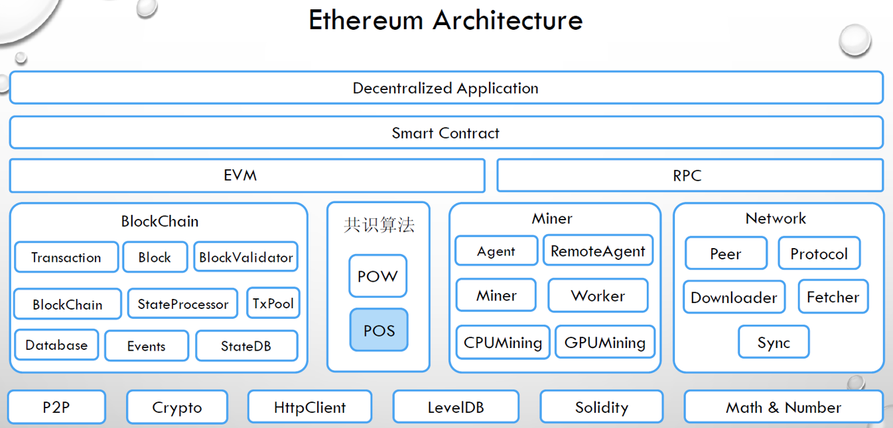

# 以太坊代码架构
相较于被称为区块链1.0的比特币系统所建立的虚拟货币体系，以太坊的定义是下一代智能合约和去中心化应用平台。从本质上而言，以太坊是
将区块链视作底层的数据库，在其上建立了一个可以编码任意状态转化功能的智能合约虚拟机，用以操作区块链中所记录的交易信息。

下图所示，是go-ethereum以太坊源码中的基本架构：

从学习的角度，我们重点希望弄清楚以太坊整个运行的流程，主要的内容有：
 1. 以太坊客户端中共识算法的具体流程
 2. 一笔交易如何从产生到执行、再到记录到底层数据库之中？
 3. 底层数据是以怎样的形式存储到数据库之中？

# 以太坊中的共识算法

# 以太坊中的交易执行

# 以太坊中的数据存储

